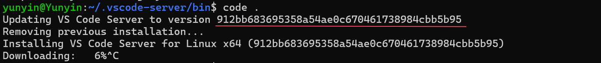

# vscode-download问题

## 情况

wsl经常性出现vscode-server需要更新版本，然后会根据某个commit-id进行下载。此时vscode卡在这里不能正常启动。



## 解决

* 复制链接，从第三方下载渠道代下载（默认下载到`D:\DownLoad\stable`）
* 执行下面的脚本，传入commit-id

```shell
#!/bin/bash

# 检查是否传入了参数
if [ $# -eq 0 ]; then
    echo "错误：没有传入参数。"
    echo "用法：$0 <commit-id>"
    exit 1
fi

# 进入VSCode服务器的bin目录
cd ~/.vscode-server/bin

# 检查目录是否存在
if [ ! -d "$(pwd)" ]; then
    echo "错误：VSCode服务器的bin目录不存在。"
    exit 1
fi

# 移动下载的VSCode Server压缩包到VSCode服务器的bin目录
mv /mnt/d/DownLoad/stable ~/.vscode-server/bin/temp.tar.gz

# 检查压缩包是否存在
if [ ! -f "./temp.tar.gz" ]; then
    echo "错误：压缩包temp.tar.gz不存在。"
    exit 1
fi

# 解压压缩包
tar -zxf temp.tar.gz

# 检查解压后的VSCode Server目录是否存在
if [ ! -d "vscode-server-linux-x64" ]; then
    echo "错误：解压后的VSCode Server目录不存在。"
    exit 1
fi

# 将解压后的VSCode Server目录重命名为传入的第一个参数
mv vscode-server-linux-x64 "$1"

echo "VSCode Server已成功重命名为：$1"

rm ~/.vscode-server/bin/temp.tar.gz
```

