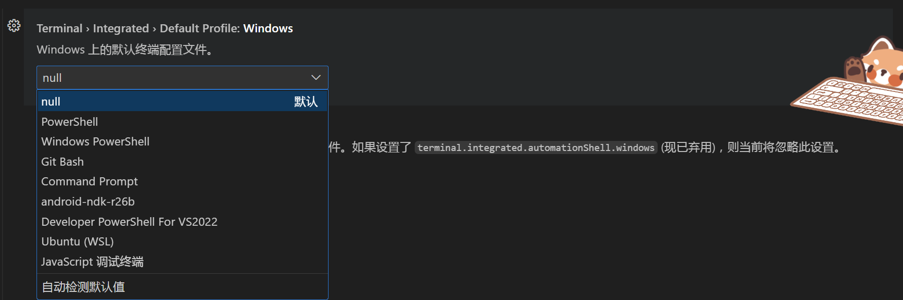

# vscode任务终端配置

vscode的不同代码，经常会需要在某些特定的终端上执行（预先配置好），而如果不设置好，每次都会新建一个终端，但是新建的终端里的一些变量就会被破坏了。

针对task会新建终端，vscode似乎并没有一个好的方法去设置这个特性：[在现有终端中运行 Python 调试控制台 ·问题 #13040 ·微软/VSCode-Python](https://github.com/microsoft/vscode-python/issues/13040)

那么如何解决这个问题呢？

## vscode自定义终端

vscode允许自定义专有终端：

```json
    "terminal.integrated.tabs.enabled": true,
    "terminal.integrated.tabs.title": "${process}",
    "terminal.integrated.profiles.windows": {

        "PowerShell": {
            "source": "PowerShell",
            "icon": "terminal-powershell"
        },
        "Command Prompt": {
            "path": [
                "${env:windir}\\Sysnative\\cmd.exe",
                "${env:windir}\\System32\\cmd.exe"
            ],
            "args": [],
            "icon": "terminal-cmd"
        },
        "Git Bash": {
            "source": "Git Bash"
        },
        "android-ndk-r26b": {
            // 基于pwsh7
            "path": "pwsh.exe",
            "icon": "terminal-powershell",
            "overrideName": true,
            "args": [
                "-NoExit",
                "-Command",
                ". 'D:\\codeSpace\\gitcode\\vscode-terminal-customer-settings\\NDK\\android-ndk-r26b\\config-windows.ps1'; cd '${workspaceFolder}'"
            ]
        },
        "Developer PowerShell For VS2022": {
            // 基于pwsh7
            "path": "pwsh.exe",
            "icon": "terminal-powershell",
            "overrideName": true,
            "args": [
                "-NoExit",
                "-Command",
                "& 'D:\\ProgrammingSoftware\\vs2022\\Common7\\Tools\\Launch-VsDevShell.ps1'; cd '${workspaceFolder}'"
            ]
        }
    },
```

## vscode设置默认终端

在自定义了专有终端之后，再通过`Terminal › Integrated › Default Profile: Windows`设置默认打开的终端，这样就可以在新建任务的时候，依然能有合适的环境变量保留了。

