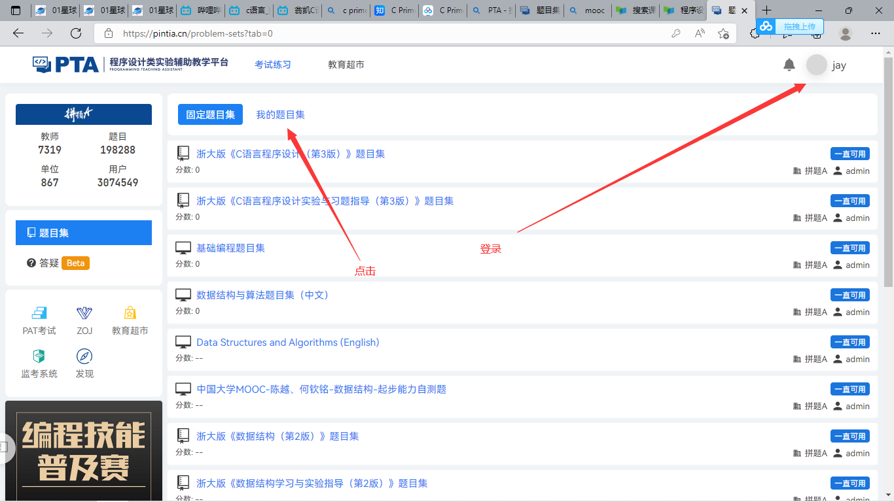
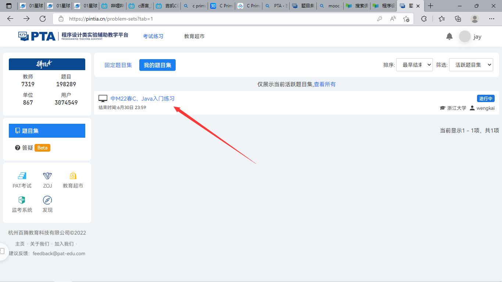
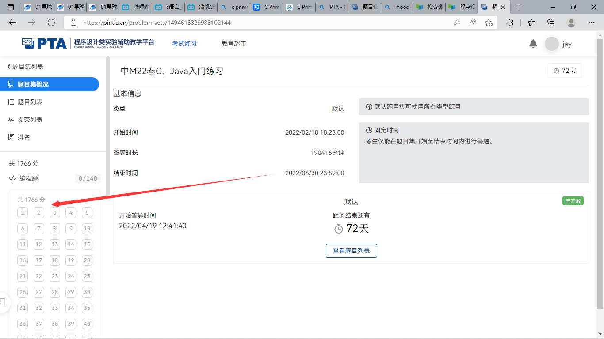

## 第三次课

> 上一节课，我们学习了最基础的变量，包括定义，赋值，初始化，用scanf进行输入等等。当然，关于程序中出现的一些细节，如果没学过不必深究，视频只是简单的打基础，帮助你先有一定的编程概念。所以难度不大，且一些知识点并不全面。
>
> 我会发给你一份《C Primer Plus》电子版PDF的书作为教材（因为现在快递还未解封，我手头上的纸质书籍不能送到你的手上，相比电子书，教材还是纸质的学起来更有手感），在完成一遍视频的学习之后（预计一个月时间），我们会将主力集中在书上。放心，每天的内容不会很多，但是不要拖到第二天。
>
> 如果有一些内容不太懂，可以看书，这本书是非常适合自学的书籍（至少我刷了两遍），不过需要一些时间去仔细阅读。

---

#### 1.学习内容

今天的学习内容是视频P16-P23。内容比较杂，注意做好笔记。

#### 2.学习平台

光看不练，都是纸上谈兵。所以视频中的PTA学习平台是一个很好的练习方式。我已经为你准备好了账号和习题，你只需跟着下图去使用就好。

###### 网址

[题目集列表 (pintia.cn)](https://pintia.cn/problem-sets?tab=0)

###### 账号

> 这是我练习的账号

账号：1065415674@qq.com
密码：2323306596qq

###### 操作步骤

进入网址，在右上角登陆之后，点击“我的题目集”，选择“中M22春C、Java入门练习”，进入在左边选择题目开始作答。

#### 3.练习内容

今天的练习内容是PTA题目1-2，当然你也可以继续往下做。

> 一般我们代码是在编译器中完成，并自己运行检查一遍再复制到网站上提交，网站会给你结果，同时会有一些反馈，你需要根据反馈来改错。

提醒一下：注意细节！

#### 4.补充学习

我已经将《C Primer Plus》电子版PDF的书附在解压包里了。有关编程学习的一些问题，可以看看第一章。放心，这一章只涉及一些背景与概述，方便你了解。这个可以分几天看完，不过内容只有17页。

---

### 总结

今天的任务如下：

> 1.视频P16-P23
>
> 2.PTA题1-2
>
> 3.《C Primer Plus》第一章

