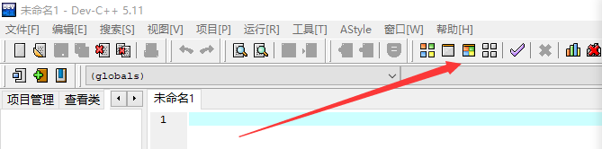
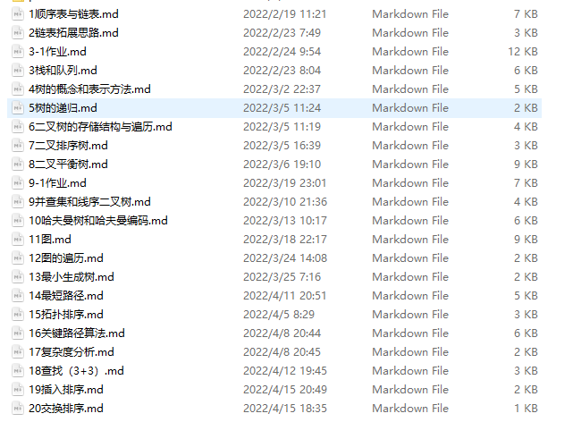
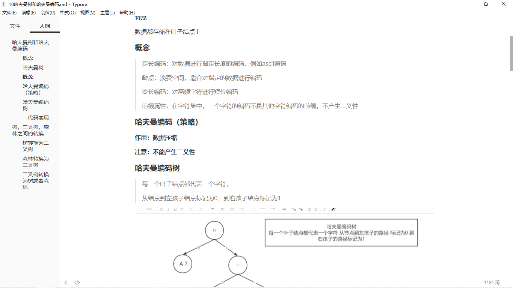
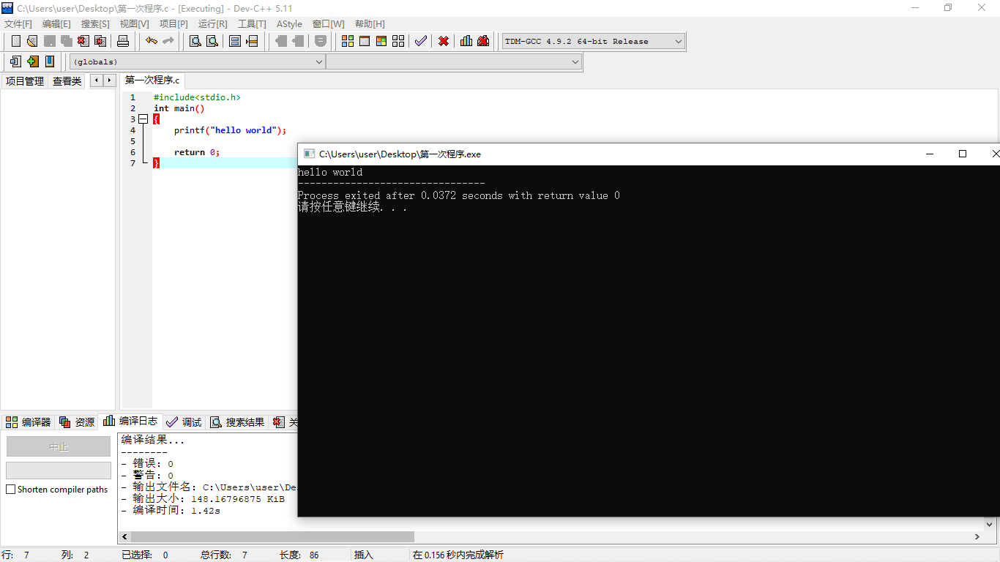

## 第二次课

> 这是第二次课，按照上次的约定，你应该已经学会了markdown语法。左边是这个文档的大纲。如果看不到可以按CTRL+shift+L来调出。如你所见，我们今天的内容有三个。

---

#### 1.尝试使用dev c++

> 如何使用一个编译器，是编程的基础，虽然你还没开始学习编程的知识，但并不妨碍你打开编译器来感受一下编程的魅力。在学习的前期，我们主要使用dev c++来编程，它的好处在于单个文件创建简单，且能很好地锻炼你的代码功底。在学习的后期及大后期，我们将使用vs2022，它更智能，同时有助于大项目的实现。

##### 创建一个c文件

这个很简单，打开dev c++，然后使用CTRL+N就搞定了。现在你能开始在里面写一些内容了。

> （或者在左上角的文件——新建——源代码中打开）

保存使用CTRL+S，并将其放在一个合适的位置便于你找到。（建议在一个地方创建一个文件夹，来专门放程序）

**注意：保存格式选择.c文件而不是.cpp文件**

---

**运行一个程序**

这个也很简单，只需在dev c++中按F11即可（当然，是在你写了一些代码的情况下）

> (或者在上面找到一个编译并运行的标记，点击它，如下图)




#### 2.学习c语言

> 每日的学习内容是必不可少的，每次都会很简单，但是积累的成果会很丰盛。

##### 学习内容

完成P6—P15的学习（内容看起来很多，毕竟刚刚开始的内容**非常**简单，我的建议是开1.5倍速之后，在不太懂的地方反复看就行，你一定能看懂）

**注：**每次学习，我建议使用markdown做好笔记。好处有很多，养成习惯。

> 不用担心笔记格式，习惯是慢慢养成的，你觉得怎么方便、好看怎么来就行。

#### 3.第一个程序

> 在看完视频之后，写一个入门程序是很有仪式感的事情，那么，hello world是必不可少的。

众所周知，markdown能用来写代码（方法是在开头用三个`和语言的名字来注明），所以下面的代码就是你需要去写的。对于一些细节，你不用太关注。请打开dev c++，自己跟着这个敲一遍就好。**（注意分号和中英文）**

```c
#include<stdio.h>
int main()
{
    printf("hello world");
    
    return 0;
}
```

> 在确认会出现一个黑框框，上面有一句hello world之后，你的程序便运行成功了。


### 总结

> 你应当完成以下任务：

1.完成今日视频学习并用markdown软件做好笔记

> 这个是我做的一些笔记内容，可以参考一下





2.打开dev c++并写一个hello world的程序，保存并运行。

> 结果应当是下面这样的



