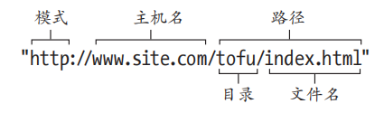

## 1.7URL

> URL是地址的别名，它包含文件的存储位置和浏览器如何处理它的信息。

组成部分：

* 模式
* 主机名
* 路径
	* 目录
	* 文件名



#### 1.7.1模式

>告诉浏览器如何处理需要打开的文件。

常用：http、https、ftp和mailto等

#### 1.7.2主机名

> 即域名，或者IP地址。

#### 1.7.3路径

##### 1. 绝对URL

对于在其它服务器上的内容，使用绝对URL来引用。

##### 2.相对URL

对于自己服务器上的内容，使用相对URL来引用。

* 同目录下：直接写文件名
* 子目录下：文件夹名+文件名
* 上层目录下：使用`../`
* 根相对目录下：为了防止出现`../../...`情况，使用根相对目录`/`来处理

```html
history.html
info/data.html
../img/image.png
/img/family/vacation.jpg
```

