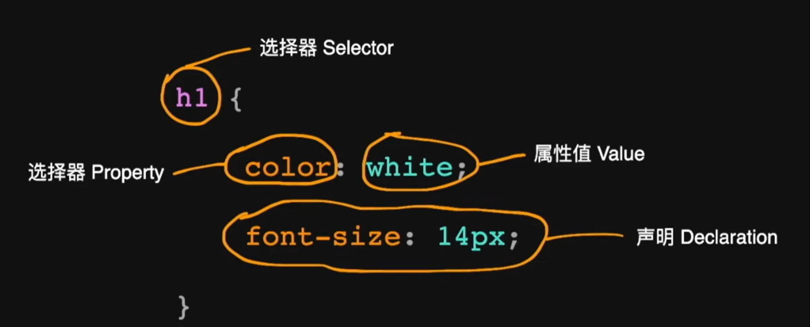

# HTML使用CSS



## 1.外链

​	当前HTML文件链接的CSS文件

```HTML
<!-- 外链 -->
<link rel="stylesheet" href="/assert/style.css">
```

## 2.嵌入

​	直接将CSS格式嵌入到HTML文件中

```HTML
<!-- 嵌入 -->
<style>
    li { margin: 0; list-style: none }
    p { margin: lem 0; }
</style>
```

## 3.内联

​	将CSS内联在html标签属性中

```html
<!-- 内联 -->
<p style="margin: lem 0">
    Example content
</p>
```

