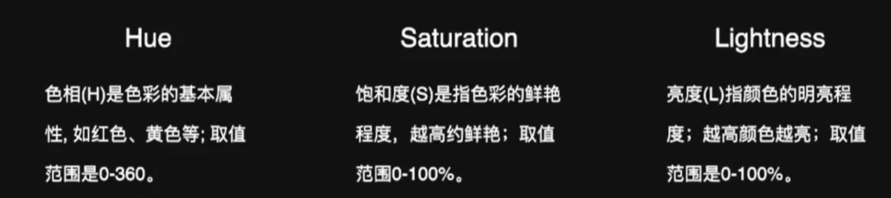

# 03 颜色

## 1.RGB表示

​	RGB表示是用三个数字来分别展示红绿蓝的比例，从而表示颜色。

表示方法如下：

* 直接表示：`rgb(143,172,135)`
* 简写：`#8fac87`

## 2.HSL表示



## 3.直接颜色表示

​	对于一些常用的颜色，比如：blue，white等简单颜色，可以直接用名字来表示。

## 4.第四维度（alpha 不透明度）

​	不透明度可以在三种表示方法的最后出现。取值范围`[0,1]`。

```CSS
#ff0000ff
rgba(255, 0, 0, 0.25)
hsla(0, 100%, 50%, 1)
```

