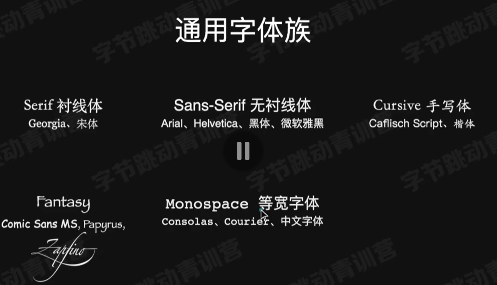

# 04 字体font-family

[TOC]

## 1.基础

​	因为不能保证在不同设备上字体都存在，所以会设置多个字体族，以优先级为顺序，最后一个一般为通用字体（有5种：`serif`，`sens-serif`，`cursive`，`fantasy`，`monospace`）。

```html
<h1>
    卡尔斯巴德洞窟(Carlsbad Caverns) 
</h1>
<p>
    卡尔斯巴德洞窟(Carlsbad Caverns) 是美国的一座国家公园，位于新墨西哥州东南部。游客可以通过天然入口徒步进入，也可以通过电梯直接到达230米的洞穴深处。
</p>

<style>
    h1 {
        font-family: Optima, Georgia, serif;
    }
    body {
        font-family: Helvetica, sans-serif;
    }
</style>
```



## 2.Web Font

​	为了严格使用设置的字体，可以将字体放在服务器上，如果在客户端不存在该字体，可以从服务器的对应URL中下载后再使用。

```html
<h1>
    Web Font are awesome!
</h1>

<!-- web Font -->
<style>
    @font-face {
        font-family: "Megrim";
        src: 
            url(https://fonts.gstatic.com/s/megrim/v11/46kulbz5WjvLqJZVam_hVUdI1w.woff2)
            format( 'woff2' );
    }
    
    h1 {
        font-family: Megrim, Cursive;
    }
</style>
```

​	也可以对使用到的字体进行裁切，只下载用到的字的字体样式，保证流畅。

## 3.font-size

* 关键字
  * small、medium、large
* 长度
  * px、em
* 百分数
  * 相对于父元素字体大小

### 示例

​	一个网页字体的示例：

* 在 `section` 元素中有一个标题 (`h2` 标签) 
* 两个段落 (`p` 标签)。其中，带有 `note` 类的段落具有特殊样式。

​	CSS 部分定义了一些样式规则：

* `section` 元素设置了字体大小为 `20px`。
* `section h1` 设置了标题的字体大小为 `2em`，基于父节点的`section`的`20px * 2 = 40px`
* `section .note` 设置了带有 `note` 类的段落字体大小为 `80%`（`20px * 80% = 16px`），并且颜色为橙色 (`orange`)。

```html
<section>
  <h2>A web font example</h2>
  <p class="note">Notes: Web fonts ...</p>
  <p>With this in mind, Let's build...</p> 
</section>

<style>
  section {
    font-size: 20px;
  }
  
  section h1 {
    font-size: 2em;
  }
  
  section .note {
    font-size: 80%;
    color: orange;
  }
</style>
```

## 4.font-style

​	常见值类型：

- `normal`：默认值，表示文本以正常字体样式显示。
- `italic`：将文本以斜体显示。如果字体不支持斜体，则使用默认字体样式。
- `oblique`：类似于斜体，但是并非由字体文件提供的斜体形式，而是通过倾斜原来的字体来实现。如果字体不支持斜体或倾斜，也会应用默认样式。
- `inherit`：继承父元素的`font-style`属性值。

以下是一个示例，演示如何使用`font-style`属性：

```css
p {
  font-style: italic;
}
```

## 5.weight（字体粗细）

​	首先保证字体本身支持这些粗细的规格。

​	weight：400为`normal`，700为`bold`。

```html
<ul>
  <li class="w1">锦瑟无端五十弦 (100)</li>
  <li class="w2">锦瑟无端五十弦(200)</li>
  <li class="w3">锦瑟无端五十弦(300)</li>
  <li class="w4">锦瑟无端五十弦(400-normal)</li>
  <li class="w5">锦瑟无端五十弦(500)</li>
  <li class="w6">锦瑟无端五十弦(600)</li>
  <li class="w7">锦瑟无端五十弦 (700-bold)</li>
  <li class="w8">锦瑟无端五十弦 (800)</li>
  <li class="w9">锦瑟无端五十弦(900)</li>
</ul>

<style>
.w1 { font-weight: 100; }
.w2 { font-weight: 200; }
.w3 { font-weight: 300; }
.w4 { font-weight: 400; }
.w5 { font-weight: 500; }
.w6 { font-weight: 600; }
.w7 { font-weight: 700; font-weight: bold; }
.w8 { font-weight: 800; }
.w9 { font-weight: 900; }
</style>
```

## 6.line-height（行高）

​	`line-height`属性用于设置行高，即行与行之间的垂直间距。它可以使用绝对单位（像素、厘米等）或相对单位（em、百分比）进行定义。

一些常见的值和描述如下：

- 数字值：表示行高的倍数，例如 `1.5` 表示行高为字体大小的1.5倍。
- 绝对单位（如像素）：直接指定行高的具体数值。
- 相对单位（如em）：相对于当前元素的字体大小来计算行高。

### 示例

​	下面的代码将使所有 `<p>` 元素的行高为字体大小的1.5倍。

```css
p {
  line-height: 1.5;
}
```

## 7. white-space

​	`white-space`属性用于控制如何处理元素内的空白字符和换行符。

以下是一些常见的值和描述：

- `normal`：默认值，连续的空白符会被合并成一个空格，并且自动换行。
- `nowrap`：空白符不会被合并，文本不会自动换行。
- `pre`：保留空白符，但只在遇到换行符时才换行。
- `pre-wrap`：保留空白符，自动换行。
- `pre-line`：合并连续的空白符为一个空格，自动换行。

### 示例

​	下面的代码，将使所有 `<p>` 元素内的文本不会换行，而是一直水平显示：

```css
p {
  white-space: nowrap;
}
```


