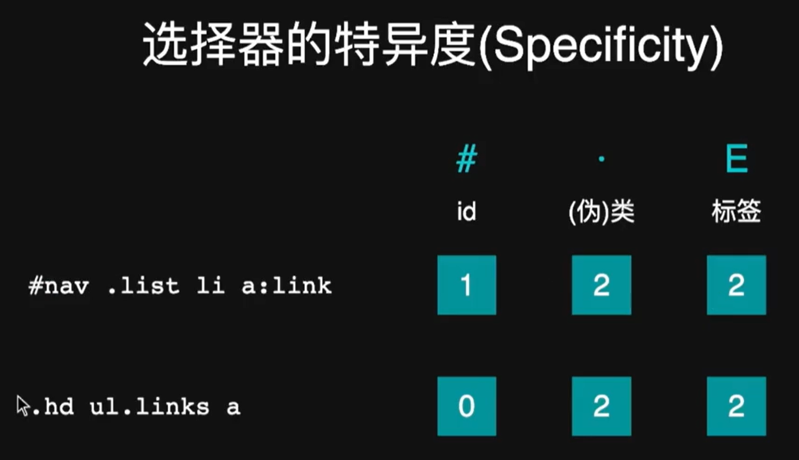

# 05 选择器优先级

​	下面的代码如何判断哪个选择器为正确结果：

```html
<article>
  <h1 class="title">拉森火山国家公园</h1>
</article>

<style>
  .title {
    color: blue;
  }

  article h1 {
    color: red;
  }
</style>

```

## 特异度

​	权重由大到小分别为：id，伪类，标签。（可以理解为百位，十位和个位）



## 2.继承

​	某些属性会自动继承其父元素的计算值，除非显式指定一个值。一般和模型相关的属性不会被继承，例如宽度。

```html
<p>
    This is a <em>test</em> of <strong>inherit<strong>
</p>

<style>
    body {
        font-size: 20px;
    }
    p {
        color: blue;
    }
    p em {
        color: red;
    }
</style>
```

### 1.显式继承

​	为了使不可被继承的属性允许被继承，可以使用显式继承的关键字：`inherit`

```html
* {
  box-sizing: inherit;
}

html {
  box-sizing: border-box;
}

.some-widget {
  box-sizing: content-box;
}

```

