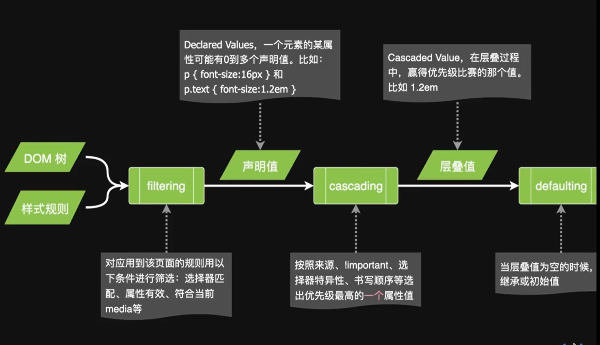
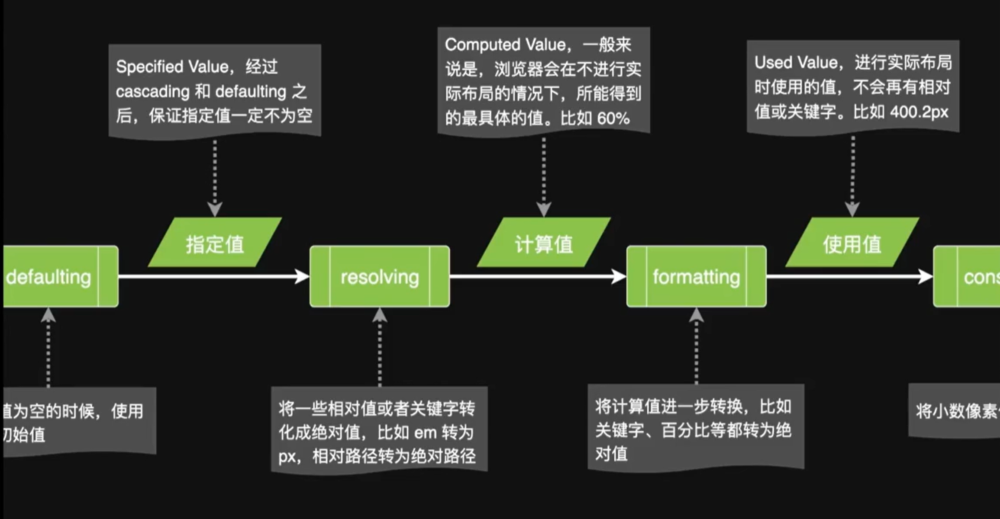
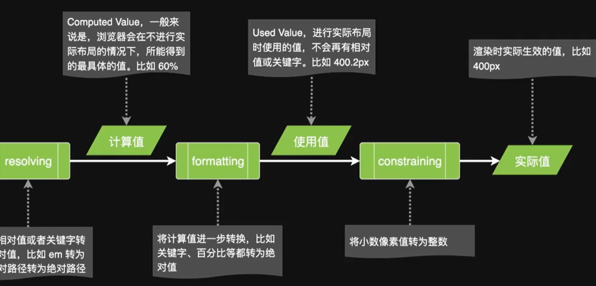

# 06 值的计算过程

CSS属性值的计算顺序和过程可以简单概括为以下几个步骤：

1. 确定初始值：每个CSS属性都有一个初始值，当未指定具体值时将使用该初始值。例如，`margin`属性的初始值是`0`。
2. 应用用户样式：浏览器首先会应用用户自定义的样式表（如用户自定义的CSS文件），这些样式会覆盖默认的初始值。
3. 应用作者样式：接下来，浏览器会应用由网页作者提供的样式表。这包括嵌入式CSS样式表和外部链接的样式表。如果有多个样式规则应用到同一个元素上，浏览器将按照CSS选择器的特定顺序应用这些规则，并根据其优先级确定最终的属性值。
4. 计算继承值：某些属性具有继承特性，这意味着它们的属性值会从父元素传递给子元素。对于继承属性，如果子元素没有指定特定的值，那么将使用父元素的属性值。
5. 应用层叠顺序：当多个样式规则应用到同一个元素上时，可能存在冲突。在这种情况下，浏览器会根据层叠顺序（也称为层叠上下文）来确定最终的属性值。层叠顺序由多个因素决定，例如样式选择器的优先级、元素的位置等。
6. 计算最终值：通过以上步骤，浏览器确定了每个CSS属性的优先级和继承关系，最终计算出它们的最终值。这些最终值将应用于渲染网页时的布局和样式。

