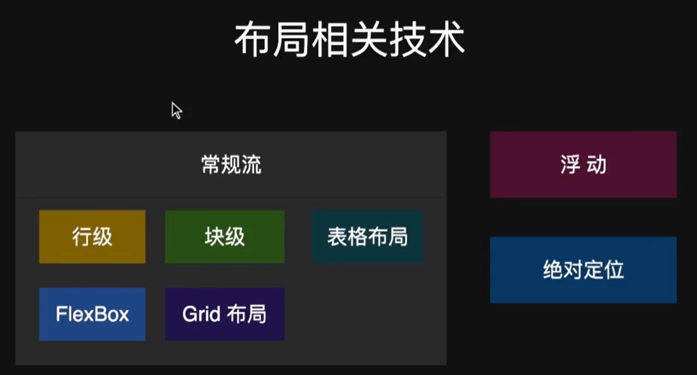
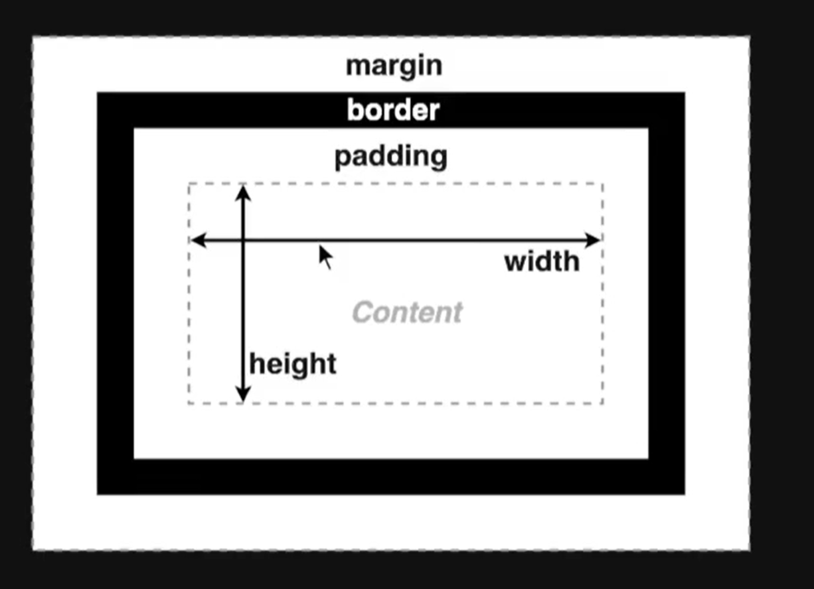

# 07 布局（Layout）

[TOC]

---

* 确定内容的大小和位置的算法
* 依据元素、容器、兄弟节点和内容等信息来计算

## 1.布局技术



## 2.盒子模型

CSS的盒子模型是用来描述和布局HTML元素的方式。它将每个HTML元素看作是一个矩形的盒子，这个盒子包括内容、内边距、边框和外边距等几个部分。



盒子模型的组成部分如下：

1. 内容区域（Content Area）：该区域包含元素的实际内容，例如文本、图片或其他嵌套的元素。
2. 内边距（Padding）：内边距是在内容区域和边框之间的空白区域，用于控制元素内容与边框之间的距离。可以设置上、下、左、右四个方向的内边距值。
3. 边框（Border）：边框是围绕元素内容和内边距的线条或样式。它定义了元素的可见区域的边界。
4. 外边距（Margin）：外边距是元素边框之外的空白区域，用于控制元素与其它元素之间的距离。可以设置上、下、左、右四个方向的外边距值。

这些部分共同决定了元素在页面中的尺寸和布局。当设置元素的宽度（width）和高度（height）属性时，通常是指的内容区域的尺寸。而盒子模型中的内边距、边框和外边距会在元素占据的总空间上进行叠加。

可以通过CSS的属性来控制盒子模型的各个部分，例如：

- `width` 和 `height`：设置元素的宽度和高度。
- `padding`：设置内边距的值。
- `border`：设置边框的样式、宽度和颜色。
- `margin`：设置外边距的值。

---

当涉及到CSS盒子模型的不同组成部分时，以下是一些示例代码：

### 1.内容区域（Content Area）的示例代码：

```css
.content {
  width: 200px;
  height: 100px;
}
```

### 2.内边距（Padding）的示例代码：

```css
.padding-example {
  padding-top: 10px;
  padding-right: 20px;
  padding-bottom: 10px;
  padding-left: 20px;
}
```

### 3.边框（Border）的示例代码：

```css
.border-example {
  border-width: 2px;
  border-style: solid;
  border-color: #000;
}
```

### 4.外边距（Margin）的示例代码：

```css
.margin-example {
  margin-top: 10px;
  margin-right: 20px;
  margin-bottom: 10px;
  margin-left: 20px;
}
```

## 3.块级 vs 行级

| Block Level        | Inline Level                         |
| ------------------ | ------------------------------------ |
| 不和其它盒子并列   | 可以和其它行级盒子并列，或拆分成多行 |
| 适用于所有盒子属性 | 盒模型中的width，height不适用        |

### 3.1 行级排版上下文（Inline Formatting Context，IFC）

- 只包含行级盒子的容器会创建一个IFC。
- IFC内的排版规则如下：
  - 盒子在一行内水平摆放。
  - 当行空间不足时，会进行换行显示。
  - `text-align`属性决定行内盒子的水平对齐方式。
  - `vertical-align`属性决定一个盒子在行内的垂直对齐方式。
- IFC能够避开浮动（float）元素的影响。

### 3.2 块级排版上下文（Block Formatting Context，BFC）

- 某些容器会创建一个BFC
  - 根元素
  - 浮动、绝对定位、inline-block
  - Flex子项和Grid子项
  - overflow值不是visible的块盒
  - display: flow-root;
- BFC内的排版规则如下：
  - 盒子从上到下摆放
  - 垂直margin合并
  - BFC内盒子的margin不会与外面的合并
  - BFC不会和浮动元素重叠

### 3.3 示例

```html
<span>
    This is a text and
    <div>b Lock</div>
    and other text.
</span>

<style>
span {
    line-height: 3;
    border: 2px solid red;
    background: coral;
}

div {
    line-height: 1.5;
    background: lime;
}
</style>

```

## 4.Flex Box

