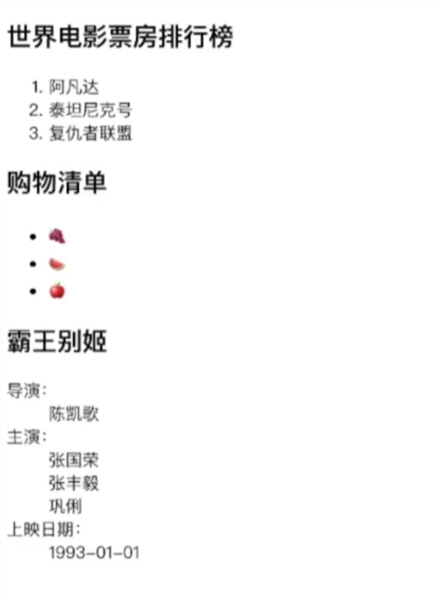

# 有序，无序和键值对列表

## 1.有序列表

```html
<h2>
    电影票房排行榜
</h2>

<ol>
    <li>阿凡达</li> 
    <li>泰坦尼克号</li>
    <li>复仇者联盟</li>
</ol>
```

## 2.无序列表

```html
<h2>
    购物清单
</h2>

<ul>
    <li>葡萄</li>
    <li>西瓜</li>
    <li>苹果</li>
</ul>
```

## 3. 键值对列表

```html
<h2>
    霸王别姬
</h2>

<dl>
    <dt>导演：</dt>
    <dd>陈凯歌</dd>
    <dt>主演：</dt>
    <dd>张国荣</dd>
    <dd>张丰毅</dd>
    <dd>巩俐</dd>
    <dt>上映日期：</dt>
    <dd>1993-01-01</dd>
</dl>
```

