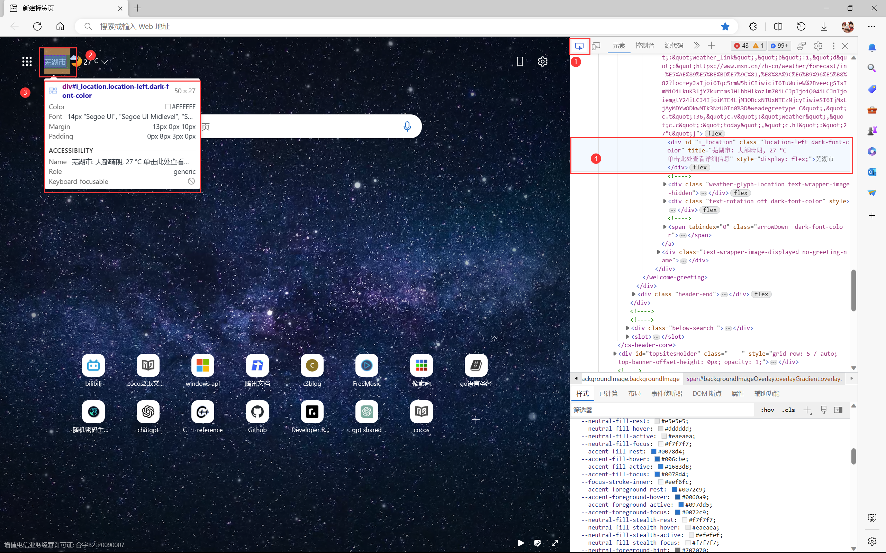
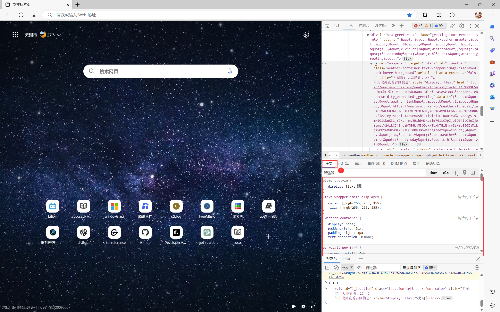
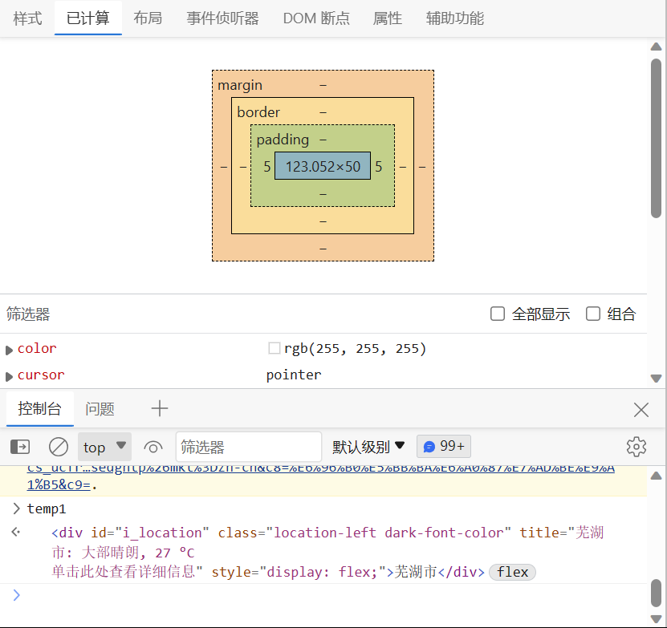
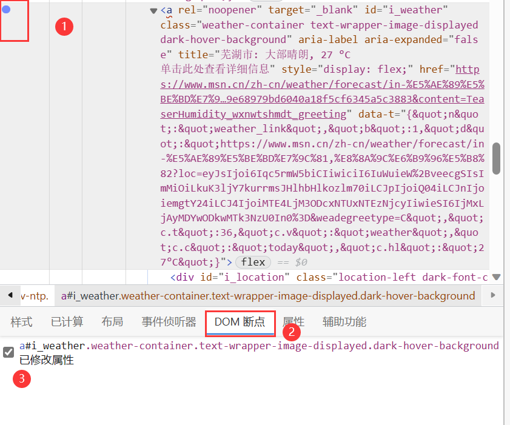
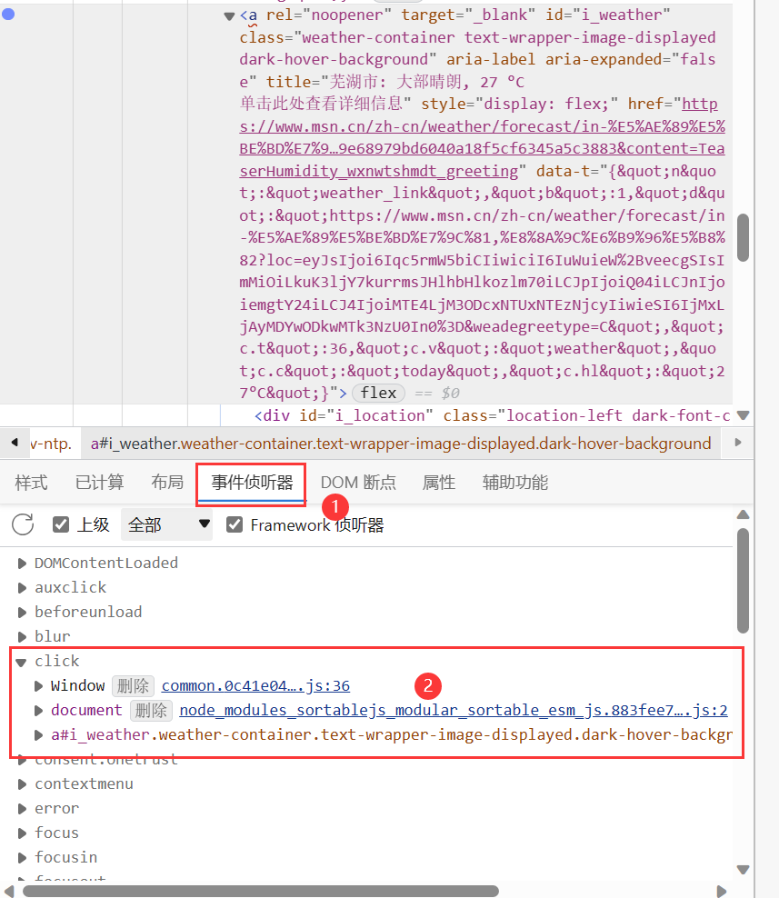

# 开发者工具——Elements

## 1.元素检查

​	在元素的左上角可以进行元素检查，用于查看页面组件的代码。

## 2.实时修改

​	右击对应的代码块，可以选择

* 修改HTML
* 修改Attribute
* 添加Attribute
* 复制一份当前Code至下方
* 删除当前代码

## 3.查看CSS元素

​	在样式中可以**查看和修改**相关的CSS元素。

​	还可以通过Computed查看CSS的计算过程。

## 4.断点

​	可以在代码部分右击添加断点。

​	在**DOM断点**处查看所有断点信息。

## 5.监听事件

​	通过代码处可以监听该代码是否会因各种操作产生事件，从而定位到具体的JS代码。

