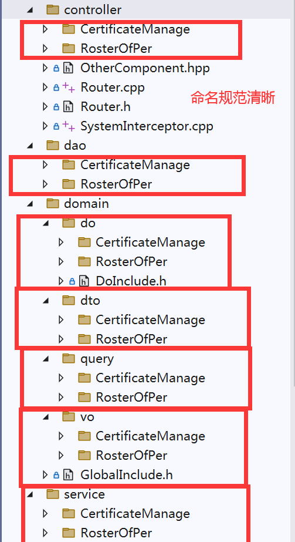
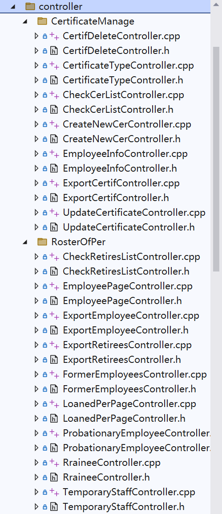
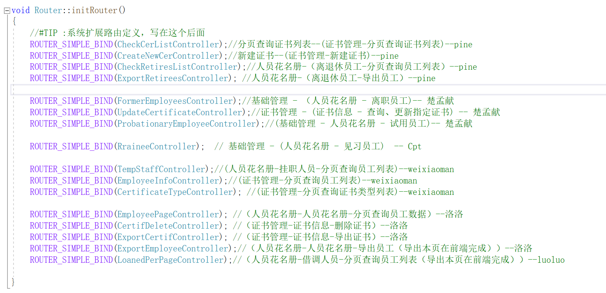
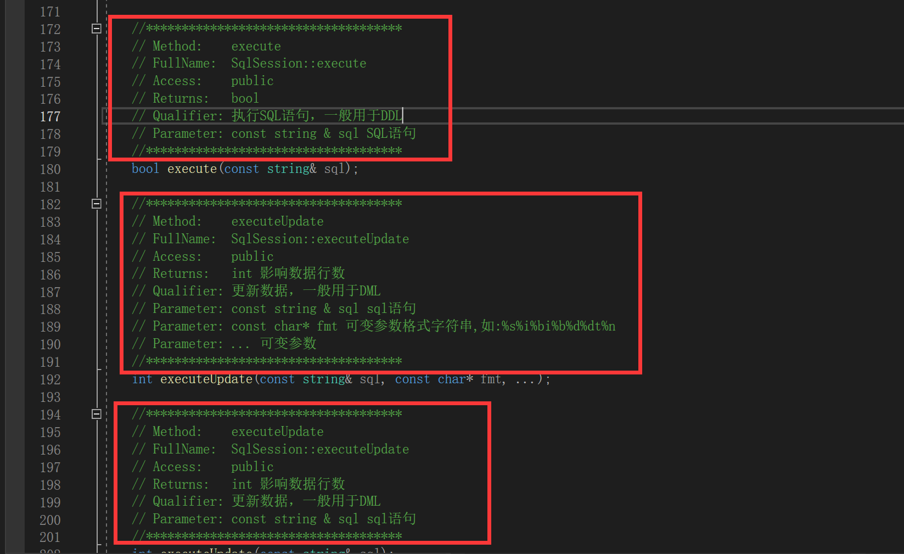

# 2023团队项目反思

## 组长

* 项目分工：对于在同一功能下的多个接口，如果**业务相近**且SQL**数据表相同**，应当被分给一个人。
* 命名：提前定下目录与文件，乃至于类和函数接口**命名规范**。
* 工作划分：对于可以复用的工作函数或数据，提前做好**沟通和记录**，保证同一功能使用者可以**明确约定**。
* 项目管理：保证小组开发分支不被污染，合并前保证**编译通过**，并检查是否有**越权修改文件行为**。
* 了解组员：了解组员对相关技术的熟悉程度，对项目需要用到的技术做好**规范演示**（形式：文档/视频）。

## 组员

* 前期准备：
  * 功能思考：
    * 是否需要缓存 Redis
    * 是否需要鉴权 （保证不越权）
  * 学习：
    * 对于`oatpp`功能进行学习
    * 对开会技术视频进行学习
      * Nacos
      * FastDFS
      * RocketMQ
      * ...

* 目录与文件命名：本次项目对结构的规划，虽然上层很清楚，但是下面**目录及文件名的规范性**有问题。有人用自己的名字命名文件，有人用大功能的模块名命名文件，有人用接口名命名文件。需要统一命名规范。

* 代码复用：
  * 数据结构体复用：另外就是对于数据表对应的DTO，DO，VO等能复用的代码结构，每个人都创建了自己的DTO，导致了很多的重复劳动。
  * 函数复用：对于一些常用的功能，每个人都实现了自己的版本，冗余代码过多。例如：
    * excel导出功能
    * redis相关功能
    * fastDFS上传功能
    * ...
* 代码权限：不允许私自修改**公有代码文件**，在其中增加便于自己模块使用的功能。
* 代码管理：统一将一致的代码放在一起，格式保持一致，做好注释，下面是一个`Router`的例子：

* 项目管理：
  * 权限问题：对于git管理项目，应该**只有一个人有权限合并**到小组开发分支，其他人应该做好`pull reques`t，提交**编译通过截图**
  * 提交流程：先将自己分支merge到**本地的小组分支**，再进行**编译测试**和**功能测试**，最后提交PR，PR里提交对应的编译通过截图
* 鉴权问题：需要鉴权的一定要做鉴权。
* 跨平台规范：
  * 文件名：在Windows下，文件名不区分大小写，因此`include`的即使大小写不正确也能正常被包含。但是代码被移植到Linux下就不能被正常使用，需要修改大量的功能。
* 配置文件：
  * yaml文件划分：应该以接口名去划分，或者有一个其它规范，而不是用自己的名字或是其它不可读的命名。
* 注释规范：每个类或接口，应该有规范的注释。
  * 类：
    * **类名含义**
    * 类功能划分（类职责清晰）
    * **负责人**
  * 函数：
    * **功能**
* 团队管理：
  * 会议管理：**记录**会议内容，确认**任务内容，提交方式和完成日期**
  * 表格管理：团队信息和项目信息
  * 流程管理：任务流程要能看到**进度**
    * 在第一天跑通demo
    * 后续填充细节
* 测试问题：
  * 测试数据要清晰，如果需要注释（一些变化的测试数据），一定要写清楚
  * 测试数据完备：
    * 正常值
    * 异常值
    * 边界值
* 多看注释：
  * 在**dao层**会用到封装好的数据库function，仔细看注释后（**符合条件例如DDL等**才能使用）使用正确的语句，例如：
  * 

​	