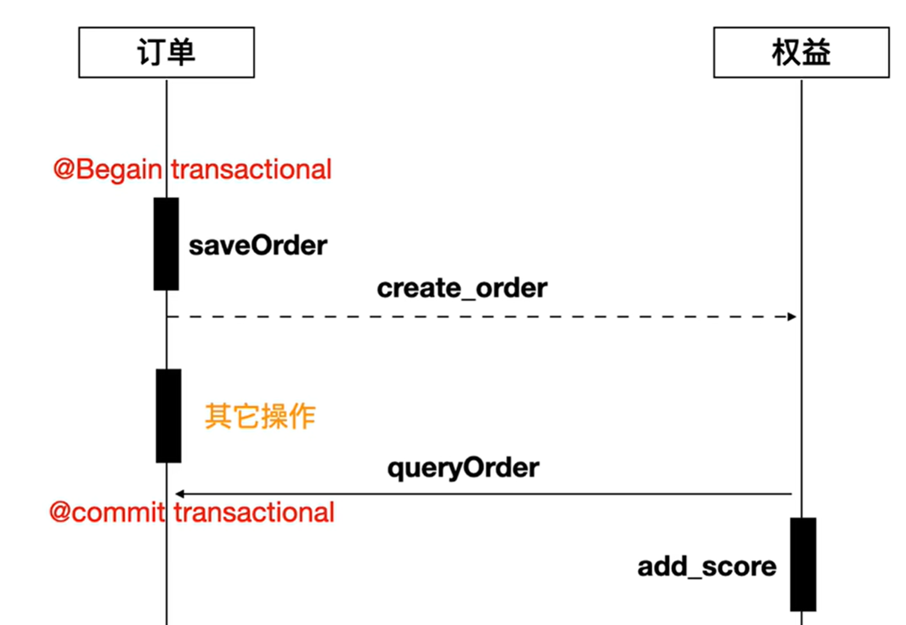

# 微服务架构的理解

微服务是在传统单体架构上，将整个应用进行拆分。

## 优点

微服务的优点，我理解是对于整个应用，可以拆解出相对正交独立的大模块进行并行开发，互不干扰。同时对于某些特定的模块，可以选择合适的编程语言和框架进行开发。

最后是隔离风险，模块之间互相独立，某个模块抛出异常，对其它模块完全没有影响。另外在拓展性方面，微服务可以单独将某个高频使用的接口进行容器化部署和动态扩容，用网关进行流量负载均衡，比直接的单体架构更加节省资源和灵活配置。

### 一、开发与维护

- **并行开发**：微服务将大型应用分解为多个独立的服务模块。每个服务可以由不同的团队独立开发，而不会相互干扰。例如，在一个电商平台上，用户服务、订单服务、商品服务等各自有独立的团队进行开发。

- **独立部署**：每个微服务可以独立部署和升级。如果要对订单服务进行优化，如改进支付流程或者添加新的支付渠道，只需要重新部署订单服务，而无需对整个电商平台进行更新。这大大提高了开发和部署的效率。

### 二、技术选型

- **语言和框架灵活选择**：不同的微服务可以使用最适合其业务需求的编程语言和框架。例如，在一个大数据分析平台中，数据处理核心服务可能使用高性能的Go语言编写，而电商中支付模块对安全性要求很高，用Java这样成熟的语言和Spring框架会更稳妥。

### 三、风险隔离

* **故障隔离**：如果某个服务出现问题，例如商品服务因为数据库连接问题导致响应缓慢或者出现错误，这种故障不会直接影响到其他服务，如支付服务和用户服务仍然可以正常运行。通过服务发现、熔断器和重试机制，可以进一步隔离和处理故障。
* **安全隔离**：微服务架构可以通过为每个服务配置独立的安全策略来增强安全性。例如，对于支付服务这样的敏感服务可以设置更严格的身份认证和加密通信机制，而其他服务可以根据业务需求应用不同的安全级别。

### 四、拓展性

- **横向扩展**：微服务非常适合现代的云原生环境，可以轻松地通过容器化技术（如Docker）和容器编排工具（如Kubernetes）进行横向扩展。当用户对某个特定功能（如订单查询接口）的访问量突然增加时，可以通过增加该服务的容器实例数量来满足需求，而不会影响其他服务的性能。
- **灵活的资源分配**：不同的服务有不同的资源需求。例如，一个计算密集型的机器学习服务可能需要更多的CPU和内存资源，而一个简单的日志记录服务可能只需要较少的资源。微服务架构可以根据服务的特性灵活分配资源，提高资源利用率，降低整体成本。

## 问题

由此也会有一些开发上常见的问题。

### 服务拆分

从开发的起点，也就是架构上来看，对于整个架构要有一个深入的理解的总架构师，来拆业务和分割模块。模块粒度太细会导致每个模块的通用代码出现冗余，每个模块都自己实现了一遍。而模块粒度太粗会出现资源的浪费和后期扩展的不灵活。

### 数据不一致（双向依赖关系）

在开发的过程中，上下游服务之间，由于技术实现上互相不透明，可能出现数据不一致的情况。例如：在电商系统的购买返积分场景中，在上游的订单服务中开启一个事务保存订单消息，但是尚未提交，在过程中通过消息队列间接将订单ID传递给下游的权益服务。下游的权益系统会反查商品，并根据商品的配置逻辑去进行权益的计算，后续再给用户添加积分。

如果消息队列空闲，下游服务就会非常快速地收到消息，并且进行反查，此时就可能出现找不到对应的数据（事务尚未提交）从而失败的情况。

