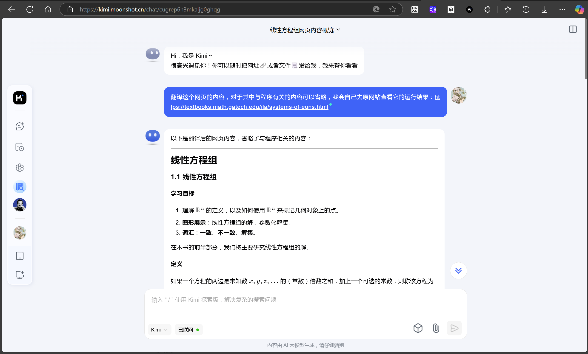

# 新的一年，我们学些什么

转眼间，一年已经过去。你已经度过了大学的第一个学期，对大学应该已经有了一些你自己的认识和想法。闲来无事，我在去年也有一些新的理解和思考，与你分享。

## 数学？数学？

作为计算机大类专业的学生，在大学里既需要学习编程相关的知识，同时又需要学习很多理论数学上的内容。例如你曾提到，高等数学的证明比较困难，难以理解和想到。这是一件非常正常和合理的事情，我也曾在大学刚刚开始的时候对此十分沮丧，不能理解很多抽象乃至繁杂的概念，并且做题目也一卡一卡的。你可能会以为我接下来会鼓励你向着困难前进，然而并非如此。在经过了几年的思考之后，我发现理解这些内容既消耗时间，又对我们实际的工作与生活没有什么帮助。特别是在微积分这个事情经过了多个时代的发展之后，我们想要理解它变得更加困难和麻烦：

* 牛顿时代的微积分（启蒙和应用）
  * 很多东西都不严谨，但是符合人们的直觉，并且人们很快将它们用在了实际的生产工作中
* 柯西时代的微积分（严格化和公理化）
  * 将原先很多粗糙的理论进行了公理化和系统化的证明，让一切都符合数学大厦的框架，但是普通人学习的门槛也变得非常高
* 现代的微积分（高级的应用）
  * 到了现代，微积分往往更加多元和复杂，并且应用领域也变得很现代化，例如优化、有限元分析、PID等等

更具体的说，这些往往应该是数学专业的学生乃至数学工作者需要去学习和努力的事情，而我们是计算机专业的学生，我们真正应该去做的是去熟练掌握更好的工具（例如编程），然后用我们擅长的方式去关注和解决我们在意的问题。

举个例子，如果我对高等数学练习册上的某个答案感到怀疑，觉得这个东西是不是写错了（比如求导$f(x)=\frac{sin(x^2)}{x}$），那么我们首先想到的不应该是：让我用我的数学水平来证明一下看看结果。作为一个学习计算机科学的学生，我们完全可以这样做：

打开python，安装`sympy`工具包，然后写下下面的代码（当然，这是我让AI帮我写的）：

```python
from sympy import symbols, sin, cos, diff

x = symbols('x')
f = sin(x**2) / x
f_prime = diff(f, x)
print(f_prime)
```


然后答案就会显而易见地出来了：$2cos(x^2)-\frac{sin(x^2)}{x^2}$。

我们会发现，已经有人把这些做的非常好了，我们不必再在数学课上学习各种各样的求导小技巧，然后机械地去求出一个一个复杂的导数。（当然如果为了顺利拿到分数，我们还是需要花时间去熟悉这些作业题）

所以我想说的是，你会发现你在数学上花费大量时间学到的大部分解题方法其实对我们未来的帮助很少，而更多的时间被浪费在了完全可以避免的地方。数学课真正有用的地方在于，我们对于一些未曾接触过的数学概念和数学对象的性质留下一些印象，并保有自己的理解就好了。至于计算，那是计算机该做的事情。

从现代的观念来看，对数学本身的研究学习依然会是极少数人的事情，我们应该去学习我们会用到的东西。

接下来你可能还会去学习某个叫做线性代数的课程（或者是高等代数），这门课老师一样会去讲很多难以处理的矩阵化简的技巧，很多其它的技巧。但是这些实际上都不重要。如果你能理解为什么线性代数这门课会有用，以及在什么地方的什么知识会被用到，比学习这些技巧本身会有用很多。（例如它会被广泛地用于计算机图形学与机器学习等学科上，3b2b有一期关于线性代数的非常好的视频去理解它）

因此，我更推荐你去以更加现代一点的方式去学线性代数，例如我曾发现的某个线性代数的在线学习网站：[Front Matter](https://textbooks.math.gatech.edu/ila/)，它在教程网页里插入了一些程序，以一种非常直观的方式将抽象的代数内容用图像展示给你看，它到底长什么样，以及你的各种变换到底改变了什么，意义在哪。当然，唯一的困难在于这个网站是全英文的。但是这一点都不影响你去学习它，这是一个有ai的时代，你可以将网址交给ai去翻译成中文，用你熟悉的方式去快速阅读它。



其它都是同理，回到计算机学科。

## 计算机第一定律

在这个时代，如果你学习计算机，那么可以记住一个定理，叫做：只要你想到了某件事，那么这件事一定有人比你先做过了。所以接下来你需要做的事情就是去打开你的搜索引擎或者ai，去查一下这个东西，而不是跃跃欲试地打算自己花大量时间造一个出来（当然你要是想锻炼自己，那就大胆去做吧，你写的前100个程序都是一坨，所以早点把它们写掉）。

这是一个很好的时代，你可以快速学到很多你感兴趣的东西，快速学习本身变得很重要，而找到这些知识的能力也变得重要（当然，再一次提到，现在有了ai这种好东西可以帮你搜索）。学校里的知识，在你对比更加现代的知识之后，会显得很落后过时。并且这只需要你问ai一句话的事情（当然在ai出现之前，还是需要在各个视频和问答平台上去寻找知识）。因此不要抱着学校里的课和PPT死啃，那只是一套过时的系统（不过你可以从中看出在过去那些年里，大家对于这个专业需要掌握哪些知识），计算机领域的知识永远是在时代的发展中不断迭代的，且比你想象的快得多。

## 理解为什么使用比使用本身重要

另一个很重要的事情是理解为什么有很多新的工具出来。它们好在哪里以及是否还有必要去学习它们。

特别是在ai出来之后，编程的门槛再一次下降，即使普通人都能写出一个很不错的代码。作为计算机学科的学生，我们已经不只追求编写代码本身了（因为你写的代码可能大概率不如ai写的好，当然我们依然需要去学习和练习如何写出一个好的代码），但同时，理解问题所在，以及尝试将问题清晰描述出来的能力也会变得重要得多。毕竟一个理解不了问题的人，即使有ai也大概率解决不了问题。

## C++？C！

最后是学习C++的事情，下学期你会开这门课，如果你想学习编程有一个好的开始，那么最好先将C语言本身学好，例如去看那本非常经典的《C Primer Plus》并用markdown做好笔记（哪怕只是抄一遍代码），并在VS2022里将代码多练习（有些学校依然选择在机房里使用dev c++这种老古董IDE，使用体验比较糟糕，而且界面很丑），而对于C++进行适当学习即可。

因为客观上来说，在这个时代，C++能做的事情已经被很多别的语言取代了，它很强大但需要非常多的时间去学习和练习，同样的时间成本学习别的语言已经可以开始独立写代码了，而你还在学C++的语法。因此如果一上来就怼C++你会发现外面的社会往往并不欢迎也不太需要这方面的新人，而是只欢迎从业多年的大佬或者天才。（如果你学完C++觉得它并不困难，说明你只学了一个皮毛。）而深入学习C语言本身可以帮你以一个适合初学者的视角去理解计算机，打下一个很好的基础。

## 最后，找点好玩的去学吧

如果平时有时间，我推荐学习：

* go语言（它在编写后端应用方面很合适和方便，并且接近C语言的编写方式）
* SQL数据库语言（数据库永远是一个很方便的工具帮你管理和存储数据，大家都喜欢用）
* 数据结构与算法（大家都会选择这个课程去打基础，虽然这让我们痛不欲生）
* python语言（它使用很简单，但是深入探索这门语言是一件不容易的事情，幸好我们不会将它作为主力语言）
* 操作系统（这是一门非常伟大的课程，让我们知道计算机的世界没有魔法，但是很少有人能讲好它）
* 计算机网络（我们生活在网络的世界，少有人知晓它如何运行）
* 做算法题（在你学习完数据结构与算法之后可以去刷leetcode为找工作做准备，但是不要去参加算法竞赛）
* 以及一些其它你感兴趣的编程方面的知识（编程的领域太多太多了，我也只是了解皮毛）

学而不思则罔，思而不学则殆，学习一个东西往往是为了更好的解决问题（如果没有发现问题说明代码写少了），并在其中找到自己的价值和乐趣。不要陷入学习的陷阱，学习之余多尝试多应用，有自己的理解。

最重要的还是，找到一个好玩的领域作为你长期努力的方向，现在正是你试错的时候。