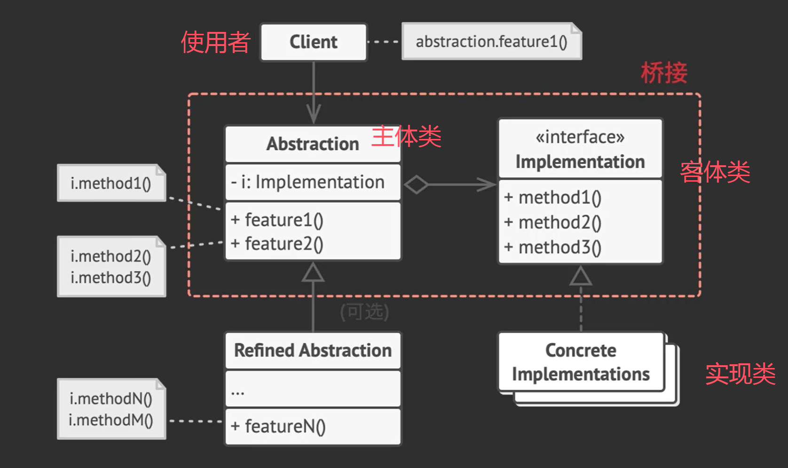

# 桥接模式的思考

桥接模式的核心在于，将抽象部分与实现部分进行分离。

更具体的来说，桥接模式往往有两个维度，如果对两两进行组合地去继承，往往就是m*n的类型数量，直接爆炸。而如果只是组合地去使用，就是m+n的类。

一开始接触的时候，不能理解桥接模式的代码。毕竟在我看来，既然是两个维度，那么它们本身是互不干扰且独立的，那不应该是各自有自己的类型继承，最后在一个class里存放两个维度的指针，然后去调用它们吗？

而桥接模式的设计却将一个维度作为主体，另一个维度作为客体，在主体中存储了客体的指针。



---

其实这样设计的原因是，我们不能做到两个方面完全独立地编写代码。在一个方面可以进行独立编写之后，另一个方面必须对它有所了解。我们无法在彼此互不知晓的情况下完成逻辑的编写，而是一方依赖另一方提供的服务接口。

例如，一个红色的圆形，这里就存在两个维度，一方是颜色Color，另一方是形状Shape。如果我的需求是绘制一个红色的圆形，那么主体可以是圆形，因为绘制接口应该由形状Shape提供，这个时候形状Shape应该对颜色Color有所了解。

```C++
class Color {};
class Red : public Color {};
class Blue : public Color {};

class Shape {
private:
    Color* c = nullptr;
public:
    void setColor(Color* c) { this->c = c; }
	virtual void draw() throw(std::runtime_exception) = 0;
};

class Circle : public Shape {
private:
    point centre;
    std::size_t r;
private:
	std::vector<point> transform_points() {
        //...
        return points;
    }
public:
    void setColor(Color* c) { this->c = c;}
    virtual void draw() throw(std::runtime_exception) override {
        if(!c) throw std::runtime_exception("color not set");
        
        auto color_value = c->get_value();	// 对Color有所了解
        for(auto& [x,y] : transform_points()) {
            screen->put_pixel(color_value, x, y);
        }
    }
};

class Rectangle : public Shape {
    // ...
};
```