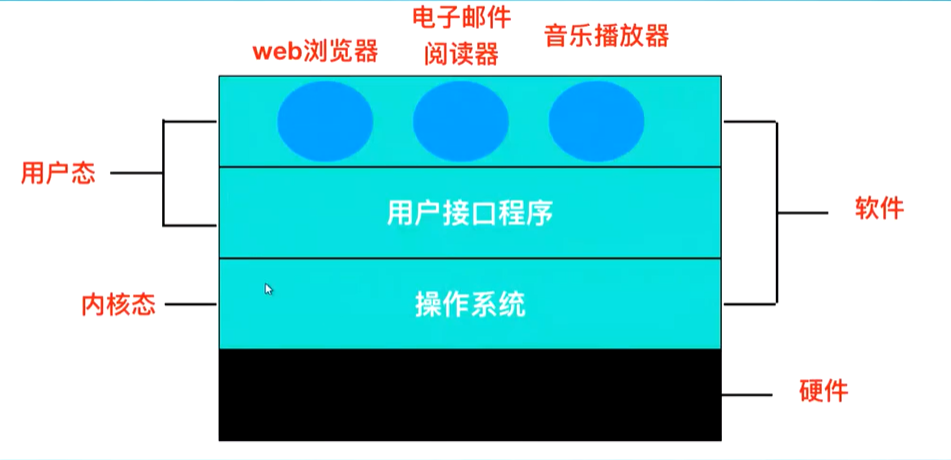
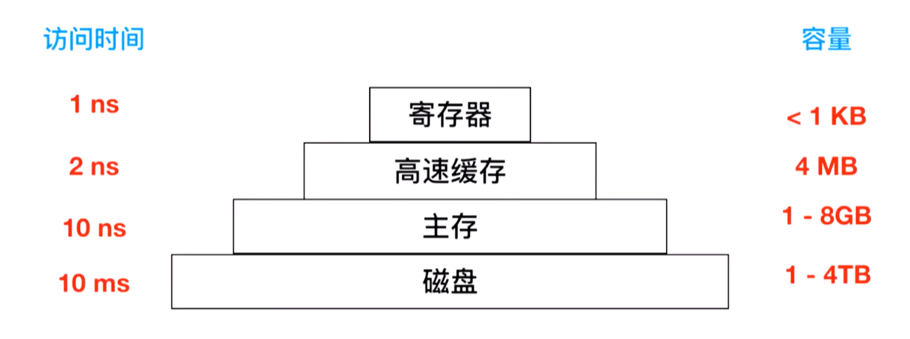

## OS总览

#### 程序生成过程

* 预处理过程：将需要引用的内容插入到源文件中，形成.i文件
	* gcc -e xxx.c -o xxx.i
* 编译阶段：将.i文件翻译成汇编程序
	* gcc -s xxx.i -o xxx.s
* 汇编阶段：汇编器将.s文件翻译成机器语言指令
	* gcc -c xxx.s -o xxx.o
* 链接阶段：将.o文件与一些预编译的库文件链接在一起，形成可执行文件

#### 操作系统如何区分和识别代码

> 根据“语境”来分析

#### 计算机整体的架构

用户态和内核态运行在CPU中，通过程序状态寄存器控制这两种状态

在内核态的情况下，能够运行任何指令，开放硬件的一切

在用户态的情况下，部分功能不能运行，对指令有所限制

为了获取操作系统的服务，必须要调用操作系统对外的接口

#### 硬件作用

* 寄存器
	* 通用寄存器：用于保存变量和临时结果
		* 程序计数器：用于存储指向下一条指令的地址
		* 用于保存堆栈指针
		* 程序状态寄存器：用于维护long型的数据集合，跟踪当前系统的状态

* CPU：执行指令（从寄存器读取）

#### 存储层次结构

#### 指令集架构

> CPU处理指令的规则（人为编写的）

用于描述机器代码所执行的效果

#### 处理器的微体系结构

用于描述处理器的具体实现

#### CPU流水线

CPU为了提升性能，将功能分为：

* 取指单元
* 解码单元
* 执行单元

#### 局部性原理

> 缓存造成性能的提升

##### 时间重复性

某一个内存多次被重复引用

##### 空间重复性

某一个内存附近的内存被引用