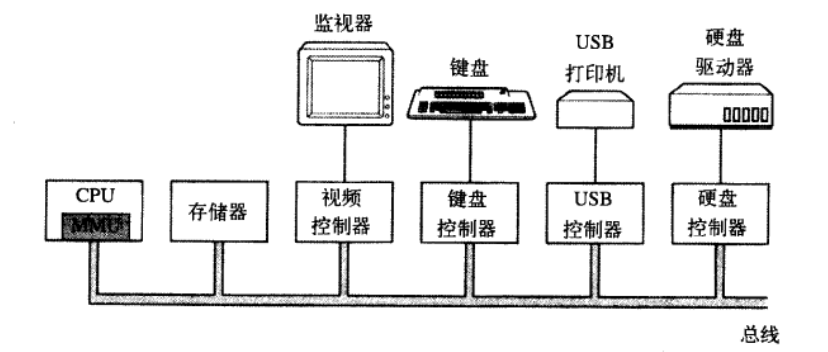

## 计算机硬件介绍

> 硬件有以下组成：

* CPU
* 内存
* IO设备
* 系统总线
* 其它设备

#### 1.3.1处理器

> CPU先取出指令，再解码，再执行，再找到下一条指令。

* 通用寄存器用于保存变量和临时结果
* 程序计数器用于保存下一条指令的内存地址
* 堆栈指针用于指向当前栈的顶端
	* 这个栈含有已经进入但未退出的每个过程的框架（内含输入参数、局部变量、保存在寄存器中的临时变量）
* 程序状态字寄存器用于保存一些特殊的字段。

