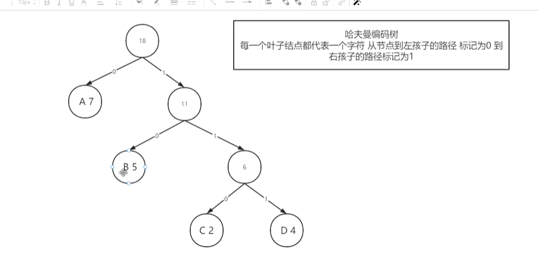

## 哈夫曼树和哈夫曼编码

#### 概念

> 1.结点路径：某一个结点从根节点到某一个路径上的连接数
>
> 2.树的路径长度：每一个叶子的结点路径长度之和
>
> 3.结点的带权路径长度：某一个结点的权重*该结点的路径长度
>
> 4.树的带权路径长度：每一个叶子的带权路径长度之和

#### 哈夫曼树

**构造方式**

> 一次选择两个权重最小的结点，构造一棵二叉树，将权重赋值给父节点，直至结束。

**特点**

数据都存储在叶子结点上

#### 概念

> 定长编码：对数据进行指定长度的编码，例如ascll编码
>
> 缺点：浪费空间，适合对指定的数据进行编码
>
> 变长编码：对高频字符进行短位编码
>
> 前缀属性：在字符集中，一个字符的编码不是其他字符编码的前缀。不产生二义性

#### 哈夫曼编码（策略）

**作用：数据压缩**

**注意：不能产生二义性**

#### 哈夫曼编码树

> 每一个叶子结点都代表一个字符，
>
> 从结点到左孩子结点标记为0，到右孩子结点标记为1



##### 代码实现

```c
#include<stdio.h>
#include<stdlib.h>

typedef struct {
    int weight;		//叶子结点的权值
    int lchild;		//左孩子下标
    int rchild;		//右孩子下标
    int parent;		//父节点下标

}Node,*HuffmanTree;

typedef char* HuffmanCode;
//步骤
//选择最小的两个结点
//创建哈夫曼树，并求出哈夫曼编码


int main()
{

}


void select(HuffmanTree* huffmanTree, int n, int* s1, int* s2)
{
    int min;//记录最小值的变量
    //找出第一个没有被赋值的单节点
    for (int i = 1; i <= n; i++)
    {
        //如果没有父节点，把结点序号赋值给min，跳出
        if ((*huffmanTree)[i].parent == 0)
        {
            min = i;
            break;
        }
    }
    //继续遍历全部结点，找到权值最小的
    for (int i = 1; i <= n; i++)
    {
        //如果没有父节点进入下一次判断
        if ((*huffmanTree)[i].parent == 0)
        {
            if ((*huffmanTree)[i].weight < (*huffmanTree)[min].weight)
            {
                min = i;
            }
        }
    }

    *s1 = min;

    //找出第一个没有被赋值的单节点
    for (int i = 1; i <= n; i++)
    {
        //如果没有父节点，把结点序号赋值给min，跳出
        if ((*huffmanTree)[i].parent == 0 && i != *s1)
        {
            min = i;
            break;
        }
    }
    //继续遍历全部结点，找到权值最小的
    for (int i = 1; i <= n; i++)
    {
        //如果没有父节点进入下一次判断
        if ((*huffmanTree)[i].parent == 0 && i != *s1)
        {
            if ((*huffmanTree)[i].weight < (*huffmanTree)[min].weight)
            {
                min = i;
            }
        }
    }

    *s2 = min;

}

//构建哈夫曼树
/*
HuffmanTree* huffmanTree:树
int w[]：数组权值
int n：元素个数
*/
void creatHuffmanTree(HuffmanTree* huffmanTree, int w[], int n)
{
    int s1, s2;//当前结点中最小的两个结点
    int m = 2 * n - 1;
    //所有结点数目=2*n-1
    //结点总数为m+1（因为加上了根节点）
    *huffmanTree = (HuffmanTree)malloc((m + 1) * sizeof(Node));
    //1至n存放叶子数据
    for (int i = 1; i <= n; i++)		//初始化叶子数组
    {
        (*huffmanTree)[i].weight = w[i];
        //权重赋值
        (*huffmanTree)[i].lchild = 0;
        (*huffmanTree)[i].rchild = 0;
        (*huffmanTree)[i].parent = 0;
    }
    //n至最后存放非叶子
    for (int i = n + 1; i < m; i++)		//初始化非叶子数组
    {
        (*huffmanTree)[i].weight = 0;
        (*huffmanTree)[i].lchild = 0;
        (*huffmanTree)[i].rchild = 0;
        (*huffmanTree)[i].parent = 0;
    }
    //开始构建哈夫曼树
    for (int i = n + 1; i <= m; i++)
    {
        select(huffmanTree, i - 1, &s1, &s2);

        (*huffmanTree)[s1].parent = i;
        (*huffmanTree)[s2].parent = i;
        (*huffmanTree)[i].lchild = s1;
        (*huffmanTree)[i].lchild = s2;
        (*huffmanTree)[i].weight = (*huffmanTree)[s1].weight + (*huffmanTree)[s2].weight;
    }
    //创造完毕
}

//从n个叶子结点到根，逆向求每个叶子结点对应的哈夫曼编码
void creatHuffmanCode(HuffmanTree* huffmanTree, HuffmanCode* huffmanCode, int n)
{
    int c;		//遍历n个叶子结点的指示标记
    int p;		//当前结点的父节点
    int start;//起始指针
    //分配n个编码的头指针
    huffmanCode = (HuffmanCode*)malloc((n + 1) * sizeof(char*));
    //分配求当前编码的工作空间
    char* cd = (char*)malloc(n * sizeof(char));
    cd[n - 1] = '\0';

    for (int i = 1; i <= n; i++)
    {
        start = n - 1;
        //从叶子到根节点求编码
        for (c = i, p = (*huffmanTree)[i].parent; p != 0; c = p, p = (*huffmanTree)[p].parent)
        {
            if ((*huffmanTree)[p].lchild == c)
            {
                cd[--start] = '0';
            }
            else
            {
                cd[--start] = '1';
            }
        }

        huffmanCode[i] = (char*)malloc((n - start) * sizeof(char));
        strcpy(huffmanCode[i], &cd[start]);
    }

    for (int i = 1; i <= n; i++)
    {
        printf("%s\n", huffmanCode[i]);
    }
}

```


## 树，二叉树，森林之间的转换

#### 树转换为二叉树

> 在兄弟结点之间连线，再去除除左孩子以外的其余所有父子连线

#### 森林转换为二叉树

> 1.将每一棵树转换为二叉树
>
> 2.从第二棵开始，根节点作为前一棵根节点的右孩子

#### 二叉树转换为树或者森林

> 1.如果x是y的左孩子，则将x的右孩子与y相连
>
> 2.去除右孩子之间的连线

