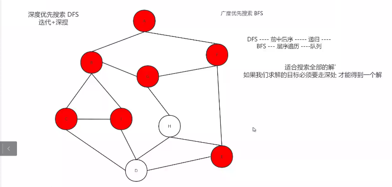

## 图的遍历

#### DFS

> 递归（前中后序）或者栈实现

> 缺点：不能保证找到的是最近的点

> 优点：
>
> 适用于搜索全部解或者必须走到最深处才能查找到解
>
> 空间上不需要额外空间
>
> 不需要保存搜索中的状态

```c
//为了判断顶点是否被访问，专门定义一个对应的数组来存储访问信息
int Visit[MAXN]={0};

void DFSTraverse(Graph G,int i)	//对连通分量进行深度搜索
{
    //如果需要输出，在此进行
    
    
    for(int j=0;j<G.n;j++)
    {
        if(G.arcnum[i][j] && !Visit[j])		//既要有边，也要没被访问
        {
            Visit[j]=1;
            DFSTraverse[G,j];
        }
    }
}

void DFS(Graph G)		//对整个图进行深搜
{
    //邻接矩阵&&无向图情况
    for(int i=0;i<G.n;i++)
    {
        if(!Visit[i])	//如果没有被访问过
        {
            Visit[i]=1;	//设置
            DFSTraverse(G,i);
		}
    }
}
```


#### BFS

> 队列（层序遍历）

> 缺点：需要持续性防止重复操作

> 优点：只要找到就是最近的点
>
> 适用于搜索最近解或一个解

```c
int Visit[MAX]={0};			//访问数组

void BFSTraverse(MGraph G)
{
    //对于每一个未被访问的结点调用广度搜索
    Queue *Q;	//先建立一个队列
    INitQueue(&Q);
    
    for(int i=0;i<G.vexnum;i++)
    {
        if(!Visit[i])
        {
            Visit[i]=1;
            //如果需要输出，在此进行
            EnQueue(&Q,G.vexs[i]);	//把第一个结点入队
            while(!QueueEmpty(Q))		//只要队列不空
            {
                int u;		//根据队列取出的是什么
                DeQueue(&Q,&u);	//元素出队
                
            }
        }
	}
}
```





