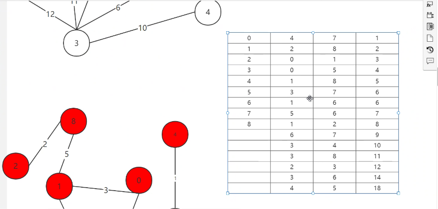
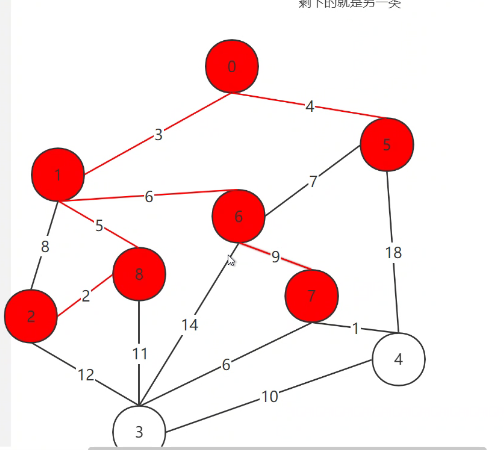

## 最小生成树

#### 生成树及其性质

> 连通图的生成树：一个极小的连通子图

> 生成树的属性：
>
> 1.一个连通图可以有多个生成树
>
> 2.一个连通图所有生成树的顶点数和边数都相同
>
> 3.生成树没有环结构
>
> 4.生成树减少任意一条边都会使图不连通，添加一条边都会形成一个环
>
> 5.n个顶点的连通图的生成树包含n个顶点和（n-1）条边
>
> 6.对于n个顶点的无向完全图包含n^(n-2)个生成树

#### 最小生成树--带权图（边的权值最小的生成树）

##### 克鲁斯卡尔算法--贪婪算法（局部最优）

> 步骤
>
> 1.将图看作森林（每个顶点都是一棵树）
>
> 2.寻找树中权值最小的顶点（同时保证不能形成环）
>
> 3.使用边集(存储前后结点和权值)排序所有边的权值
>
> 4.增序设置结点，并使用并查集（初始化为自身）判断是否相连

##### 普里姆算法--针对结点的算法

> 将顶点分为两类
>
> 一类是已经在生成树中的顶点，其余为另一类
>
> 再一步一步的将B类加入到A类，每次在与A类所有顶点相连的顶点中查找
>
> 直到找到所有结点

