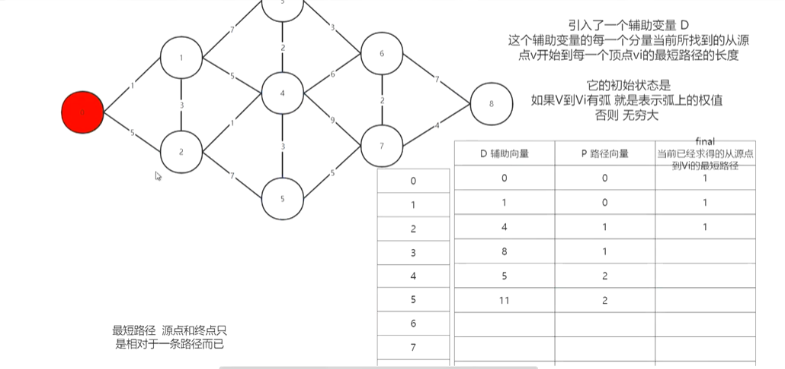
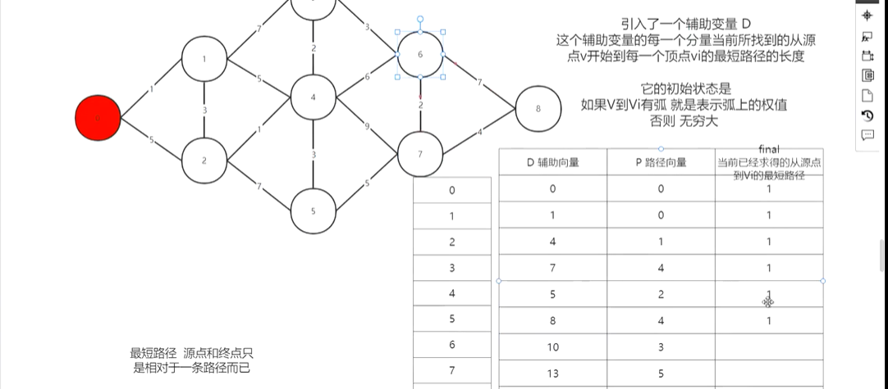
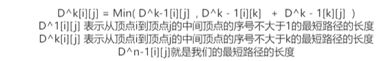

## 最短路径

#### 概念

> 源点：一条路径的起始点
>
> 终点：一条路径的终止点


#### 迪杰斯特拉算法-单源点

**变量引入介绍**

> 引入一个辅助变量D（数组）
>
> 它的每一个分量表示  当前找到的“从源点v开始到每一个顶点vi的最短路径”的长度
>
> 初始状态：如果v到vi有弧，表示权值，否则无穷大
>
> 引入路径向量，表示当前结点的上一个结点下标
>
> 引入final标记，表示已经经过测试的路径点

**解法说明**

> 从初始开始，标记final，然后找相邻结点的最短路径。
>
> 更新相邻结点的辅助向量（=min(当前结点+到这个结点的权值，之前的辅助向量））
>
> 在final未标记的点继续循环，直到找到





> 完成后从末尾倒推出最短路径

##### 代码实现

```c
#include<stdio.h>
#include<stdlib.h>
#define INF 65535
//图结构
typedef struct {
    int vexs[20];		//顶点
    int arc[20][20];	//边
    int numVer,numEdges;
}MGraph;

typedef int Pathaec[20];
//存储最短路径下标
typedef int ShortPathTable[20];
//存储v0到各个点的最短路径长度之和

//需要两个数组
//P的值是前驱结点的下标
//D的值是选取结点到v结点的最短路径长度

void ShortPath_Dijkstra(MGraph,int v0,Patharc* P,ShortPathTable* D)
{
    int k;//记录下标
    int final[20];	//标记数组，表示已经求得当前下标的结点已被完成求出最短路径
    //初始化数组
    for(int v=0;v<G.numVer;i++)
    {
        final[i]=0;	//全部未被处理
        (*D)[i]=G.arc[v0][i];	//初始化起始结点与周边结点的权值
        (*P)[i]=-1;		//路径数组初始化为-1
    }
    final[v0]=1;		//从起始点开始
    (*D)[v0]=0;			//自己对自己的路径为0
    
    //开始循环，每次求出的v0到某个结点的最短路径
    for(int i=1;i<G.numVer;i++)
    {
        int min=INF;
        for(int j=0;j<G.numVer;j++)	//找到距离v0最近的点
        {
            if(!final[j] && (*D)<min)	//同时不能被标记
            {
                min=(*D)[j];
                k=j;
            }
        }
        final[k]=1;		//将找到的最近结点放入标记
        
        //修正其余最短路径
        for(int j=0;j<G.numVer;j++)
        {
            //如果经过这个结点的路径比现在的短
            if(min+G.arc[k][j]<(*D)[j] && !final[j])
            {
                (*D)[j]=min+G.arc[k][j];
                (*P)[j]=k;
            }
		}
	}
}
```


#### 弗洛伊德算法-任意两个结点间的路径

> 数学表达式



> 步骤：
>
> 外层循环：从第一个结点开始
>
> ​	内存循环：检查经过每个结点一次，比较路径并更新

> 实现结构：
>
> 邻接表和路径向量数组


```c
#include<stdio.h>
#include<stdlib.h>
#define INF 65535
//图结构
typedef struct {
    int vexs[20];		//顶点
    int arc[20][20];	//边
    int numVer,numEdges;
}MGraph;

//path 路径	表示两个结点之间经过的某个结点
//dist 长度数组	代表两个结点的最短路径数值
void floyd(MGraph G,int path[20],int dist[20])
{
    for(int i=0;i<G.numVer;i++)		//初始化
    {
        for(int j=0;j<G.numVer;j++)
    	{
            dist[i][j]=G.arc[i][j];
            path[i][j]=j;
    	}
    }
    
    //计算
    
    for(int i=0;i<G.numVer;i++)	//i是中转
    {
        for(int j=0;j<G.numVer;j++)		
        {
            for(int k=0;k<G.numVer;k++)
            {
                //更新规则：如果经过i结点的路径小于原有路径，则更新
                int temp=(dist[j][i]==INF || dist[i][k]==INF)?INF:(dist[j][i]+dist[i][k]);
                if(dist[j][k]>temp)
                {
                    dist[j][k]=temp;
                    path[j][k]=path[j][i];
                }
            }
        }
    }
}
```

