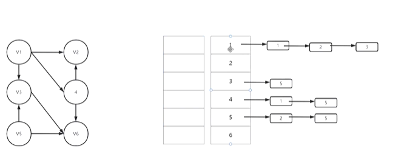

## 拓扑排序

#### 基础概念

> 有向无环图：有向图且无环
>
> 活动：在一个表示工程的有向图中，顶点表示活动，边表示活动之间的优先级关系
>
> AOV网：描述“顶点表示活动，边表示活动之间的优先级关系”的图
>
> 拓扑序列：一个具有n个顶点的有向图，只要满足vi到vj有路径且vi在vj之前，则称之为拓扑序列
>
> 拓扑排序：从有向图中每次选出一个没有前驱的结点，输出（放入序列中），并删除有关的弧

#### 步骤

> 需要一个图，使用邻接表来存储，附带一个矩阵来存储每个结点的入度（如图）



> 为了减少循环次数，使用栈来辅助决策
>
> 每次循环，都先把入度为0的结点入栈，在一个一个出栈过程中更新其余结点的入度，更新过程中出现了入度为0的结点就入栈

#### 代码实现

```c
#include<stdio.h>
#include<stdlib.h>
#define OK 1
#define ERROR 0
#define MVNum 100
typedef int Status;
typedef char VerTexType;
typedef char OtherInfo;

//创建栈 
typedef struct StackNode {
	int data;
	struct StackNode* next;
}StackNode, * StackList;
//出栈函数 
StackList Pop(StackList S, int* e)
{
	StackList p;
	p = S;
	if (!p)
		return ERROR;
	*e = p->data;
	S = S->next;
	free(p);
	return S;
}
//入栈函数： 
StackList Push(StackList S, int e)
{
	StackList p;
	p = (StackNode*)malloc(sizeof(StackNode));
	p->data = e;
	p->next = S;
	S = p;
	return S;
}

//边结点 
typedef struct ArcNode {    //链表结点
	int adjvex;           //邻接表创建无向网的实现
	struct ArcNode* nextarc;    //指向下一条边的指针
	OtherInfo info;       //和边相关的信息
}ArcNode;

//顶点信息 
typedef struct VNode {   //头结点
	VerTexType data;   //顶点信息
	ArcNode* firstarc;//指向第一条依附该顶点的边的指针
}VNode, AdjList[MVNum];//AdjList 表示邻接表类型

typedef struct {
	AdjList vertices;     //邻接表头结点数组
	int vexnum, arcnum;   //图的顶点数和弧数
}ALGraph;


int indegree[100] = { 0 };//结点入度的个数
//这里大家自行解决入度的问题 你可以创建图的时候直接创建相对应的数组

void TopoSort(ALGraph G, int* topo)
{
	StackList S = NULL;
	ArcNode* p;
	//先检查所有入度为0的结点并且入栈
	for (int i = 0; i < G.vexnum; i++)
	{
		if (!indegree[i]) {
			S = Push(S, i);
		}
	}
	int m = 0;//记录拓扑序列的个数 
	int index = 0;
	while (S)
	{
		S = Pop(S, &index);
		topo[m] = index;
		m++;
		while (p != NULL)
		{
			int k = p->adjvex;
			indegree[k]--;
			if (indegree[k] == 0)
			{
				S = Push(S, k);
			}
			p = p->nextarc;
		}
	}
	topo[m] = -1;
	if (m < G.vexnum)
	{
		//有环
	}
	else
	{
		//输出拓扑序列
	}
}

```

