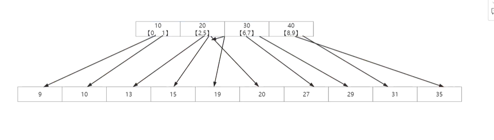
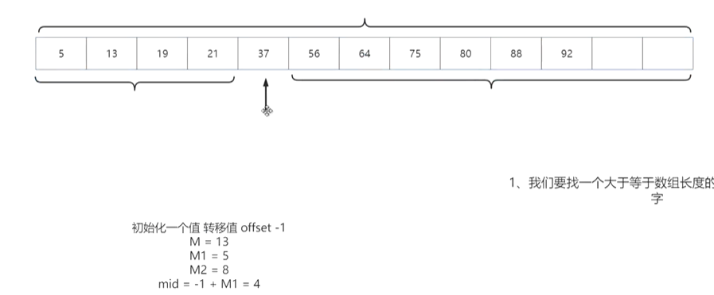

## 查找（3+3）

#### 基本概念

> 静态查找：数据无需改动，只需查找
>
> 动态查找：对查找的数据需要进行频繁的改动

> 内查找：内存中进行的查找
>
> 外查找：外存中进行的查找

> 平均查找长度：平均查找的次数ASL=cigma(Pi*Ci)

> 分类：
>
> 顺序查找
>
> 区间查找

### 基础查找

#### 顺序查找

> 一一比较（数据无序）

#### 二分查找

> 有序数据，区间划分

```c
#include<stdio.h>
#include<stdlib.h>

int binarySearch(int a[], int n, int key)
{
    int low=0;
    int high=n-1;
    while(low<=high)
    {
        int mid = (low+high)/2;
        int midValue = a[mid];
        if(midValue < key)
        {
            low = mid+1;
        }
        else if(midValue > key)
        {
            high = mid-1;
		}
        else
            return mid;
    }
}
```

**注意：二分查找的区间与while条件有很大的细节问题**（此处采用双闭区间）

[动图理解二分搜索的实现细节 - 知乎 (zhihu.com)](https://zhuanlan.zhihu.com/p/139579615#:~:text=通过上面二分搜索的几种实现，我们总结了几个值得注意的细节。 一，右区间的开闭，也就是右指针的赋值 right %3D nums.length 决定了 while 循环里,(规律一)。 二，nums [mid].value %3D%3D target 的实现 决定了方法最后的返回值 (规律二)。)

#### 分块查找

>索引存储结构：存储数据的同时附加一个索引表-键（关键字 唯一标识）值（地址）对

>索引顺序查找

>基本思想：将查找的表分成若干的子块，块内的元素可以无序，第一个块中的最大关键字小于第二个块中的所有记录的关键字，索引表室有序的

**案例**



> 将需要查找的数组以某个规则分块，再建立一个对应的索引表进行查找

```c
#include<stdio.h>
#include<stdlib.h>

struct index
{
    int key;		//索引值
    int start;		//开始下标。注：结束下标是下一个开始下标-1
}newIndex[3];		//定义结构体数组

int search(int key, int a[])
{
    int i=0;
    while(i<3 && key > newIndex[i].key)
        i++;			//找到待查找关键字所在范围
    if(i>=3)
        return -1;		//数组中不存在这个值
    int startValue = newIndex[i].start;
    while(startValue <= newIndex[i+1].start-1 && a[startValue] != key)
        startValue++;
    if(startValue>newIndex[i+1].start-1)
        return -1;
    return a[startValue];
}
//数组已排好序才能分块
```


### 经典查找

#### 跳越查找

>有序数据
>
>固定步长地跳越（跳过尽可能多的不在待查找数据边上的数据）
>
>与二分相比，只需回溯一次

#### 斐波那契查找

> 是对二分的改进

> 使用黄金分割0.618
>
> 根据斐波那契数列f(k)=f(k-1)+f(k-2)

> 步骤
>
> 找一个大于等于数组长度的最小斐波那契数字
>
> 将数组分成两部分，前半是斐波那契的前半数字，后半是斐波那契的后半数字

**案例**

> 1.根据数组长度找到M=13
>
> 2.由斐波那契数列给出两个部分的区间下标
>
> 3.设定初始offset值（后续查找数据在区间2offset = mid / 区间1不更新）
>
> 3.mid = M1+offset
>
> 4.没找到则更新M、M1、M2、offset



#### 插值查找

>适用于数据**均匀分布**的有序数组
>
>与二分查找类似
>
>公式：mid = low + ( (x - arr[low]) / (arr[high] - arr[low]) ) (high - low)

**如果数据不均匀，会整体退化为n**

