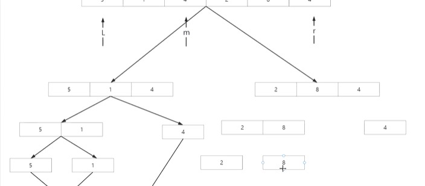
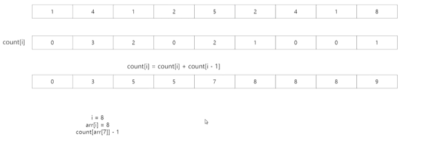
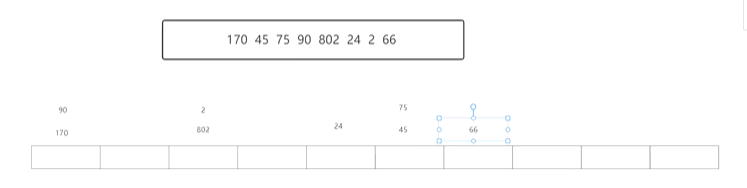
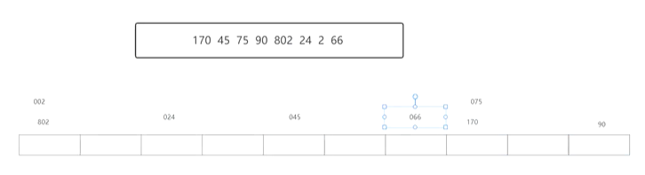
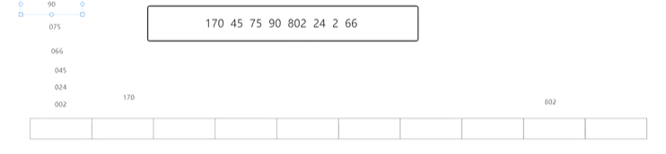

## 归并排序、计数排序、桶排序、基数排序

#### 归并排序（分治思想）

> 递归，将数组拆分成子数组，不断递下去直到拆分成1的数组，再归时排序

**时间复杂度**

> 时间：排序时间+合并时间
>
> 空间复杂度：O(n)
>
> 空间换时间



**稳定性**

稳定，不破坏原有的排序规则

```c
#include<stdio.h>
#include<stdlib.h>

void merge_sort(int arr[], int first, int last)
{
    int mid= 0;
    if(first<last)
    {
        mid = (first+last)/2;
        //分下标
        merge_sort(arr,first,mid);
        merge_sort(arr,mid+1,last);
        //对于分开的元素做处理
        merge(arr,first,mid,last);
    }
}

void merge(int arr[], int first, int mid, int last)
{
    int k=0;
    int *temp=(int *)malloc((high-low+1)*sizeof(int));
    //申请空间用来存放之后排序的内容
    int left_low = low;
    int left_high = mid;
    int right_low = mid+1;
    int right_high = high;
    //记录左右的头尾
    for(int i=0;left_low<=left_high && right_low<=right_high;i++)
    {
        if(arr[left_low]<=arr[right_low])
            temp[i]=arr[left_low++];	//排序并存入数组
        else
            temp[i]=arr[right_low++];
        k++;
	}
    //三种情况：正好全部跑完、左边结束、右边结束
    if(left_low<=left_high)
    {
        for(int i=left_low;i<left_high;i++)
        {
            temp[k]=arr[i];
		}
    }
    if(right_low<=right_high)
    {
        for(int i=right_low;i<right_high;i++)
        {
            temp[k]=arr[i];
		}
    }
    
    //将新数组的内容放回原数组
    for(int i=0;i<high-low+1;i++)
    {
        arr[low+1] = temp[i++];
    }
    free(temp);
}
```


#### 计数排序

> 针对于特定范围（数据跨度小）内的整数进行排序，不能用于小数
>
> 使用一个新数组（大小为最小值到最大值）统计给定数组中不同元素的数量，再遍历这个数组输出

**时间复杂度**

> 如果待排序数据的范围不明显大于待排序数组的长度，效率高于快排和归并排序，O(n)+k

**稳定性**

不稳定，会破坏原有排序规则

> 优化方案
>
> 1.更新建立的新数组，规则是count[i]=count[i]+count[i-1]，用于存储下标代表的数字在排序之后的位置范围
>
> 2.原数组从后往前遍历，count[arr[i]]-1就是这个arr[i]排序之后的位置，同时count[arr[i]]要减去1，来保证下一个相同的数组的位置范围不重复。



#### 桶排序

> 有若干个桶，将数据尽量均匀地分到桶中
>
> 在桶中进行排序，并合并

**时间复杂度**

遍历数组的时间+对每个桶内的元素排序的时间

**适用场景**

数据跨度不大且范围不大

#### 基数排序（位数）

> 对元素最低有效位到最高有效位逐位排序（先个位，后十位，再百位）

**案例**







**时间复杂度**

O（(n+b)*d）

(n-数组长度)

(b-一个数的基础 十进制b=10)

(k-计算机表示的最大整数)

(d-logbK)

**应用场景**

日期(先日再月最后年)

