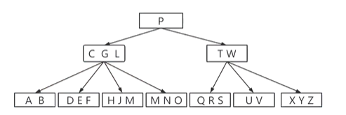
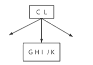
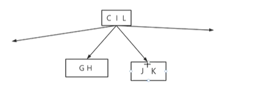

## B树

> 本质是一个多路平衡树
>
> 用处：降低树的高度，将树的高度控制在一个可控的范围里，保持在一个较小的值
>
> 实际用途：数据库索引，磁盘I/O（每一个结点代表一块磁盘）

---

**大致特点**

> 1.每个结点多个数据
>
> 2.多个孩子
>
> 3.高度可控--根据数据总量的大小，指定每一个结点的数据量大小，从而定下高度

#### 特点

> 1.所有的叶子都在同一层，但是不带信息（逻辑模型），在实际实现中，不存在这个结点
>
> 2.每个结点包含的关键字个数有明确的上界和下界（t-1~2t-1），被称为B树的最小的度（一般>=2）
>
> 3.如果一个结点有x个关键字，则有x+1个孩子
>
> 4.每个结点中的关键字是升序排列的，两个关键字之间的孩子的范围是介于这两个关键字之间



#### 操作实现

**插入**

> 跟排序树的插入类似，最终插入到叶子结点
>
> 优点：主动插入，不必回溯

步骤：

1.初始化关键字x在根节点内

2.当x不是叶子结点的时候

​		2.1先找到x的下一个要被访问的孩子结点y

​		2.2如果y不满，将y作为新的探索结点，返回2

​		2.3如果y已经满了，拆分y

3.找到叶子，插入即可

> 因为每个结点有空间上限，如果达到容量上限，拆分这个空间块，操作如下



> 将中间的关键字上移，再分块，如果有孩子结点，则原结点所有孩子结点也跟着被划分成两块



```c++
#include<stdio.h>
#include<stdlib.h>
using namespace std;
#define m 3 //B树的阶
#define NOT_INIT 0	//没有初始化
#define HAVE_INIT 1	//有初始化了
#define TRUE 1
#define FALSE 0
typedef int KeyType;

typedef struct {
	KeyType key;		//关键字的值
	char data;			//关键字所指向的数据实际值
}Record;

typedef struct BTNode {
	KeyType key[m + 1];	//关键字数组 0不用，用于逻辑模型补足
	struct BTNode* ptr[m + 1];//指向孩子的指针
	struct BTNode* parent;	//指向父亲的指针
	int keynum;		//记录当前关键字个数
	Record* recptr[m + 1];		//索引+值，是ptr和key数组的结合形式
}BTNode,*BTree;

typedef struct {
	BTree pt;	//指向查找到的结点
	int i;		//数据关键字的序号
	int tag;	//查找成功或失败的标志
}Result;		//查找的结果集

int status;

//初始化一颗B树
void InitBTreeOpreation(BTree& t)
{
	if (HAVE_INIT == status)
	{
		//说明B树已经创建好了
	}
	t = NULL;
	status = HAVE_INIT;
}
/*
从1至keynum找key，返回下标
*/
int Search(BTree p, KeyType key)	//专门找位序的函数
{
	int i = 1;
	while (i <= p->keynum && key > p->key[i])
		i++;
	return i;
}

void SearchBTree(BTree t, KeyType key, Result& r)	//返回封装好的结果集的函数
{
	int i;
	int found = 0;
	BTree p = t;	//根节点指针
	BTree q = NULL;	//指向父亲结点
	while (p != NULL)
	{
		i = Search(p, key);
		if (i <= p->keynum && p->key[i] == key)
		{
			//查找失败即该关键字已经存在了
			found = 1;
		}
		else//没找到的话，指针下移
		{
			q = p;
			p = p->ptr[i - 1];
		}

		if (found == 1)		//找到了这个关键字
		{
			r.pt = p;		//返回找到的关键字所处的结点
			r.i = i;		//返回找到的关键字所在的序号
			r.tag = 1;		//说明查找失败了
			return;
		}
		
	}

	//没找到关键字，才会执行这个
	{
		r.pt = q;
		r.i = i;
		r.tag = 0;
	}
	return;
}
//生成新的根结点
void newRoot(BTree& t, BTree p, KeyType key,BTree ap)
{
	t = (BTree)malloc(sizeof(BTNode));	//创建了一个根节点
	t->key[1] = key;
	t->ptr[0] = p;
	t->ptr[1] = ap;
	t->keynum = 1;
	if (p != NULL)
	{
		p->parent = t;
	}
	if (ap != NULL)
	{
		ap->parent = t;
	}

	t->parent = NULL;
}

/*
将关键字和新的结点ap分别插入到对应的q->key[i]和q->ptr[i]中
q 插入的目标结点
i 插入的位序
key 待插入的关键字
ap 新节点的指针
*/
void Insert(BTree& q, int i, KeyType key, BTree ap)
{
	for (int j = q->keynum; j >= i; j--)	//数组后移
	{
		q->key[j + 1] = q->key[j];
		q->ptr[j + 1] = q->ptr[j];
	}
	q->key[i] = key;
	q->ptr[i] = ap;
	if (ap != NULL)
	{
		ap->parent = q;

	}
	q->keynum++;

}

//分裂函数
/*
将q结点分裂成两个结点，前一半保留在源节点，另一半移入新节点中
*/
void split(BTree& q, int s, BTree& ap)
{
	ap = (BTree)malloc(sizeof(BTNode));
	ap->ptr[0] = q->ptr[s];
	for (int i = s + 1, int j = 1; i <= q->keynum; i++, j++)
	{
		ap->key[j] = q->key[i];
		ap->ptr[j] = q->ptr[i];
	}
	ap->keynum = q->keynum - s;
	ap->parent = q->parent;
	for (int i = 0; i < ap->keynum; i++)
	{
		if(ap->ptr[i]!=NULL)
			ap->ptr[i]->parent = ap;
	}
	q->keynum = s - 1;
}

//在B树t中q的结点插入相关的关键字
void InsertBtree(BTree& t, KeyType key, BTree q, int i)
{
	BTree ap;
	int finished = FALSE;
	int neednewroot = FALSE;
	if (q == NULL)	//说明树不存在
	{
		//new一个结点,因为此时树没有根，即还未开始
		newRoot(t, NULL, key, NULL);
	}
	else
	{
		ap = NULL;
		//注意:如果只是判断结束，不能确定是否需要创建新的结点来插入，所以需要新的变量neednewroot来判断
		while (finished == FALSE && neednewroot == FALSE)
		{
			Insert(q, i, key, ap);
			//将关键字和ap分别插入到q->key[i]和q->ptr[i]	
			if (q->keynum < m)	//如果q结点的关键字数目符合规则
			{
				//结构正常
				finished = TRUE;
			}
			else
			{
				//否则分裂
				//先找中间位置
				int s = (m + 1) / 2;
				split(q, s, ap);
				//改变关键字
				key = q->key[s];
				//将关键字插入到双亲中
				if (q->parent != NULL)
				{
					q = q->parent;
					i = Search(q, key);

				}
				else
				{
					neednewroot = TRUE;
				}
			}
		}
		if (neednewroot == TRUE)
		{
			newRoot(t, q, key, ap);
		}
	}
	
}

void InsertKey(BTree& t, KeyType key)
{
	Result r;
	//在初始化中定义一个变量 表示状态
	
	if (NOT_INIT == status)
	{
		//没有初始化，需要初始化
	}

	if (t == NULL)
	{
		//代表树存在空间，但内部尚未赋值
	}

	//如果不允许重复，先查找这个值存不存在
	SearchBTree(t, key, r);		//查找这个值存在与否，并检查结果集
	if (r.tag == 1)		//关键字已经存在
	{
		
	}
	else
	{
		//执行插入
		InsertBtree(t, key, r.pt, r.i);
	}
}
```


**删除**

步骤：

1.待删除数据在当前结点x中，并且x是叶子，直接删除

2.待删除数据在当前结点x中，并且x不是叶子

​		2.1如果位于这个结点中的待删除数据之前的第一个孩子y至少有t个（下界+1）关键字，则在y中找到待删除数据的直接前驱，那么删除这个数据，并用这个直接前驱替换。（直接删除可能导致孩子结构发生改变，不符合B树的规则）

​		2.2如果位于这个结点中的待删除数据之前的第一个孩子y正好是t-1个关键字，则检查后一个孩子结点z包含的关键字个数，如果至少有t个关键字，则使用这个后驱替换待删除位置。

​		2.3如果前后孩子结点都正好是t-1个（最少关键字个数）关键字，则合并这两个结点和待删除结点，并递归地对合并结点进行删除关键字操作

3.执行过程中，如果待删除的关键字不在当前的内部结点x里，则能够先确定其必然被包含在子树的根节点x.c中。此时x.c如果也只有最少关键字个数t-1。

​		3.1如果这个x.c和他所有相邻的兄弟结点都只有最少关键字，则合并两个结点与中间夹着的关键字，再将这个结点作为x进行递归。

​		3.2如果这个x.c的左右兄弟包含至少t个关键字，则将x的某个关键字下移到x.c中，再将其兄弟结点的最近关键字上移到x。再删除结点。

```c++
```

