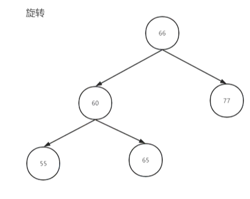
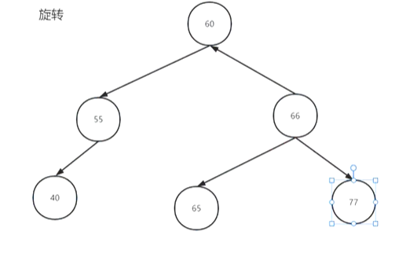

## 二叉平衡树

#### 平衡二叉树

###### 由来：

> 为了防止二叉排序树中斜树的出现，影响查找效率

###### 性质：

> 1.可以是空树

> 2.任一结点的左右子树高度之差<=1

##### 调整失衡操作

> 旋转
>
> 左旋
>
> 步骤：
>
> 1.结点的右孩子代替失衡结点的位置
>
> 2.如果右孩子有左子树，变成失衡结点的右子树
>
> 3.失衡结点本身变成右孩子的左子树
>
> 右旋类似





**注：这是在左子树的左孩子失衡或右子树的右孩子失衡下进行的基础操作。如果出现的情况与之不符，则应先对左子树左旋或右子树右旋，再进行上述基本操作**

> 总结：
>
> LL 单一右旋
>
> RR 单一左旋
>
> LR 先左后右
>
> RL 先右后左


##### 删除操作

> 与二叉排序树一致
>
> 唯一问题在于删除后是否平衡

```c
#include<stdio.h>
#include<stdlib.h>
#define HEIGHT(node) (node==NULL)?0:((avlnode*)(node)->height)
#define MAX(a,b) ((a)>(b)?(a):(b))
typedef struct Node {
    int key;
    struct Node* left;
    struct Node* right;
    int height;
}avlnode, * avltree;

avltree left_left_rotation(avltree tree)
{
    avlnode* k2 = tree->left;
    tree->left = k2->right;
    k2->right = tree;
    //注：旋转操作改变了树的高度
    tree->height = MAX(getNode_height(tree->left), getNode_height(tree->right)) + 1;
    k2->height = MAX(getNode_height(tree->left), getNode_height(tree->right)) + 1;
    return k2;
}

avltree right_right_rotation(avltree tree)
{
    avlnode* k2 = tree->right;
    tree->right = k2->left;
    k2->left = tree;
    //注：旋转操作改变了树的高度
    //底层的高度是没有变化的，而顶层的失衡结点和替代结点高度发生了变化
    tree->height = MAX(getNode_height(tree->left), getNode_height(tree->right)) + 1;
    k2->height = MAX(getNode_height(tree->left), getNode_height(tree->right)) + 1;
    return k2;
}

avltree left_right_rotation(avltree tree)
{
    tree->left = right_right_rotation(tree->left);
    tree = left_left_rotation(tree);
    //在调用的函数中树的高度已经调整，此处就无需调整
    return tree;
}

avltree right_left_rotation(avltree tree)
{
    tree->right = left_left_rotation(tree->right);
    tree = right_right_rotation(tree);
    //在调用的函数中树的高度已经调整，此处就无需调整
    return tree;
}

//插入结点
avltree insert(avltree tree, int key)
{
    if (tree == NULL)//找到可以插入的位置了
    {
        avlnode* node = create_node(key, NULL, NULL);
        tree = node;
    }
    else if (key < tree->key)//左子树中插入结点
    {
        tree->left = insert(tree->left, key);//递归查找应该插入的位置
        if (HEIGHT(tree->left) - HEIGHT(tree->right) == 2)//从最底层开始判断是否失衡（递归层层向上判断）
            //注：大前提是左插，所以只可能左边的高度大于右边高度引起的失衡
        {
            if (key < tree->left->key)//如果当前树的左子树的key小于插入值
            {
                tree = left_left_rotation(tree);
                //说明当前树是左左型失衡，使用左左旋调整，同时将当前最顶端的结点赋值给树，在最后返回
            }
            else
            {
                tree = left_right_rotation(tree);
                //说明当前树是左右型失衡，使用左右旋调整，同时将当前最顶端的结点赋值给树，在最后返回
            }
        }
    }
    else//在右子树中插入结点
    {
        tree->right = insert(tree->right, key);//递归查找应该插入的位置
        if (HEIGHT(tree->right) - HEIGHT(tree->left) == 2)//从最底层开始判断是否失衡（递归层层向上判断）
            //注：大前提是右插，所以只可能右边的高度大于左边高度引起的失衡
        {
            if (key < tree->right->key)//如果当前树的右子树的key小于插入值
            {
                tree = right_left_rotation(tree);
                //说明当前树是右左型失衡，使用右左旋调整
            }
            else
            {
                tree = right_right_rotation(tree);
                //说明当前树是右右型失衡，使用右右旋调整
            }
        }
    }

    //重新调整二叉树的深度
    tree->height = MAX(getNode_height(tree->left), getNode_height(tree->right)) + 1;

    return tree;
}

//创建新节点
avlnode* create_node(int key, avlnode* left, avlnode* right)
{
    avlnode* node = (avlnode*)malloc(sizeof(avlnode));
    node->key = key;
    node->left = left;
    node->right = right;
    node->height = 0;
    return node;
}

//计算当前树的高度
int getNode_height(avlnode* node)
{
    return HEIGHT(node);
}

avlnode* search_node(avltree tree, int key)
{
    if (tree == NULL || key == tree->key)
    {
        return tree;
    }
    else if (key < tree->key)
    {
        search_node(tree->left, key);
    }
    else
    {
        search_node(tree->right, key);
    }
}

avlnode* minimun(avltree tree)
{
    if (tree == NULL)
    {
        return NULL;
    }
    else
    {
        while (tree->right)
        {
            tree = tree->right;
        }
    }
    return tree;
}

avlnode* avltree_deleteNode(avltree tree, int key)
{
    avlnode* node = search_node(tree, key);
    if (node == NULL || tree == NULL)//如果node定位结果NULL
    {
        return tree;
    }
    else//node定位到了
    {
        if (key < tree->key)//删除的结点在当前树的左子树
        {
            tree->left = avltree_deleteNode(tree->left, key);
            
            //检查高度的代码,因为删除的是左子树上的结点，所以右子树可能比左子树高，所以使用右减左
            if (HEIGHT(tree->right) - HEIGHT(tree->left) == 2)//从最底层开始判断是否失衡（递归层层向上判断）
            {                                                 
                if (tree->right->left)//当前结点的右结点的左结点是否存在
                {//存在
                    tree = right_left_rotation(tree);
                    //说明当前树是右左型失衡，使用右左旋调整
                }
                else//不存在
                {
                    tree = right_right_rotation(tree);
                    //说明当前树是右右型失衡，使用右右旋调整
                }
            }
        }
        else if(key > tree->key)//删除的结点在右子树
        {
            tree->right = avltree_deleteNode(tree->right, key);
            if (HEIGHT(tree->left) - HEIGHT(tree->right) == 2)//从最底层开始判断是否失衡（递归层层向上判断）
            {
                if (key < tree->left->key)
                {
                    tree = left_left_rotation(tree);
                    //说明当前树是左左型失衡，使用左左旋调整
                }
                else
                {
                    tree = left_right_rotation(tree);
                    //说明当前树是左右型失衡，使用左右旋调整
                }
            }
        }
        else//待删除的结点就是当前树，即递归定位到了当前树==删除结点
        {
            if (tree->left && tree->right)//左右都不为NULL
            {
                avlnode* min_node = minimun(tree->left);//找到适合取代该结点的结点
                tree->key = min_node->key;//把找到的值放入当前结点
                tree->left = avltree_deleteNode(tree->left, min_node->key);
                
            }
            else//左右至少有一个NULL
            {
                tree = (tree->left ? tree->left : tree->right);
                //独子或无子
            }
        }

        if (tree)//整理高度
        {
            tree->height = MAX(getNode_height(tree->left), getNode_height(tree->right)) + 1;
        }
    }

    return tree;
}
```

注：递归这样理解：

在这个树中，如果结点一下子看不到，就深入一层，直到找到，在当前这个局部树中删除这个结点并消除影响
