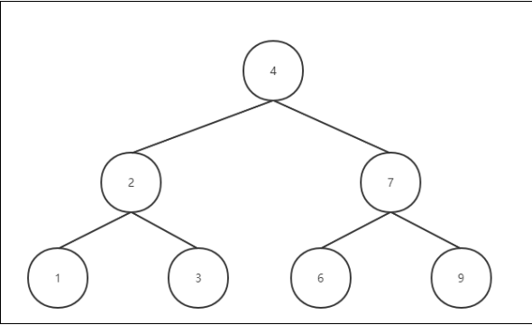
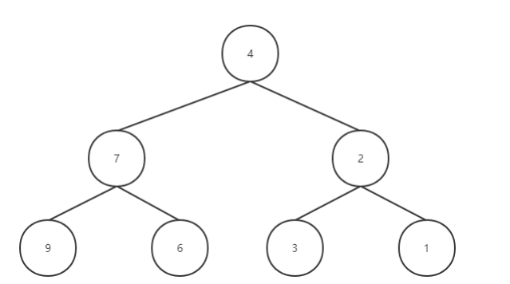

## 9-1作业

**第一题：部族**

上古之时，一场灾劫席卷大地。不周山天柱倾塌，天穹皲裂，霪雨无止，大水浩洋不息。神农至

西北一处天裂，以神树矩木为基，兴建流月城。于此指引众神，以灵力炼制五色石，交由女娲补天。补

天之事耗时弥久，人界黎氓死伤惨重。

补天进展艰难，各人类部族不忍生灵涂炭，自请入流月城相助。神农感其赤诚，欣然应允，于是

将一滴神血封入矩木。使其蕴含的生命之力通过矩木枝叶发散，以供各部族人不饮不食而活。

灾劫过后，神农欲奖赏各部人类，然流月城过于混杂，需将各部族人民分类统一。

**规定**

需要你帮忙划分部族人民。如果x和y是同一部族，y和z是同一部族，那么x和z也是同一部族。

如果x和y是同一部族，那么和x同一部族的也和y是同一部族，和y同一部族的也都和x是同一部

族。

**输入格式**

> 第一行：三个整数x，y，z。分别表示有x个人，y个关系，询问z对是否是同一部族。

> 接下来y行，每行两个数 yi，yj。1<= yi,yj <= N,表示yi,yj具有亲戚关系

> 接下来z行，每行两个数Zi,Zj，询问Zi和Zj是否是同一部族的。

**输出格式**

> z行，每行一个yes或者No，表示第X个询问是或者不是同一部族。

```c
#include<stdio.h>
#include<stdlib.h>

int main()
{
    int x, y, z;
    int yi, yj;
    int zi, zj;
    scanf("%d%d%d", &x, &y, &z);
    int* uset = (int*)malloc(sizeof(int) * x);  //分配内存

    for (int i = 0; i < x; i++)                 //初始化
    {
        uset[i] = i;
    }

    for (int i = 0; i < y; i++)                 //关系建立
    {
        scanf("%d%d", &yi, &yj);
        while (uset[yi] != yi)           //找到代表
        {
            yi = uset[yi];
        }
        while (uset[yj] != yj)           //找到代表
        {
            yj = uset[yj];
        }
        uset[yi] = yj;                  //yi的代表为yj
    }

    for (int i = 0; i < z; i++)         //关系查询
    {
        scanf("%d%d", &zi, &zj);
        while (uset[zi] != zi)          //找到zi的代表
        {
            zi = uset[zi];
        }
        while (uset[zj] != zj)          //找到zj的代表
        {
            zi = uset[zj];
        }

        if (zi == zj)                   //看是否在同一集合中
        {
            printf("yes\n");
        }
        else
        {
            printf("no\n");
        }
    }

    free(uset);         //释放内存
}
```

**第二题：谷歌面试**

在谷歌的一次面试中， Homebrew的作者Max Howell,就是因为没在白板上写出翻转二叉树,最

后被Google拒绝了。我们已经学完二叉树了，我们可以将二叉树翻转一下么？

**输入格式**



**输出格式**



```c
#include<stdio.h>
#include<stdlib.h>

typedef struct TreeNode {
    int data;
    struct TreeNode* left;
    struct TreeNode* right;
}node;

void creatTree(node* root);
void turn_Tree(node* root);

int main()
{
    node* root;
    creatTree(&root);
    turn_Tree(&root);

}

void creatTree(node* root)
{
    int data;
    node* temp = root, *temp_pre;
    scanf("%d", &data);
    while (data != -1)
    {
        while (temp != NULL)
        {
            temp_pre = temp;
            if (temp->data > data)
            {
                temp = temp->left;
            }
            else
            {
                temp = temp->right;
            }
        }

        if (data > temp_pre->data)
        {
            temp_pre->right = (node*)malloc(sizeof(node));
            temp_pre->right->data = data;
        }
        else
        {
            temp_pre->left = (node*)malloc(sizeof(node));
            temp_pre->left->data = data;
        }
        
        scanf("%d", &data);
    }


}

void turn_Tree(node* root)
{
    node* temp;
    if (temp->left == NULL && temp->right == NULL)
    {
        return;
    }

    temp = root->left;
    root->left = root->right;
    root->right = temp;
	
    if(root->left!=NULL)
    turn_Tree(root->left);
    if(root->right!=NULL)
    turn_Tree(root->right);
}
```

**第三题：验证二叉排序树**

我们已经学过二叉树的数组表示和链表表示了。那么现在，给你一个数组表示的二叉树结构，让你去判断一下这个结构是不是二叉排序树。

> 比如：

> 输入：tree=[5,1,4,null,null,3,6]

> 输出：false

```c
//思路：根据数组中二叉树父子之间结点的关系来判断

```

**第四题：兽族入侵**

兽人的故乡叫德拉诺大陆，生活在这个星球上的兽人、鸦人、食人魔都有着自己的文明，从德莱尼人来到德拉诺的那天起也预示了这个这个星球，这个种族的命运；德莱尼人来自阿古斯星球，属于阿古斯的难民，自从萨格拉斯蛊惑了基尔加丹和阿克蒙德后，维纶带领部分族人逃难来到了德拉诺，虽然来了新的邻居，但是兽人和德莱尼人并没有发生什么大规模的冲突，大家都相安无事的生活在这里！后来由于种种原因，，德拉诺的生存环境越来越差，几乎无法再维持生存！于是基尔加丹把艾泽拉斯呈现给了古尔丹，让古尔丹和被萨格拉斯附体的麦迪文取得了联系，双方共同建造了黑暗之门，黑暗之门将艾泽拉斯和德拉诺联系在一起，让兽人可以穿过黑暗之门来到艾泽拉斯。引发了第一次兽人大战！

为了防止战争的延续，我们首先需要判断哪些世界是直接相连的，哪些世界是不直接相连的。

**规定：**

> 给你一个 n x n 的矩阵 isConnected ，其中 isConnected [i] [j] = 1 表示第 i 个世界和第 j 个世界直接相连，而 isConnected[i] [j] = 0 表示二者不直接相连。

**第五题：打劫**

一伙人找到了一个可行窃的新的地区进行打家劫舍，这伙人发现，这个地区只有一个可以进去的入口，除了这个入口以外，每栋房子只有一个“父”房子与之连接。在一番侦查之后，这伙人意识到整个地区的房屋排列类似于一颗二叉树。这些房屋有自动报警的能力。 如果两个直接相连的房子在同一天晚上被打劫，就会触发警报。

这时候我们要计算，在不触发警报的前提下，这伙人能够有多少的收入。

> 入: [3,2,3,null,3,null,1]

> 3

> / \

> 2 3

> \ \ 

> 3 1

> 输出: 7 

> 解释: 小偷一晚能够盗取的最高金额 = 3 + 3 + 1 = 7.