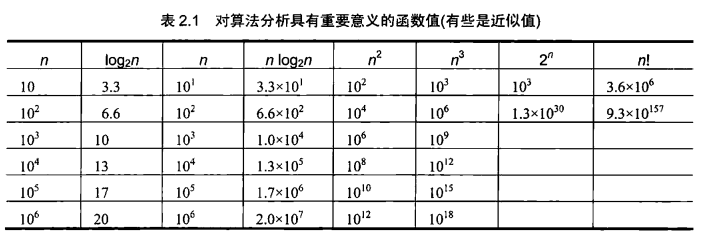
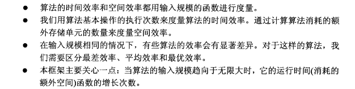

## 分析框架

#### 2.1.1输入规模的度量

> 几乎所有的算法对于规模更大的输入都需要运行更长的时间。所有在研究算法效率的时候，把它作为一个算法输入规模n为参数的函数。

#### 2.1.2运行时间的度量单位

> 对于算法运行时间的度量单位，尽管可以采用时间的标准单位来衡量，但这种方式往往取决于硬件与其它一些问题，因此不采用。我们也可以统计每一步消耗的时间，但这没有必要。我们关注的是一个算法中对总时间贡献最大的，最重要的操作，并计算运行次数。

**公式**

T(n)=copC(n)

> cop是一个常数，C(n)是执行次数，这个结果往往是一个近似值

#### 2.1.3增长次数

> 对于小规模输入而言，无需区分算法之间的效率区别。对于n较大时，有意义的是函数的增长次数。

> 如果一个算法具有对数级增长次数，我们可以认为它对于任何实际规模的输入几乎都会在瞬间完成。

#### 2.1.4算法的最优、最差和平均效率

##### 最坏

> 一个算法的最差效率是指当输入规模为n时算法在最坏情况下的效率。

**确定方法**

> 在算法的所有可能输入中，哪种类型的输入会导致基本操作数次数达到最大，再计算这个最差值Cworst(n).

##### 最优

> 指当输入规模为n时，算法在最优情况下的效率。

**确定方法**

> 在算法可能的规模为n的输入中，找到输入对应最小C(n)值

##### 平均效率

> 在随机输入的情况下，一个算法具有怎样的行为。

### 总结

