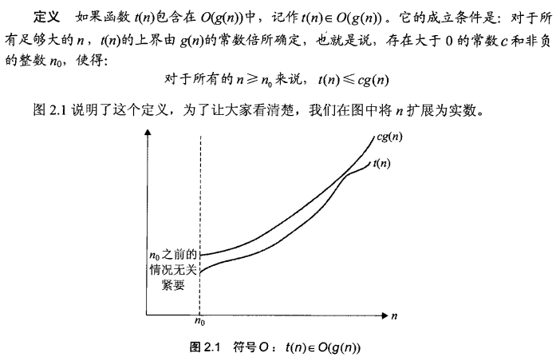
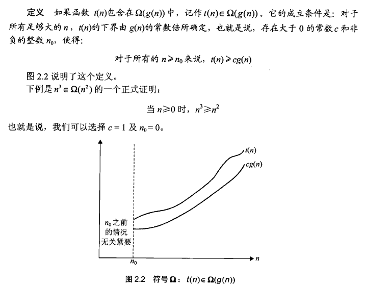
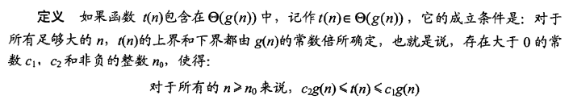
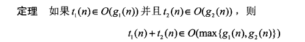
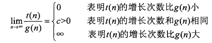
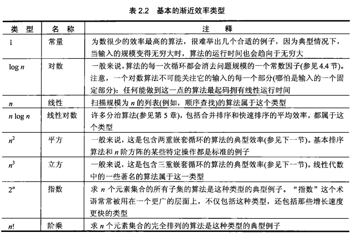

## 渐进符号和基本效率类型

> 在n趋近于无穷的情况下：
>
> O(g(n))表示增长次数小于等于cg(n)的函数集合
>
> omega(g(n))表示增长次数大于等于cg(n)的函数集合
>
> theta(g(n))表示增长次数等于cg(n)的函数集合

#### 2.2.2符号O

#### 2.2.3符号omega

#### 2.2.4符号theta

#### 2.2.5渐进符号的有用特性

> 这意味着在同一算法时间函数中，效率取决于最高次项。在两个连续算法中，总效率取决于最慢的那一个。

#### 2.2.6利用极限比较增长次数

> 基于定义比较增长次数虽然更通用，但不简便。因此采用基于极限的比较方法。

#### 2.2.7基本的效率类型

> 大多数算法可以分成为数不多的几种类型。

