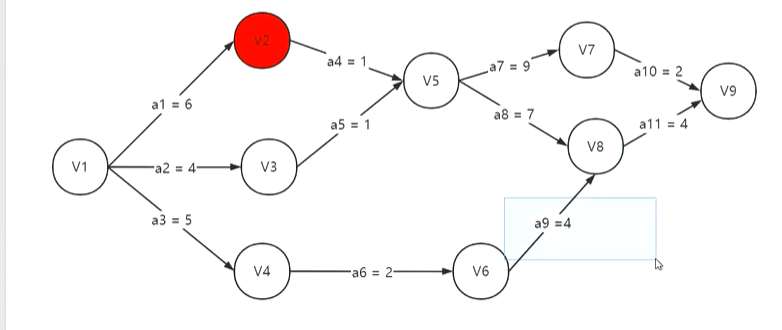
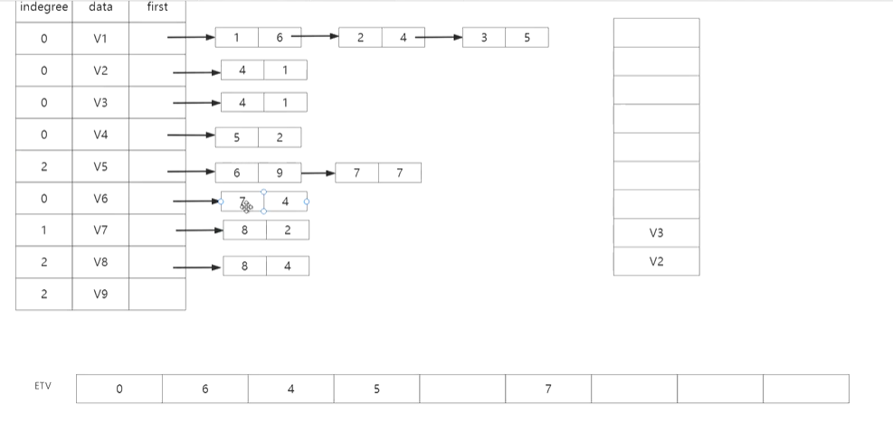

## 关键路径算法（运用拓扑排序）

#### 概念

> AOV网：顶点表示活动
>
> AOE网：边来表示活动（带权有向无环图）顶点代表事件，权值表示活动持续的时间
>
> AOE网常常应用于工程，所以有一个开始和结束的顶点（源点和汇点）（入度/出度为0）



> 关键路径：从源点到汇点路径最长的路径（活动的集合，所描述的是时间）
>
> 例如：西天取经要等到唐僧到西天才能结束
>
> 1.事件最早发生时间ETV（顶点最早发生时间）：从源点开始计算至当前事件所需时间权值之和的最小值
>
> 2.事件最晚发生时间：从如果超出这个时间，就会耽误整个工期。（关键路径时间权值之和）-（从汇点回溯到当前事件所需时间权值之和）
>
> **注：**如果“事件最早发生时间”=“事件最晚发生时间”，则该事件是关键路径上的事件结点
>
> 3.活动的最早开工时间：与前端事件最早发生时间一致
>
> 4.活动的最晚开工时间：=后端事件的最晚发生时间-活动所需时间

#### 实现思路——运用拓扑排序

> 建立一个邻接表来表示图
>
> 建立关键路径上的ETV数组（初始化为0）
>
> 建立关键路径上的LTV数组（初始化为汇点总时间）
>
> 建立栈（入度为0的入栈，同时以该结点为入度的结点入度-1）



> 从源点（入度为0）入栈开始
>
> 进行拓扑排序
>
> （增加步骤：在结点入栈时计算对应结点ETV）
>
> （增加步骤：在结点出栈时再进入另一个栈，直至栈满）
>
> ETV数组由此计算出关键路径所需的总时间（即汇点所对应的值），中间结点只是承接来辅助计算
>
> 在结点再次入栈后，进行出栈操作，出栈时遍历该结点的下一个结点，根据下一个结点的ETV-权值得到当前结点的LTV

> 计算ETE和LTE数组：
>
> ETE=ETV
>
> LTE=活动下一个事件的LTE-活动权值

> 如果ETE=LTE，则是关键路径

#### 代码实现

```c
#include<stdio.h>
#include<stdlib.h>
#define OK 1
#define ERROR 0
#define MVNum 100
typedef int Status;
typedef char VerTexType;
typedef char OtherInfo;

//创建栈 
typedef struct StackNode {
	int data;
	struct StackNode* next;
}StackNode, * StackList;
//出栈函数 
StackList Pop(StackList S, int* e)
{
	StackList p;
	p = S;
	if (!p)
		return ERROR;
	*e = p->data;
	S = S->next;
	free(p);
	return S;
}
//入栈函数： 
StackList Push(StackList S, int e)
{
	StackList p;
	p = (StackNode*)malloc(sizeof(StackNode));
	p->data = e;
	p->next = S;
	S = p;
	return S;
}

//边结点 
typedef struct ArcNode {    //链表结点
	int adjvex;           //邻接表创建无向网的实现
	struct ArcNode* nextarc;    //指向下一条边的指针
	OtherInfo info;       //和边相关的信息
}ArcNode;

//顶点信息 
typedef struct VNode {   //头结点
	VerTexType data;   //顶点信息
	ArcNode* firstarc;//指向第一条依附该顶点的边的指针
}VNode, AdjList[MVNum];//AdjList 表示邻接表类型

typedef struct {
	AdjList vertices;     //邻接表头结点数组
	int vexnum, arcnum;   //图的顶点数和弧数
}ALGraph;


int indegree[100] = { 0 };//结点入度的个数
//这里大家自行解决入度的问题 你可以创建图的时候直接创建相对应的数组

int TopoSort(ALGraph G, int* topo,int *etv)
{
	StackList S = NULL;
	ArcNode* p;
	//先检查所有入度为0的结点并且入栈
	for (int i = 0; i < G.vexnum; i++)
	{
		if (!indegree[i]) {
			S = Push(S, i);
		}
	}
	int m = 0;//记录拓扑序列的个数 
	for (int i = 0; i < G.vexnum; i++)
	{
		etv[i] = 0;
	}
	int index = 0;
	while (S)
	{
		S = Pop(S, &index);
		//紧接着跟一个进栈
		topo[m] = index;
		m++;
		while (p != NULL)
		{
			int k = p->adjvex;
			indegree[k]--;
			if (indegree[k] == 0)
			{
				S = Push(S, k);
			}
			//求事件的最早发生时间
			if (etv[index] + (p->info) > etv[k])
			{
				etv[k] = etv[index] + (p->info);
			}
			p = p->nextarc;
		}
	}
	topo[m] = -1;
	if (m < G.vexnum)
	{
		//有环
		return 0;
	}
	else
	{
		//输出拓扑序列
		return 1;
	}
}


void CriticalPath(ALGraph G, int* etv, int* ltv)
{
	int ete, lte;//活动的最早和最晚
	ArcNode* p;
	int topo[99] = { 0 };
	if (TopoSort(G,topo,etv))
	{
		for (int i = 0; i < G.vexnum; i++)
		{
			ltv[i] = etv[G.vexnum - 1];//初始化ltv
		}
	}
	int count = G.vexnum;
	while (count)
	{
		int gettopo = topo[--count];//将拓扑序列从后往前拿出来
		for (p = G.vertices[gettopo].firstarc; p ;p = p->nextarc)
		{
			int k = p->adjvex;
			if (ltv[k] - (p->info) < ltv[gettopo])
			{
				ltv[gettopo] = ltv[k] - (p->info);//求事件的最晚
			}
		}
	}
	//求活动的最早和最晚
	for (int i = 0; i < G.vexnum; i++)
	{
		for (p = G.vertices[i].firstarc; p; p = p->nextarc)
		{
			int k = p->adjvex;
			ete = etv[i];
			lte = ltv[k] - p->info;
			if (ete == lte)
			{
				//输出相对应的点和边 加入到最短路径当中
			}
		}
	}
}

int main() 
{
	int[n] a;
	int count = 0;//下标
}

void insert(int val)
{
	//摊还分析
	//每进行一次O(n)的操作 都会跟着N-1次的O(1)
	//O(1)
	if (count == a.length)
	{
		int sum = 0;
		for (int  i = 0; i < a.length; i++)
		{
			sum = sum + a[i];
		}
		a[0] = sum;
		count = 1;
	}
	a[count] = val;
	count++;
}

int find(int[] a, int n, int x)
{
	int pos;
	for (int i = 0; i < n; i++)
	{
		if (a[i] == x)
		{
			pos = i;
			break;
		}
	}
	return pos;
}
```

