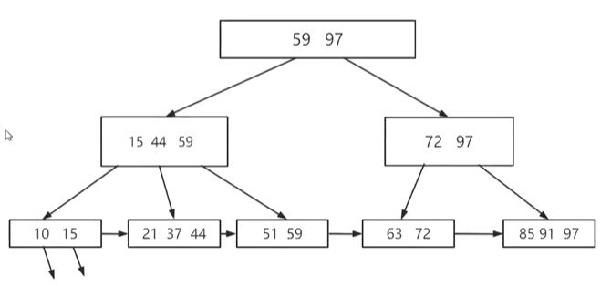

## B+树的逻辑模型

> 内部的所有结点都不存放数据，只存放索引，真实数据都存在叶子结点中，叶子结点指向磁盘中的某个位置。

#### 概念

> 阶：两个阶a，b分别控制叶子节点和内部节点

#### 结构

> 与B树类似，都是值之间夹着指针
>
> 区别在于：
>
> 1.父节点与孩子节点之间：对于一个pi指向的子树x而言，每一个内部节点的孩子最多有a个指向子树的指针，父节点最多存放a个数据。（每个父节点都存放着其所有子节点的最大数据/最小数据）
>
> 2.如果任意一个内部节点包含x个（x<=a）指向孩子节点的指针，则包含x-1个孩子。
>
> 3.每个叶子节点有一个next指针，用于将指向下一个叶子，共同组成一个单链表（便于遍历）。

#### 操作

##### 插入

> 每次从叶子开始插入。
>
> 分为三种情况：
>
> 1.被插入关键字所在的节点中，关键字数目小于阶数，直接插入
>
> 2.被插入关键字所在的节点中，关键字数目等于阶数，先分裂成两个节点，计算两个节点各有几个数据（一般是阶/2向上和下分别取整），上移一个新的最大值，再插入。
>
> 3.如果在2中，双亲结点关键字大于阶数，继续分裂
>
> 4.如果插入的关键字比当前节点的关键字还大，要及时修正索引，再插入。

##### 删除

> 1.如果找到存储关键字的节点，如果关键字个数大于最小值，直接删除
>
> 2.如果删除的是最大/最小关键字，修正双亲的关键字。
>
> 3.如果删除了关键字导致当前节点的关键字个数小于最小值，直接从兄弟节点借，修改兄弟节点的双亲索引。
>
> 4.如果删除了关键字导致当前节点的关键字个数小于最小值，且兄弟节点不够，则合并两个节点：向上删除兄弟节点的最大值，修改当前节点的最大值。