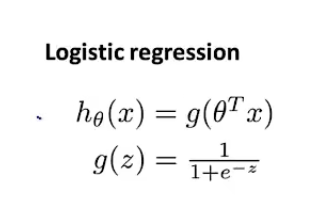
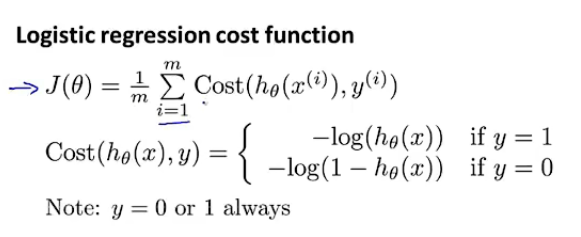
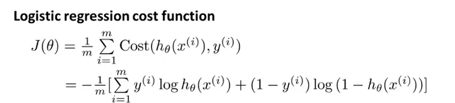

## logistic回归-分类算法

> 为保证回归曲线位于分类问题的值域内，采用传统的线性回归算法很容易超出值域，由此引出logistic回归曲线

##### 实现函数

> 对需要拟合的线性回归曲线进行logistic函数变换

> 然而，针对该函数产生的原有代价函数并不是一个合格的凹函数，因此采用新的代价函数计算方式来达到目的

> 对于这个函数，可以采用一种比较紧凑的方式来去除分段

> 之后，采用梯度下降法来收敛这个函数，得到所有zeta的值

**注：采用特征缩放能更好执行梯度下降**

