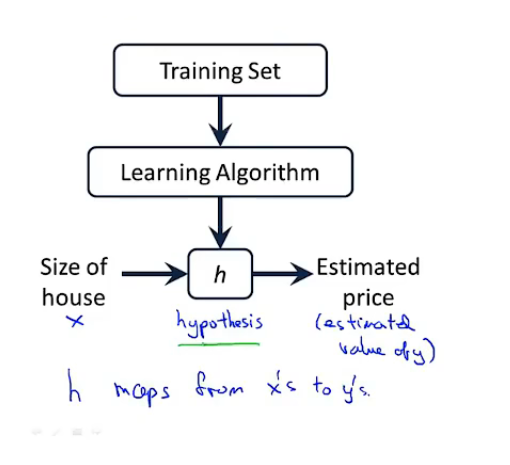
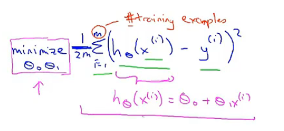
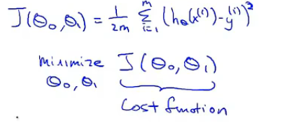
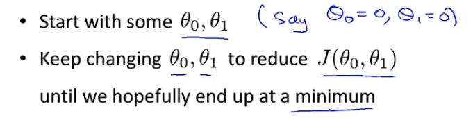
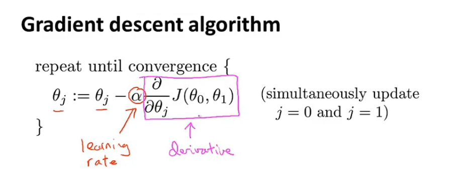
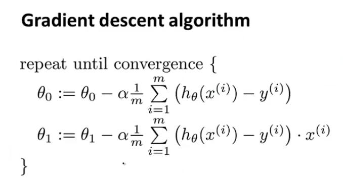

## 模型描述

#### 一些符号

> m	表示训练集的数量
>
> x	输入的值
>
> y	输出的值
>
> (x,y)	一个训练样本
>
> (x(i),y(i))	第i个训练样本

#### 一元函数

##### 最小化问题

> 找出(h(x)-y)^2的最小值

##### 代价函数(平方误差函数)

> 数学定义

##### 梯度下降法

> 步骤

> 数学定义

> a：学习效率（百分比）（本质是每次梯度下降的跨度）
>
> 注：导数随着接近局部最小值减少，从而自动减少步幅

> 这是在求完偏导之后的结果

