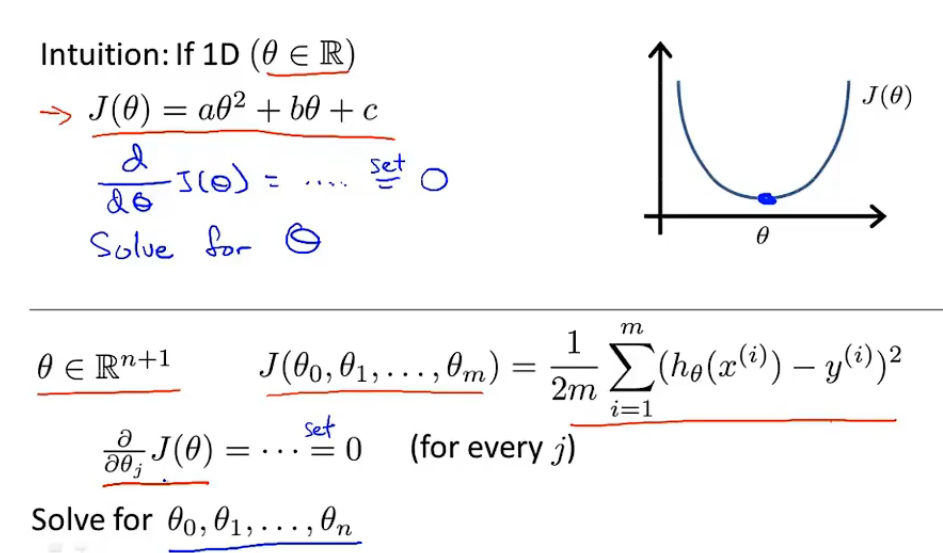
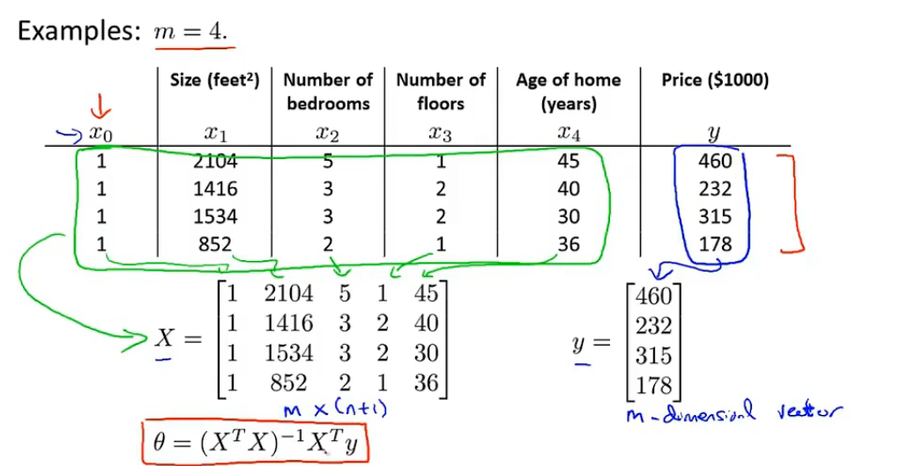

## 正规方程

> 优点：
>
> 无需选择学习率a
>
> 无需多次迭代
>
> 缺点：
>
> 在特征量多的情况下，求解时间随维度的三次方递增（o(n^3)）

#### 原理

> 对于只有一个特征量的方程，代价函数是一个关于zita的二次函数，求解方法是求导后取零。
>
> 对于存在多个特征量的方程，代价函数是一个关于zita向量的二次函数，求解方法是求出偏导后取零。

#### 计算公式

> 使用矩阵公式求解

求解出zita的最优值

即 使其符合代价函数的最小值

#### 有关矩阵不可逆的问题

##### 可能原因：

1.某些特征量之间线性相关（删除一个特征量以解决）

2.特征量太多，超过数据集中记录条数

##### 注：

某些算法允许计算出矩阵的广义逆矩阵的形式，从而正确的进行运算。

