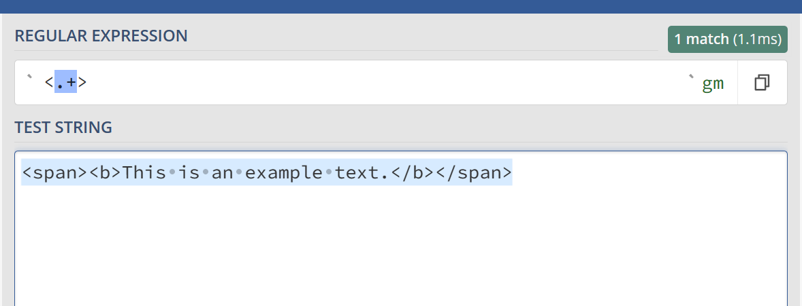
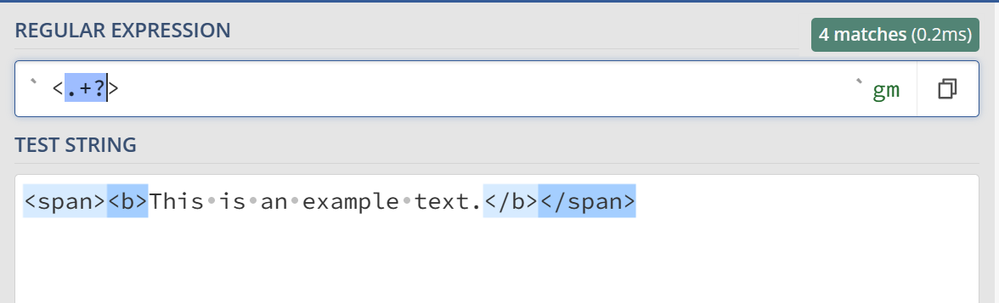

# 04 贪婪与懒惰匹配

## 贪婪匹配

> +{}等会匹配尽可能多的字符

​	对于下面的html，想要正常匹配`<>`内容，可能会出问题：

```html
<span><b>This is an example text.</b></span>
```

​	使用下面的正则表达式：

```regex
<.+>
```

​	匹配结果是将整个句子全部匹配：



## 懒惰匹配

> 使用后缀?来切换为懒惰匹配

```regex
<.+?>
```

