## Cheat Engine自动汇编使用

[TOC]

​	关键字：Cheat Engine;自动汇编;AOB注入;绝对地址注入

### 1.找到要修改的指令

​	使用`find out what writes to this address`，找到修改数据的指令地址。

### 2.打开自动汇编工具

​	选择Tools——Auto Assembly（`Ctrl+A`）

### 3.根据需要选择模板

#### 3.1 AOB（Array Of Bytes）注入

​	AOB注入用于查找类似指令，即`指令码+xxxx+指令码+xxxx...`的格式。用途主要是用于游戏版本迭代后，被修改的指令位置会偏移，但是内容不变，所以用AOB注入可以无视版本迭代进行指令查找和修改。

##### 步骤1 确认唯一指令码

1. 复制该地址的指令（**右击——Copy to ClipBoard——Bytes only**）
2. 在查找里选择**AOB模式**；WriteAble改成**无要求（方块/减号）**，因为指令段的内存属性一般是不可写的。
3. 输入该地址的指令码+数据，查找是否是唯一的。如果不是，则继续添加下一条指令的指令码；重复此步骤，直到找到唯一的搜索结果。
4. 将数据部分改为xx，**保证长度一致**（代表任意数据）。因为版本迭代可能导致数据发生变化，但是操作的指令依旧不变。
5. 再次检查，因为搜索条件放宽了，扫描结果会不唯一，因此需要重新执行步骤3
6. 保存唯一指令码（搜索框中的编码）

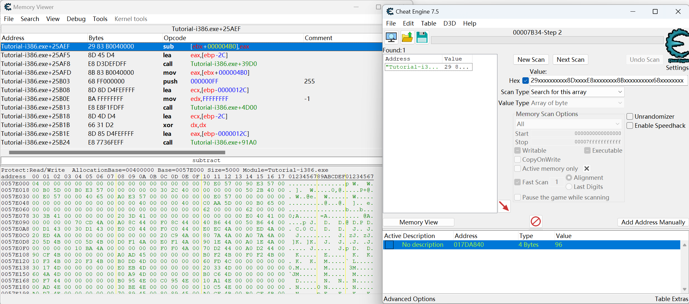

##### 步骤2 使用AOB模板

1. 在自动汇编中选择**AOB模板**
2. 将指令码**覆盖**掉`aobscanmodule`中原来的指令码

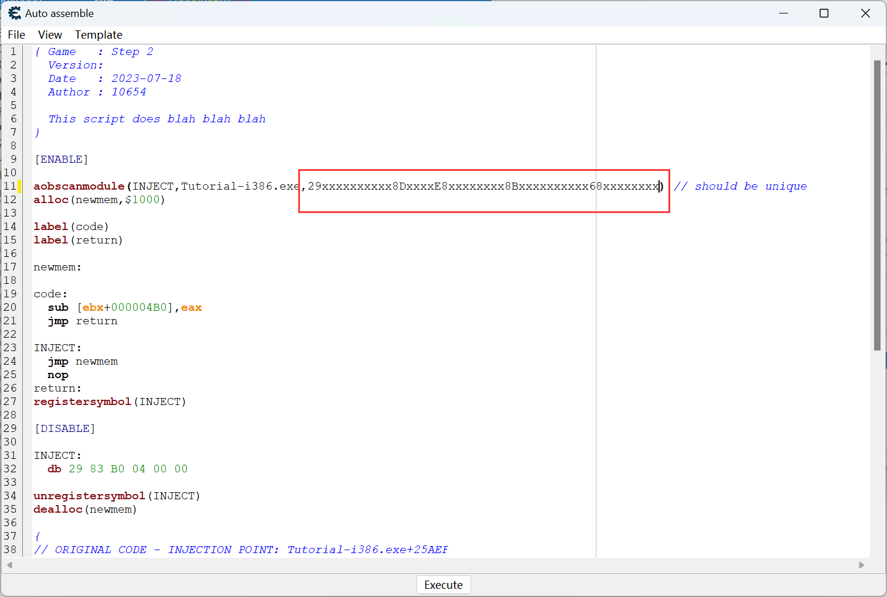

##### 步骤3 将脚本加入CT表

1. 左上角**File——Assign to current cheat table**（此时界面的ct表里就出现了脚本，选择激活时，查找处的代码就会变成`INJECT`标签处的指令：`jmp newmen` `nop`）
2. **关闭脚本窗口**

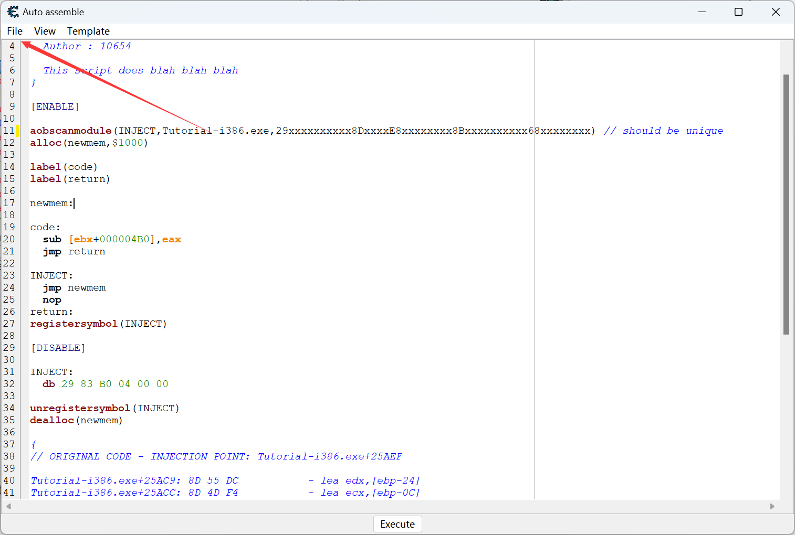

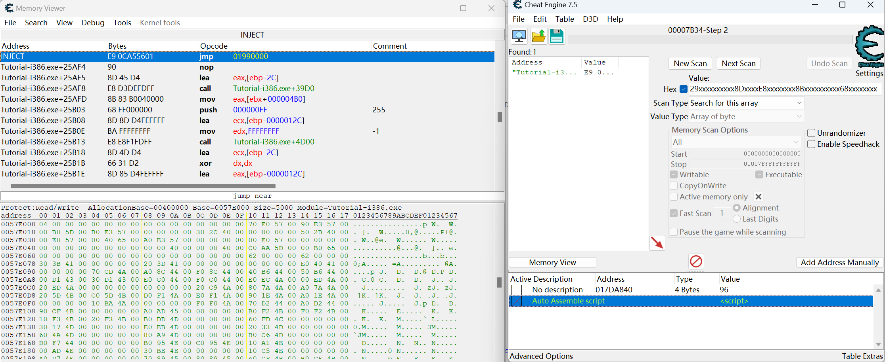

##### Tips：普通标签与特殊标签

* 特殊标签：与某个**绝对地址绑定**的标签，通过某些**脚本语句调用**得到的，例如：`alloc`，`aobscanmodule`等
* 普通标签：通过`label`**注册得到**的，没有绝对的地址，只有标签的名字和标签的作用。
* 区别：特殊标签是在指定地址存放指令，而普通标签是根据指令的地址决定标签的地址。
* 关系：普通标签的地址是跟着特殊标签的地址所决定的，在特殊标签指令结束后的第一个地址。

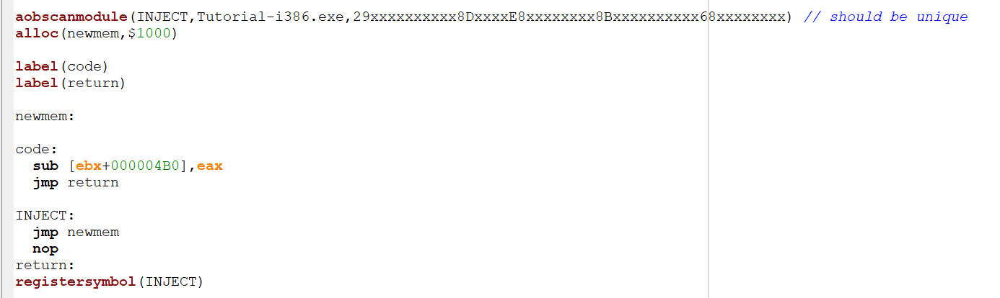

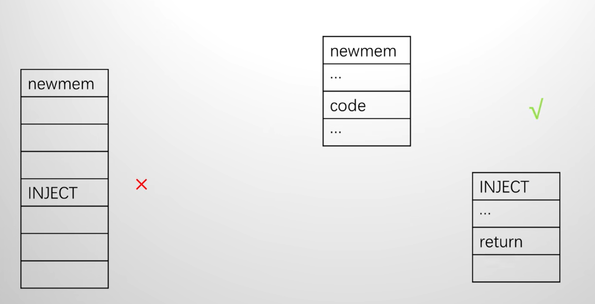

##### 步骤4 修改指令

1. 再次在ct表中打开脚本
2. 编写的位置应该在newman后面或者code的后面（也属于newman）。
3. code部分是CE将原有指令搬过来给的参考，如果要修改，应该在code部分删去参考指令，编写需要的指令。
4. 点击下方的OK

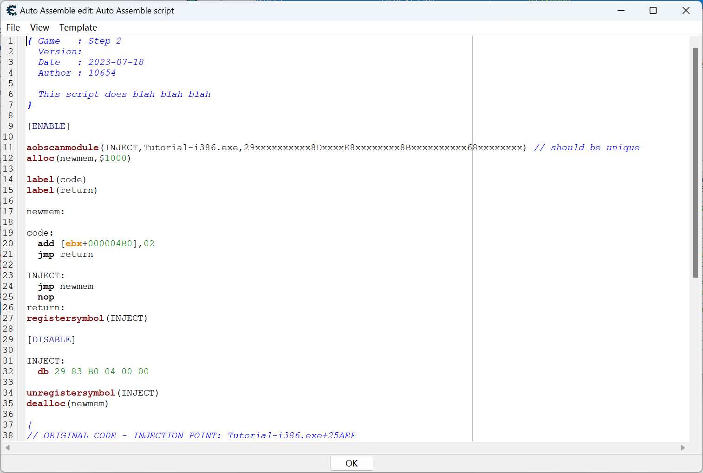

#### 3.2 AOB进阶使用（动态设置指令数据部分）

​	如果在脚本里写死了数据，在后续如果有新的需求时，又要重新在脚本里修改数据。因此可以使用一个变量来保存需要的数据，当有新的需求时，直接修改变量里的数据，使数据与指令分离开。

##### 步骤1 注册标签并分配空间

​	在`label`区域再注册一个数据标签，并在`code`区域后面写上该标签，使用`dd`指令分配空间。（因为该标签里保存的是数据，不应该被执行，因此写在code后面保证不会被当成指令执行）

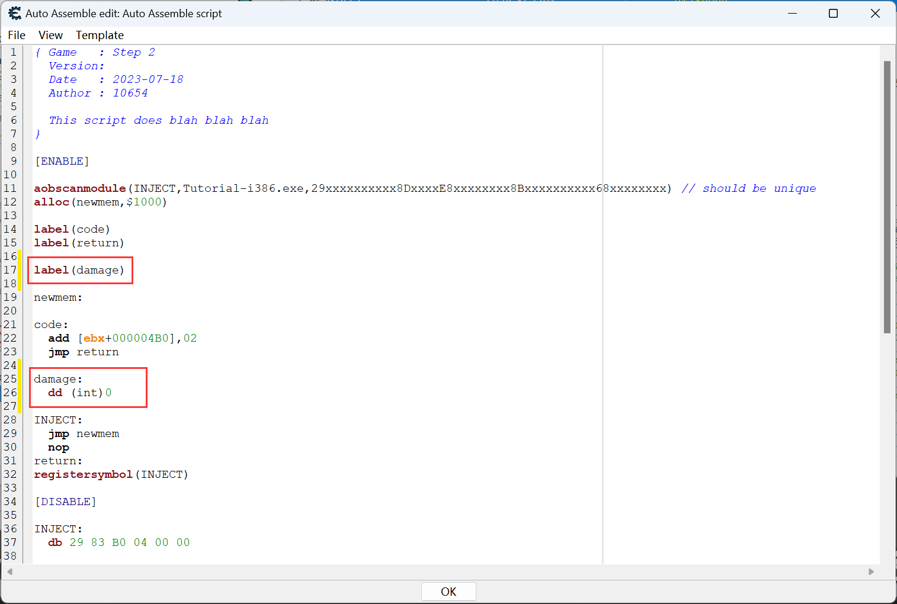

##### 步骤2 将死数据修改为变量（标签）

​	注意：下面的修改有一个问题：不能同时访问两个内存，而是应该用寄存器作为中转。

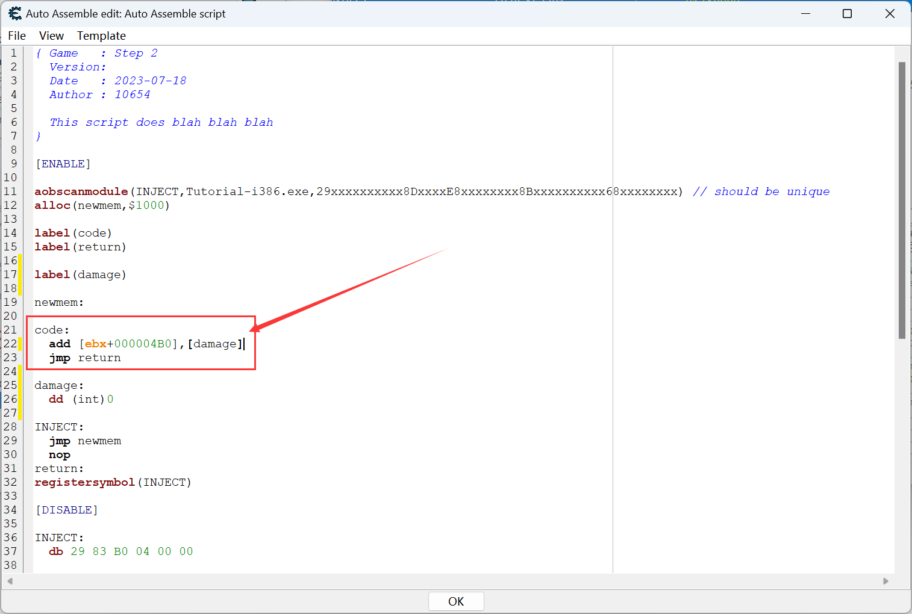

​	修改后的代码应该是：先将寄存器里的数据压栈，使用该寄存器保存这个标签里的数据，再执行加减指令，最后将寄存器出栈以恢复寄存器原有数据。

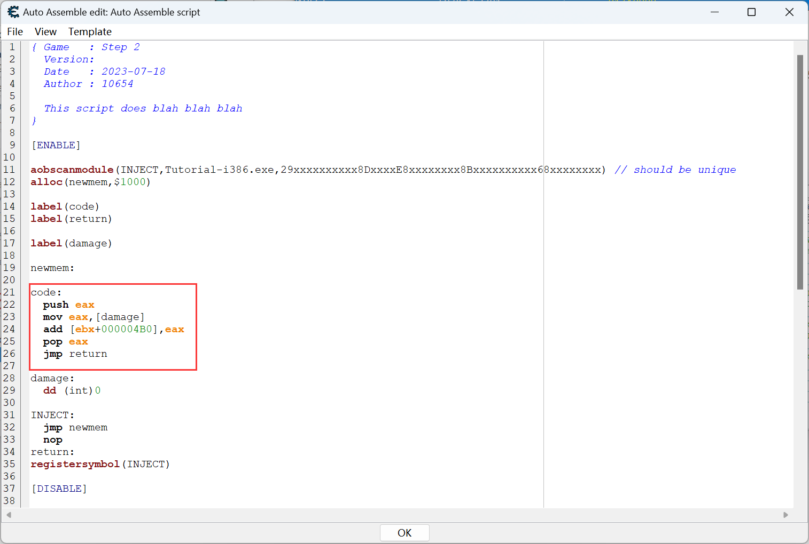

##### 步骤3 注册全局符号并在ct表中获取

​	使用registerSymbol调用，将该标签注册为全局符号（这样CE才能知道这个标签的地址）。

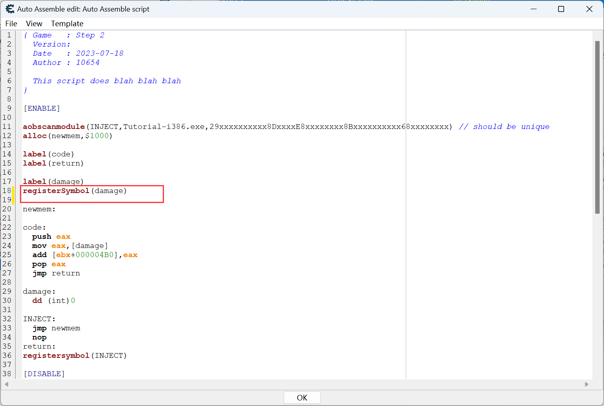

​	再在ct表中激活脚本，点击`add address manually`，输入全局符号名称。

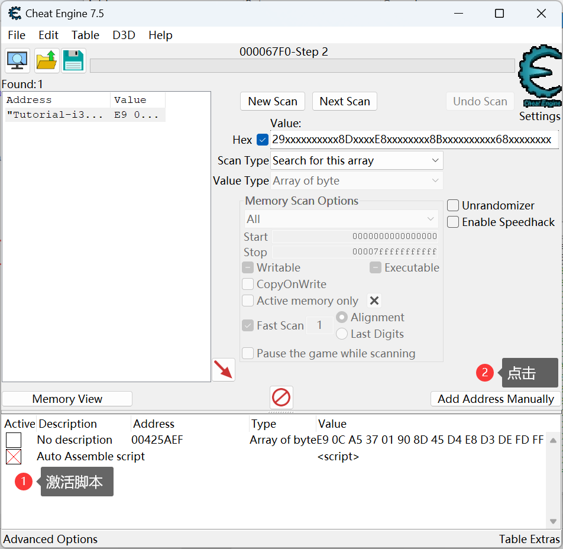

##### 步骤4 显示设置

​	可以将该数据作为脚本的子条目，并设置脚本未激活时隐藏子条目。

* 拖拽数据至脚本条目后，使其成为子条目
* 右击脚本，选择`Group Config——Hide children when deactived`
* 右击数据，更改名称，同时选择`show as signed`

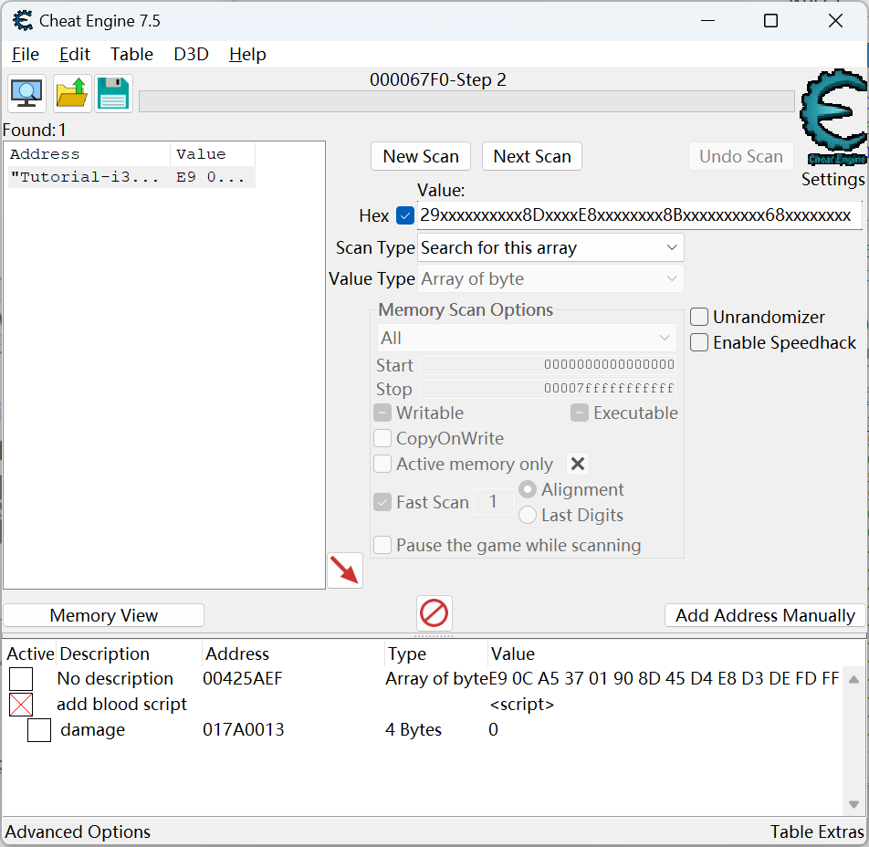

#### 3.3 绝对地址注入

​	有时如果没有版本的要求，可以直接选择绝对地址注入来完成脚本。

##### 步骤1 模板选择

* 选择模板中的`Cheat Table FrameWork Code`
* 再选择模板中的`Code Injection`

##### 步骤2 将脚本加入CT表

1. 左上角**File——Assign to current cheat table**
2. 关闭脚本

##### 步骤3 修改指令

​	双击脚本打开，在`originalcode`区域删除原指令，加上自己的指令。点击OK生效。

##### 其余步骤与AOB注入进阶部分一致

---

### 参考资料

[CE / *Cheat Engine*高阶教程 CE新手入门教程（下篇）Auto Assembler脚本](https://www.bilibili.com/video/BV1UZ4y127uq/?spm_id_from=333.337.search-card.all.click)

[你能学会的*Cheat Engine*零基础入门*教程*](https://www.bilibili.com/video/BV1nR4y1u7PZ/?spm_id_from=333.337.search-card.all.click)
