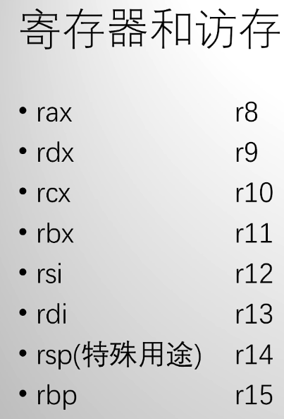

## x86指令集（汇编语言基础）

#### 指令格式：

> 操作类型 结果去向，数据来源

注意：数据来源可以有多个，结果去向只能有一个

> 数据来源与去向中，中括号是指访存（访问内存），中括号内的内容表示访问内存的地址（这个内存包括寄存器）

格式有：

* 常数

* 寄存器

* 寄存器+常数

（由此得出，寄存器内容就是指针的内容，常数就是偏移量）

> 注意：x86规定：一条指令集中，最多只能有一个访存，剩下的只能是寄存器
>
> 如果需要将内存中的数据移到另一个内存位置，需要用一个寄存器中转。

#### 指令编码

> 指令前端是操作码，长度为1-3个字节
>
> 因此，操作一样的指令，数据部分可能不同，但第一个字节（指令的最小长度）一定一样