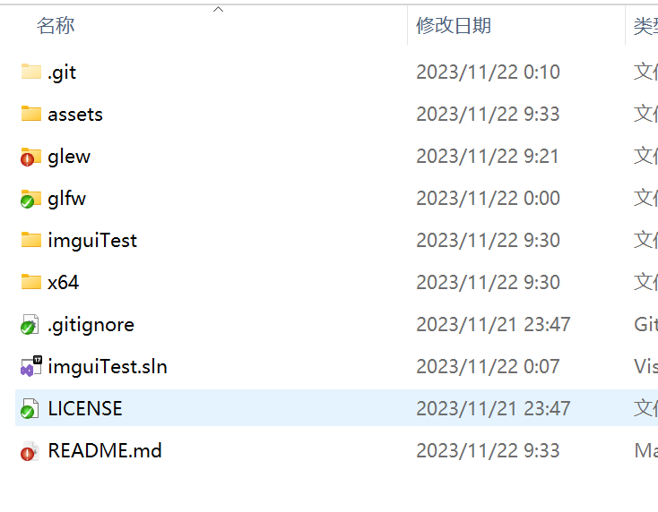
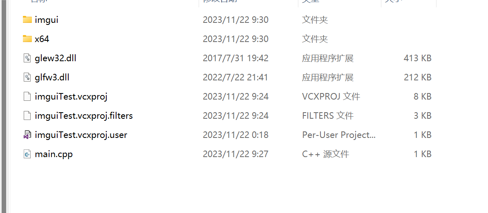
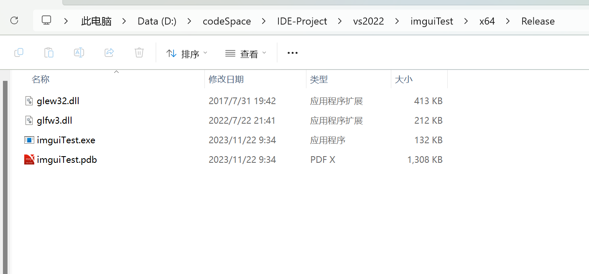

# 配置项目（VS2022）

## 1. 复制文件夹

### 1.1 glew和glfw

​	复制这两个文件夹到项目根目录



### 1.2 imgui

​	复制该文件夹到项目目录（与main.cpp同级）

## 2. 复制dll

​	复制glew32.dll和glfw3.dll到main.cpp同级



​	再次复制，到根目录的/x64/Release下（需要运行一次才会生成）。



## 3. 添加include

​	将glew和glfw添加到include目录中

​	将imgui添加到include目录中

## 4. 添加链接lib和头文件

```c++
#include "GL\glew.h"
#include "GLFW\glfw3.h"

#pragma comment(lib, "../glew/glew32.lib")
#pragma comment(lib, "../glfw/lib-vc2022/glfw3.lib")
#pragma comment(lib, "Opengl32.lib")

#include "imgui.h"
#include "imgui_impl_glfw.h"
#include "imgui_impl_opengl3.h"

int main()
{

}
```

## 5. 完整配置

```C++
#include "GL\glew.h"
#include "GLFW\glfw3.h"

#pragma comment(lib, "../glew/glew32.lib")
#pragma comment(lib, "../glfw/lib-vc2022/glfw3.lib")
#pragma comment(lib, "Opengl32.lib")

#include "imgui/imgui.h"
#include "imgui/imgui_impl_glfw.h"
#include "imgui/imgui_impl_opengl3.h"

//窗口指針
GLFWwindow* Windows;

int main()
{
	//初始化窗口
	glfwInit();
	//給窗口定義 創建模式 (包括關閉垂直同步 使用不同的底層渲染 多重渲染... ... 操作可以使用它來實現)
	glfwWindowHint(GLFW_CONTEXT_VERSION_MAJOR, 3);
	glfwWindowHint(GLFW_CONTEXT_VERSION_MINOR, 3);
	glfwWindowHint(GLFW_OPENGL_PROFILE, GLFW_OPENGL_CORE_PROFILE);

	//創建窗口給予 窗口指針     窗口大小X 窗口大小Y  窗口標題   這兩個為控制項 直接留空
	Windows = glfwCreateWindow(900, 800, "HalfPeople-Imgui", NULL, NULL);
	//給予控制權
	glfwMakeContextCurrent(Windows);
	glfwSwapInterval(0);

	//初始化ImGui
	IMGUI_CHECKVERSION();
	ImGui::CreateContext(NULL);
	//獲取 io (設置ImGui內容)
	ImGuiIO& io = ImGui::GetIO(); (void)io;

	//允許停靠
	io.ConfigFlags |= ImGuiConfigFlags_DockingEnable;
	//視口設置無裝飾
	io.ConfigFlags |= ImGuiViewportFlags_NoDecoration;
	//允許視口停靠
	io.ConfigFlags |= ImGuiConfigFlags_ViewportsEnable;
	//停靠於背景
	io.ConfigFlags |= ImGuiCol_DockingEmptyBg;

	//設置基礎 顏色風格
	ImGui::StyleColorsDark();
	


	//初始化ImGui用於Glfw創建的窗口 (而且使用OpenGL進行底層渲染)
	ImGui_ImplGlfw_InitForOpenGL(Windows, true);
	//初始化ImGui用於OpenGL渲染繪製  (需要定義OpenGL版本號  進行GLSL代碼的自動創建)
	ImGui_ImplOpenGL3_Init("#version 330");
	while (!glfwWindowShouldClose(Windows))
	{
		//清除渲染數據
		glClear(GL_COLOR_BUFFER_BIT);
		//ImGui每幀初始化
		ImGui_ImplOpenGL3_NewFrame();
		ImGui_ImplGlfw_NewFrame();
		ImGui::NewFrame();
		//創建視口停靠
		ImGui::DockSpaceOverViewport();
		
        //code here
        {
            static bool isOpen = true;
            if (isOpen)
            {
                ImGui::Begin("Test", &isOpen);
                //here
                
                ImGui::End();
            }
        }
        
        
        
		//獲取所需繪製數據
		ImGui::Render();
		//繪製ImGui數據
		ImGui_ImplOpenGL3_RenderDrawData(ImGui::GetDrawData());

		if (io.ConfigFlags & ImGuiConfigFlags_ViewportsEnable)
		{
			//當窗口拉出窗口範圍 創建子窗口
			GLFWwindow* backup_current_context = glfwGetCurrentContext();
			ImGui::UpdatePlatformWindows();
			ImGui::RenderPlatformWindowsDefault();
			glfwMakeContextCurrent(backup_current_context);
		}
		//繪製窗口內容
		glfwSwapBuffers(Windows);
		//繪製事件
		glfwPollEvents();
	}
}
```

## 6. 完整实例

```C++
//定義此宏 ( GLEW_STATIC ) 告訴GLEW 需要公開某些函數  !!!否則無法使用
#define GLEW_STATIC
//引用 glfw (窗口創建工具) 和 glew (OpenGL 3d繪製褲)
#include <GL/glew.h>
#include <GLFW/glfw3.h>
//導入褲
#pragma comment(lib,"../API/GLFW/glfw3.lib")
#pragma comment(lib,"../API/GLEW/glew32s.lib")
//雖然我們沒有這一個 lib 但是他直接存在於 你的顯卡驅動當中
#pragma comment(lib,"Opengl32.lib")
//引用 <iostream> 方便進行Debug和打印 (可以沒有)
#include <iostream>
//引用 <string> 方便進行文本操作 (可以沒有)
#include <string>

//引用 "imgui.h" 當中包含大部分 Imgui 內容
#include "imgui.h"
//引用 "imgui_impl_glfw.h" 由於我們的窗口是由 GLFW 進行創建的
#include "imgui_impl_glfw.h"
//引用 "imgui_impl_opengl3.h" 由於我們的底層渲染是由 OpenGL (glew) 進行的
#include "imgui_impl_opengl3.h"
//引用 把控件繪製分離到 "GUI.h" 當中 (方便整理)
#include "GUI.h"

//窗口指針
GLFWwindow* Windows;

//程式開始
int main()
{
  	//初始化窗口
	glfwInit();
  	//給窗口定義 創建模式 (包括關閉垂直同步 使用不同的底層渲染 多重渲染... ... 操作可以使用它來實現)
	glfwWindowHint(GLFW_CONTEXT_VERSION_MAJOR, 3);
	glfwWindowHint(GLFW_CONTEXT_VERSION_MINOR, 3);
	glfwWindowHint(GLFW_OPENGL_PROFILE, GLFW_OPENGL_CORE_PROFILE);

  	//創建窗口給予 窗口指針     窗口大小X 窗口大小Y  窗口標題   這兩個為控制項 直接留空
	Windows = glfwCreateWindow(900, 800,"HalfPeople-Imgui",NULL,NULL);
	//給予控制權
	glfwMakeContextCurrent(Windows);
	glfwSwapInterval(0);

  	//初始化ImGui
	IMGUI_CHECKVERSION();
	ImGui::CreateContext(NULL);
  	//獲取 io (設置ImGui內容)
	ImGuiIO& io = ImGui::GetIO(); (void)io;
  	//添加字體                  文件路徑   字體大小 (高級)混合多種字體會使用所以留空即可  定義字體範圍
	io.Fonts->AddFontFromFileTTF("kaiu.ttf" ,  18 ,  NULL, io.Fonts->GetGlyphRangesChineseFull());

  	//允許停靠
	io.ConfigFlags |= ImGuiConfigFlags_DockingEnable;
  	//視口設置無裝飾
	io.ConfigFlags |= ImGuiViewportFlags_NoDecoration;
  	//允許視口停靠
	io.ConfigFlags |= ImGuiConfigFlags_ViewportsEnable;
  	//停靠於背景
	io.ConfigFlags |= ImGuiCol_DockingEmptyBg;

	//設置基礎 顏色風格
	ImGui::StyleColorsDark();
  	//獲取風格
	ImGuiStyle& style = ImGui::GetStyle();
	//從風格當中獲取顏色列表
	ImVec4* colors = style.Colors;
  	//進行顏色配置
	colors[ImGuiCol_FrameBg] = ImVec4(0.16f, 0.16f, 0.17f, 1.00f);
	colors[ImGuiCol_FrameBgHovered] = ImVec4(0.37f, 0.36f, 0.36f, 102.00f);
	colors[ImGuiCol_FrameBgActive] = ImVec4(0.10f, 0.10f, 0.10f, 171.00f);
	colors[ImGuiCol_TitleBgActive] = ImVec4(0.20f, 0.20f, 0.20f, 255.00f);
	colors[ImGuiCol_CheckMark] = ImVec4(0.61f, 0.61f, 0.61f, 1.00f);
	colors[ImGuiCol_SliderGrab] = ImVec4(0.64f, 0.64f, 0.64f, 1.00f);
	colors[ImGuiCol_SliderGrabActive] = ImVec4(0.31f, 0.31f, 0.31f, 1.00f);
	colors[ImGuiCol_Button] = ImVec4(0.22f, 0.22f, 0.22f, 0.40f);
	colors[ImGuiCol_ButtonHovered] = ImVec4(0.29f, 0.29f, 0.29f, 1.00f);
	colors[ImGuiCol_ButtonActive] = ImVec4(0.13f, 0.13f, 0.13f, 1.00f);
	colors[ImGuiCol_Header] = ImVec4(0.45f, 0.45f, 0.45f, 0.31f);
	colors[ImGuiCol_HeaderHovered] = ImVec4(0.55f, 0.55f, 0.55f, 0.80f);
	colors[ImGuiCol_HeaderActive] = ImVec4(0.09f, 0.09f, 0.09f, 1.00f);
	colors[ImGuiCol_ResizeGrip] = ImVec4(1.00f, 1.00f, 1.00f, 0.20f);
	colors[ImGuiCol_ResizeGripHovered] = ImVec4(0.46f, 0.46f, 0.46f, 0.67f);
	colors[ImGuiCol_ResizeGripActive] = ImVec4(0.17f, 0.17f, 0.17f, 0.95f);
	colors[ImGuiCol_SeparatorActive] = ImVec4(0.42f, 0.42f, 0.42f, 1.00f);
	colors[ImGuiCol_SeparatorHovered] = ImVec4(0.50f, 0.50f, 0.50f, 0.78f);
	colors[ImGuiCol_TabHovered] = ImVec4(0.45f, 0.45f, 0.45f, 0.80f);
	colors[ImGuiCol_TabActive] = ImVec4(0.28f, 0.28f, 0.28f, 1.00f);
	colors[ImGuiCol_TabUnfocusedActive] = ImVec4(0.19f, 0.19f, 0.19f, 1.00f);
	colors[ImGuiCol_DockingPreview] = ImVec4(0.51f, 0.51f, 0.51f, 0.70f);
	colors[ImGuiCol_Tab] = ImVec4(0.21f, 0.21f, 0.21f, 0.86f);
	colors[ImGuiCol_TabUnfocused] = ImVec4(0.15f, 0.15f, 0.15f, 0.97f);
	colors[ImGuiCol_NavHighlight] = ImVec4(1.00f, 0.40f, 0.13f, 1.00f);
	colors[ImGuiCol_TextSelectedBg] = ImVec4(0.45f, 1.00f, 0.85f, 0.35f);

	//從風格當中配置 窗口/控件 樣式數據
	style.WindowRounding = 4;
	style.FrameRounding = 4;
	style.GrabRounding = 3;
	style.ScrollbarSize = 7;
	style.ScrollbarRounding = 0;

	//初始化ImGui用於Glfw創建的窗口 (而且使用OpenGL進行底層渲染)
	ImGui_ImplGlfw_InitForOpenGL(Windows, true);
  	//初始化ImGui用於OpenGL渲染繪製  (需要定義OpenGL版本號  進行GLSL代碼的自動創建)
	ImGui_ImplOpenGL3_Init("#version 330");
	//創建文本編輯器給予 "GUI.h"
	te = new TextEditor();
  	//給文本編輯器定義  使用的電腦語言
	te->SetLanguageDefinition(TextEditor::LanguageDefinition::C());
  	//渲染循環  (若用戶點擊右上角 交叉 停止循環)
	while (!glfwWindowShouldClose(Windows))
	{
      	//清除渲染數據
		glClear(GL_COLOR_BUFFER_BIT);
		//ImGui每幀初始化
		ImGui_ImplOpenGL3_NewFrame();
		ImGui_ImplGlfw_NewFrame();
		ImGui::NewFrame();
      	//創建視口停靠
		ImGui::DockSpaceOverViewport();
		//調用 "GUI.h" 當中函數進行繪製
		DrawGUI();
		//繪製 ImGui Demo Window (完全是可以不用)
		ImGui::ShowDemoWindow();
		//獲取所需繪製數據
		ImGui::Render();
      	//繪製ImGui數據
		ImGui_ImplOpenGL3_RenderDrawData(ImGui::GetDrawData());

		if (io.ConfigFlags & ImGuiConfigFlags_ViewportsEnable)
		{
          	//當窗口拉出窗口範圍 創建子窗口
			GLFWwindow* backup_current_context = glfwGetCurrentContext();
			ImGui::UpdatePlatformWindows();
			ImGui::RenderPlatformWindowsDefault();
			glfwMakeContextCurrent(backup_current_context);
		}
		//繪製窗口內容
		glfwSwapBuffers(Windows);
      	//繪製事件
		glfwPollEvents();
	}
}
```

