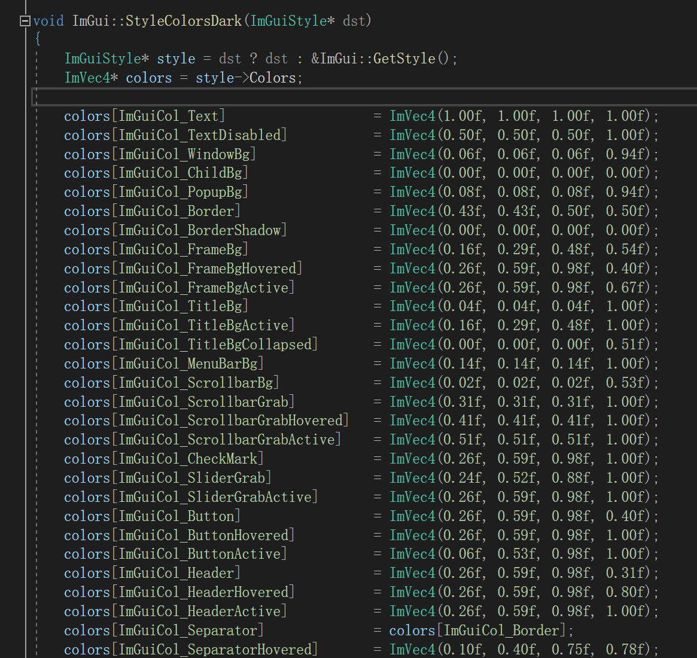
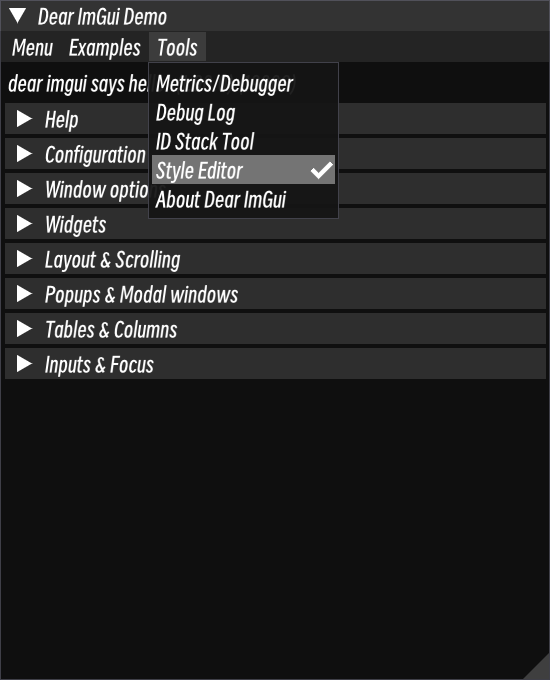
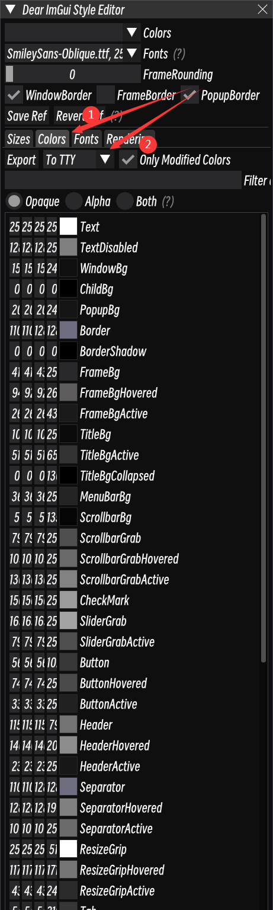
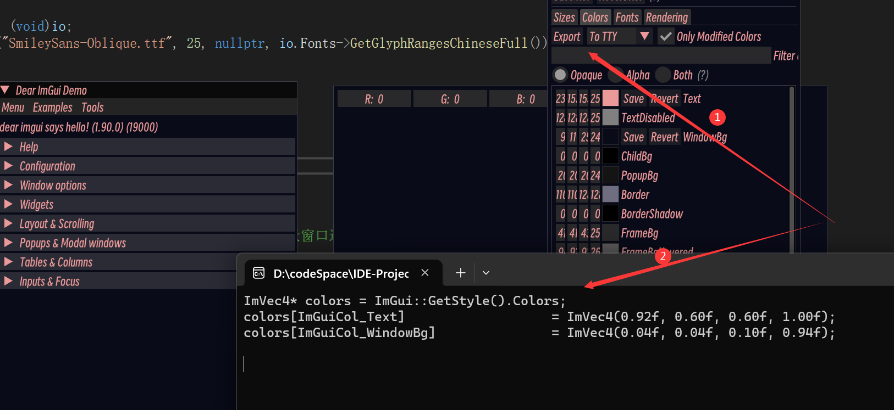

# 01 设置Style

## 1. 内置style

​	`ImGui`内置了**三种**颜色风格供选择，也可以自定义：

```C++
// Setup Dear ImGui style
ImGui::StyleColorsDark();
//ImGui::StyleColorsLight();
//ImGui::StyleColorsClassic();
```

​	其**本质**都是设置了一系列控件的表现颜色：



## 2. color内容

### 设置代码

```C++
ImGuiStyle& style = ImGui::GetStyle();
ImVec4* colors = style.Colors;
// 使用colors设置颜色
```

### 设置获取（从DemoWindow）

#### 获取style edit窗口



#### 导出到控制台



#### 修改color后点击export



```C++
ImVec4* colors = ImGui::GetStyle().Colors;
colors[ImGuiCol_Text]                   = ImVec4(0.92f, 0.60f, 0.60f, 1.00f);
colors[ImGuiCol_WindowBg]               = ImVec4(0.04f, 0.04f, 0.10f, 0.94f);
```

## 3. style内容

## 4. 实例

```C++
	//獲取風格
	ImGuiStyle& style = ImGui::GetStyle();
	//從風格當中獲取顏色列表
	ImVec4* colors = style.Colors;
  	//進行顏色配置
	colors[ImGuiCol_FrameBg] = ImVec4(0.16f, 0.16f, 0.17f, 1.00f);
	colors[ImGuiCol_FrameBgHovered] = ImVec4(0.37f, 0.36f, 0.36f, 102.00f);
	colors[ImGuiCol_FrameBgActive] = ImVec4(0.10f, 0.10f, 0.10f, 171.00f);
	colors[ImGuiCol_TitleBgActive] = ImVec4(0.20f, 0.20f, 0.20f, 255.00f);
	colors[ImGuiCol_CheckMark] = ImVec4(0.61f, 0.61f, 0.61f, 1.00f);
	colors[ImGuiCol_SliderGrab] = ImVec4(0.64f, 0.64f, 0.64f, 1.00f);
	colors[ImGuiCol_SliderGrabActive] = ImVec4(0.31f, 0.31f, 0.31f, 1.00f);
	colors[ImGuiCol_Button] = ImVec4(0.22f, 0.22f, 0.22f, 0.40f);
	colors[ImGuiCol_ButtonHovered] = ImVec4(0.29f, 0.29f, 0.29f, 1.00f);
	colors[ImGuiCol_ButtonActive] = ImVec4(0.13f, 0.13f, 0.13f, 1.00f);
	colors[ImGuiCol_Header] = ImVec4(0.45f, 0.45f, 0.45f, 0.31f);
	colors[ImGuiCol_HeaderHovered] = ImVec4(0.55f, 0.55f, 0.55f, 0.80f);
	colors[ImGuiCol_HeaderActive] = ImVec4(0.09f, 0.09f, 0.09f, 1.00f);
	colors[ImGuiCol_ResizeGrip] = ImVec4(1.00f, 1.00f, 1.00f, 0.20f);
	colors[ImGuiCol_ResizeGripHovered] = ImVec4(0.46f, 0.46f, 0.46f, 0.67f);
	colors[ImGuiCol_ResizeGripActive] = ImVec4(0.17f, 0.17f, 0.17f, 0.95f);
	colors[ImGuiCol_SeparatorActive] = ImVec4(0.42f, 0.42f, 0.42f, 1.00f);
	colors[ImGuiCol_SeparatorHovered] = ImVec4(0.50f, 0.50f, 0.50f, 0.78f);
	colors[ImGuiCol_TabHovered] = ImVec4(0.45f, 0.45f, 0.45f, 0.80f);
	colors[ImGuiCol_TabActive] = ImVec4(0.28f, 0.28f, 0.28f, 1.00f);
	colors[ImGuiCol_TabUnfocusedActive] = ImVec4(0.19f, 0.19f, 0.19f, 1.00f);
	colors[ImGuiCol_DockingPreview] = ImVec4(0.51f, 0.51f, 0.51f, 0.70f);
	colors[ImGuiCol_Tab] = ImVec4(0.21f, 0.21f, 0.21f, 0.86f);
	colors[ImGuiCol_TabUnfocused] = ImVec4(0.15f, 0.15f, 0.15f, 0.97f);
	colors[ImGuiCol_NavHighlight] = ImVec4(1.00f, 0.40f, 0.13f, 1.00f);
	colors[ImGuiCol_TextSelectedBg] = ImVec4(0.45f, 1.00f, 0.85f, 0.35f);
```

