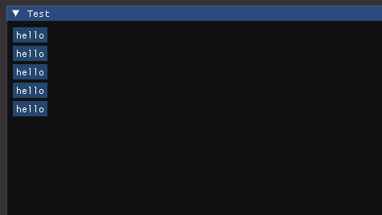
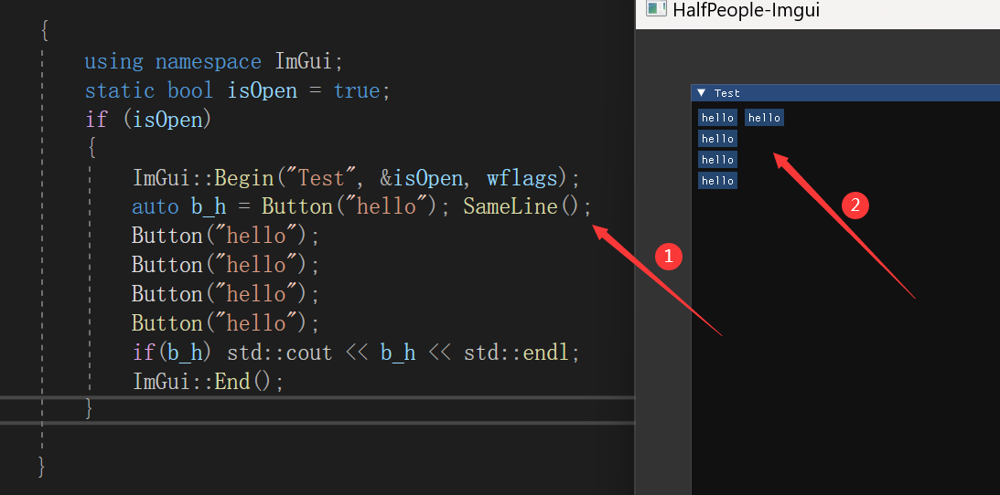

# 03 控件：按钮（Button）

​	控件要写在`Begin`和`End`之间，才能被窗口正确接收使用。

## 基本案例

​	按钮创建直接使用Button函数，注意**按钮文本不能为空**：

```C++
		{
			using namespace ImGui;
			static bool isOpen = true;
			if (isOpen)
			{
				ImGui::Begin("Test", &isOpen, wflags);
				auto b_h = Button("hello");
				if(b_h) std::cout << b_h << std::endl;
				ImGui::End();
			}
		}
```

## 按钮布局

### 换行布局

​	一般来说，创建多个控件会以**换行的形式**布局，如下：



### 同行布局

​	使用`ImGui::SameLine();`设置下个控件同行布局。



