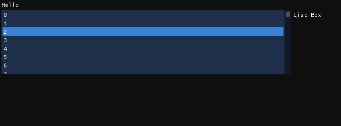

# 05 控件：列表（List Box）和下拉框（Combo Box）

## List Box

​	列表控件。



### 1. Begin和End

​	创建一个`ListBox`，和创建窗口一样，有一个`BeginListBox`和一个`EndListBox`（老版本为`ListBoxHeader`和`ListBoxFooter`），与之有关的设置都写在它们中间。

```C++
ImGui::BeginListBox("List Box");
// 添加内容
ImGui::EndListBox();
```

### 2. 添加一行选项

​	使用`for-loop`+`Selectable`添加选项（绘制选项）。

```C++
ImGui::BeginListBox("List Box");
for (size_t i{}; i < 100; i++)
{
    if (ImGui::Selectable(std::to_string(i).c_str(), true))		// 添加（绘制）选项，参数1：选项名，参数2：是否有选中效果
    {
    	//设置效果
    }
}
ImGui::EndListBox();
```

---

### 3. 使用案例：选中选项，文本变为该选项

```C++
std::string text("Hello");

while (!glfwWindowShouldClose(Windows))
{
    // ...

    {
        using namespace ImGui;
        static bool isOpen = true;
        if (isOpen)
        {
            ImGui::Begin("Test", &isOpen, wflags);
            // draw text
            Text(text.c_str());
            
            ImGui::BeginListBox("List Box");
            for (size_t i{}; i < 100; i++)
            {
                if (ImGui::Selectable(std::to_string(i).c_str(), std::to_string(i)== text))
                {
                    text = std::to_string(i).c_str();
                }
            }

            ImGui::EndListBox();
            
            ImGui::End();
    	}

    }
    // ...
}
```

## Combo Box

​	下拉框控件。

### 1. Begin和End

​	创建一个`ComboBox`，和创建窗口一样，有一个`BeginCombo`和一个`EndCombo`，与之有关的设置都写在它们中间。

```C++
if (ImGui::BeginCombo("Combo Box", "0"))	// param 1:name, param 2:selected text
{
	// 设置
}
ImGui::EndCombo();
```

### 2. 添加一行选项

```C++
std::string text{"0"};

// in While loop
if (ImGui::BeginCombo("Combo Box", text.c_str()))
    {
        for (size_t i{}; i < 100; i++)
        {
            if (ImGui::Selectable(std::to_string(i).c_str(), std::to_string(i) == text))
            {
            	text = std::to_string(i);
            }
        }
    }
ImGui::EndCombo();
```

