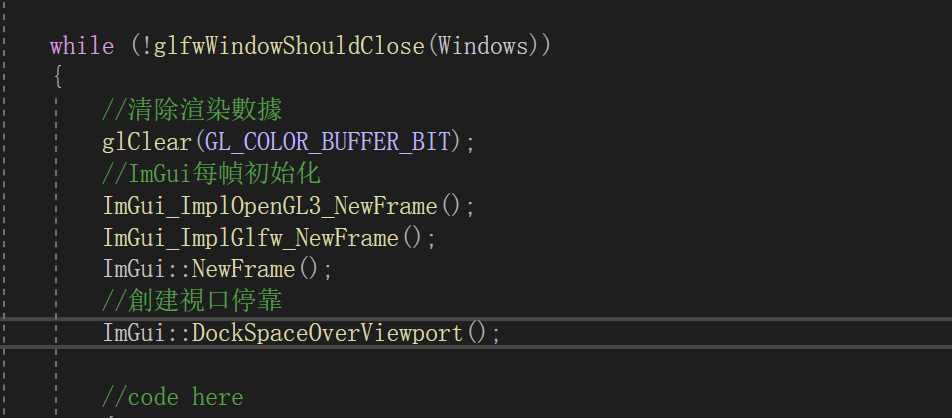

# 08 窗口：停靠

## 1. 添加io.ConfigFlags

```C++
	ImGuiIO& io = ImGui::GetIO(); (void)io;

	//允許停靠
	io.ConfigFlags |= ImGuiConfigFlags_DockingEnable;
	//視口設置無裝飾
	io.ConfigFlags |= ImGuiViewportFlags_NoDecoration;
	//允許視口停靠
	io.ConfigFlags |= ImGuiConfigFlags_ViewportsEnable;
	//停靠於背景
	io.ConfigFlags |= ImGuiCol_DockingEmptyBg;
```

## 2. 允许背景停靠

```C++
ImGui::DockSpaceOverViewport();
```



## 3. 拉出创建子窗口

```C++
if (io.ConfigFlags & ImGuiConfigFlags_ViewportsEnable)
{
    //當窗口拉出窗口範圍 創建子窗口
    GLFWwindow* backup_current_context = glfwGetCurrentContext();
    ImGui::UpdatePlatformWindows();
    ImGui::RenderPlatformWindowsDefault();
    glfwMakeContextCurrent(backup_current_context);
}
```

