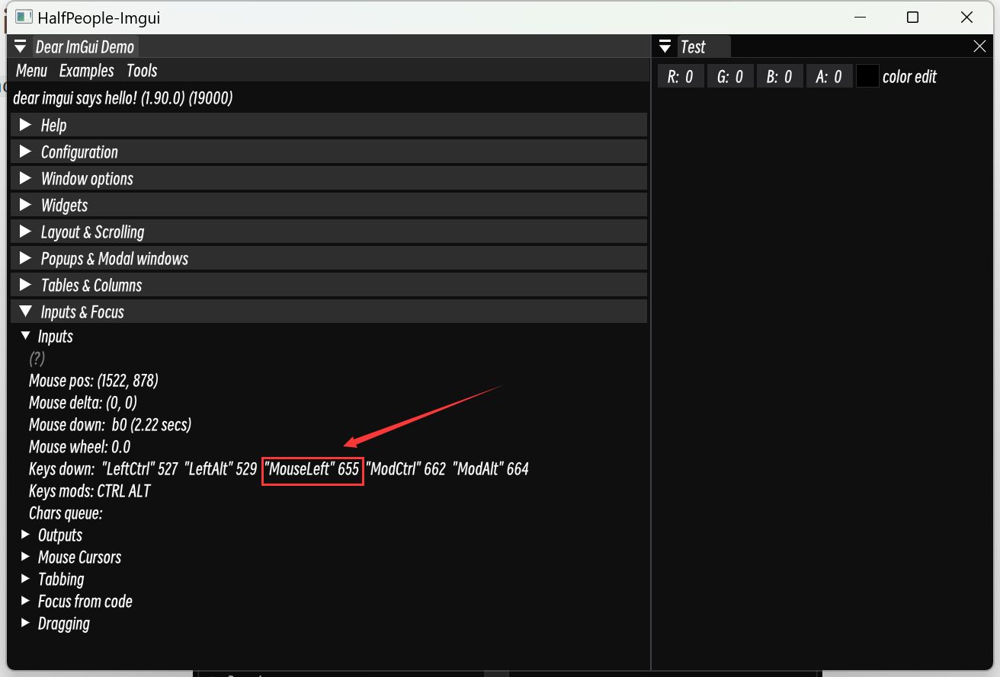
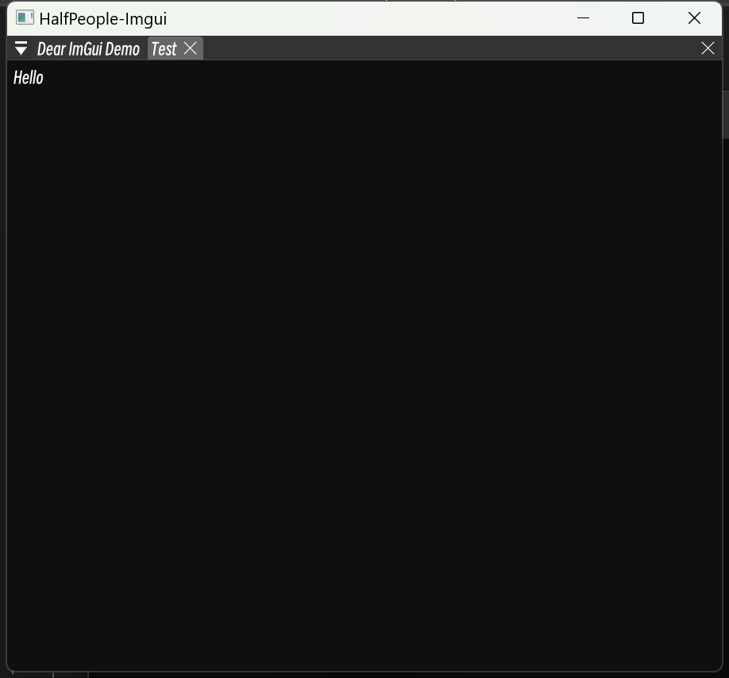
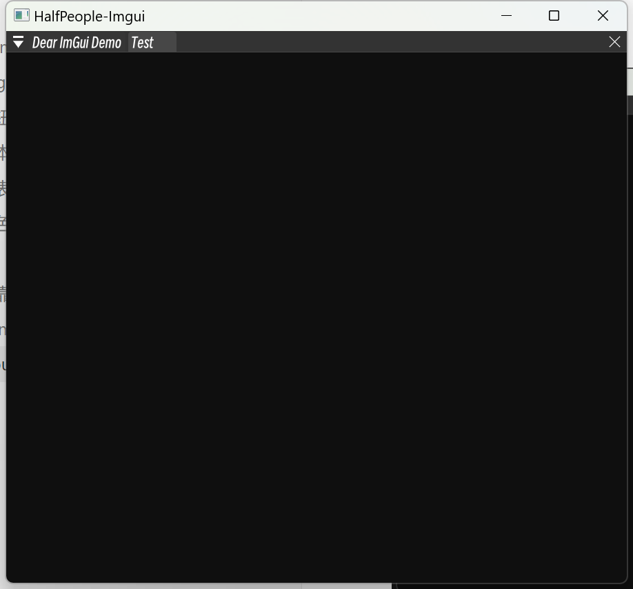

# 10 输入：Input

## Key Input

### 获取ImGui中Key对应的val

​	在`DemoWindow`中的`Input`里可以获取对应**按键**的`Value`。


### Mouse

​	**Mouse也是Key的一种**。



### 检测Key

​	

```C++
if(ImGui::IsKeyDown((ImGuiKey)655) && ImGui::IsItemHovered())	// 在对应的窗口焦点下并且按下键
{
    ImGui::Text("Hello");
}
```

### Press和Down区别：

* Down：检测持续状态
* Pressed：检测状态改变的瞬间