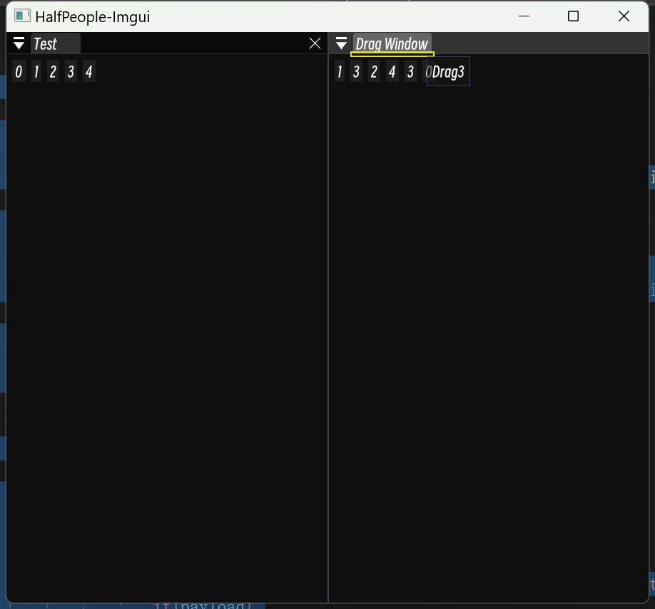

# 11 拖拽

​	拖拽事件创建在对应控件的后面。

## 1. Begin & End

```C++
				for (size_t i{}; i < 5; i++)
				{
					ImGui::Button(std::to_string(i).c_str()); ImGui::SameLine();

					if (ImGui::BeginDragDropSource())
					{
						ImGui::Text(("Drag" + std::to_string(i)).c_str());
						ImGui::EndDragDropSource();
					}
				}
```

## 2. Payload & Target

​	拖拽可以放入拖拽的信息，在拖拽结束时检测目标。



```C++
				static std::vector<int> DragList{};
				ImGui::Begin("Test", &isOpen, wflags);

				for (size_t i{}; i < 5; i++)
				{
					ImGui::Button(std::to_string(i).c_str()); ImGui::SameLine();

					if (ImGui::BeginDragDropSource())
					{
						ImGui::Text(("Drag" + std::to_string(i)).c_str());
						ImGui::SetDragDropPayload("DragButtonIndex", &i, sizeof(i));	// create drag payload

						ImGui::EndDragDropSource();
					}
				}


				ImGui::End();

				ImGui::Begin("Drag Window");
				
				if (ImGui::BeginDragDropTarget())	// start drag target
				{
					auto* payload = (ImGui::AcceptDragDropPayload("DragButtonIndex"));	// get payload
					if(payload)	// test payload
						DragList.push_back(*(int*)(payload->Data));	// get data, insert into vector
					ImGui::EndDragDropTarget();		// end drag target
				}	
				
				
				
				for (size_t i{}; i < DragList.size(); i++)
				{
					ImGui::Button(std::to_string(DragList[i]).c_str()); ImGui::SameLine();
				}


				ImGui::End();
```

