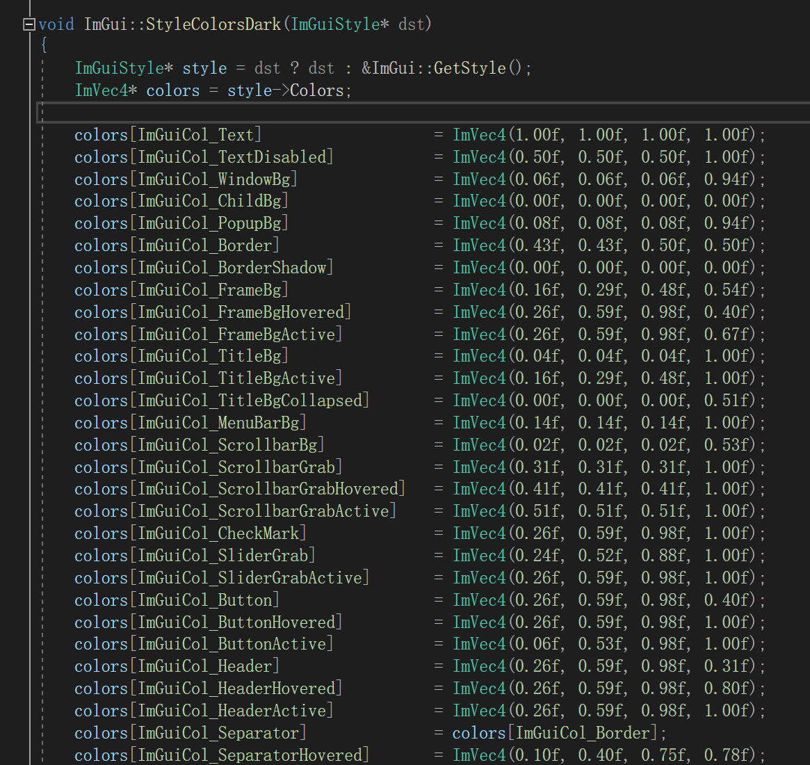

# Imgui解读Style

​	`ImGui`内置了**三种**颜色风格供选择，也可以自定义：

```C++
// Setup Dear ImGui style
ImGui::StyleColorsDark();
//ImGui::StyleColorsLight();
//ImGui::StyleColorsClassic();
```

​	其本质都是设置了一系列控件的表现颜色：

