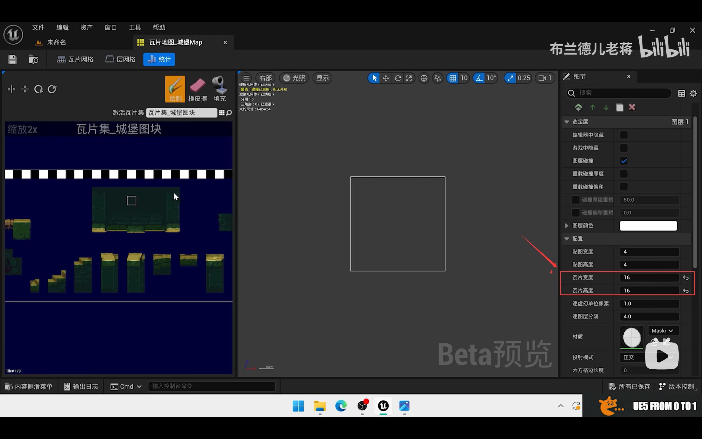

# 导入与基本设置

[TOC]

## 0. 插件

​	使用`paper2d`插件和`paperzd`插件即可。

## 0. 网站

​	itch.io

## 1. 导入jpg

​	将jpg文件拖入UE即可。

## 2. 创建素材

​	右击——Sprite操作——应用paper2d纹理设置。

​	右击——Sprite操作——创建瓦片集。

## 3. 调整大小

​	将素材中的图块调整为统一的大小来使得后续使用兼容。

​	在瓦片集中设置瓦片大小为素材说明的大小或者自己需要的大小。

## 4. 创建地图

​	使用瓦片集，可以创建地图。

​	右击瓦片集——创建瓦片贴图。

## 5. 制作地图

### 地图基础

### 瓦片尺寸

​	地图的瓦片尺寸与瓦片本身的尺寸保持一致。

### 设置贴图宽高

​	贴图宽高自己定义，但是注意要给上下留出空间以放置背景。

### 设置逐图层分隔

​	在UE中，2d的地图本质上是多个图片叠加的效果，它们前后在3d空间中有间隔的距离。可以通过调整该距离实现一些效果。

### 碰撞厚度

​	2d的碰撞是基于3d的碰撞实现的，因此一个2d的物体，在z轴上存在厚度以给不同图层上的物体以碰撞检测。

​	根据需要设置碰撞厚度。

## 6. 放置地图

​	将地图assert拖入场景中，将其坐标归零即可。

## 7. 配置场景中的物体碰撞

​	场景物体的碰撞需要在瓦片集中设置。

​	选中有碰撞检测的瓦片块，选择碰撞瓦片以添加盒体。在右侧的编辑器中可以通过修改节点位置、增加或减少节点来改变碰撞盒体的形状，制作更多效果（例如：下台阶等）。

## 8. 其它场景设置

### 后期处理体积

​	细节面板：

* 勾选无限范围
* Exposure
  * 勾选曝光补偿
  * Min EV100设置为1
  * Max EV100设置为1
* Image Effects
  * 勾选晕映强度，并调整
* Motion Blur
  * 勾选之后调整为0（即关闭运动模糊）

## 参考资料

* [【虚幻*2D*像素游戏开发教程】1. 场景素材导入与绘制](https://www.bilibili.com/video/BV1a94y1z7ju?spm_id_from=333.880.my_history.page.click)