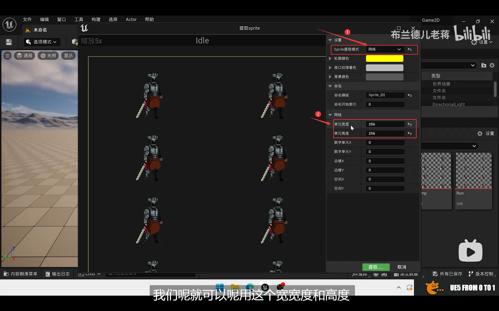
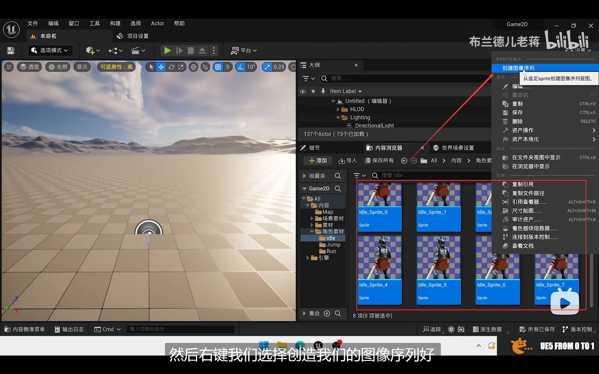
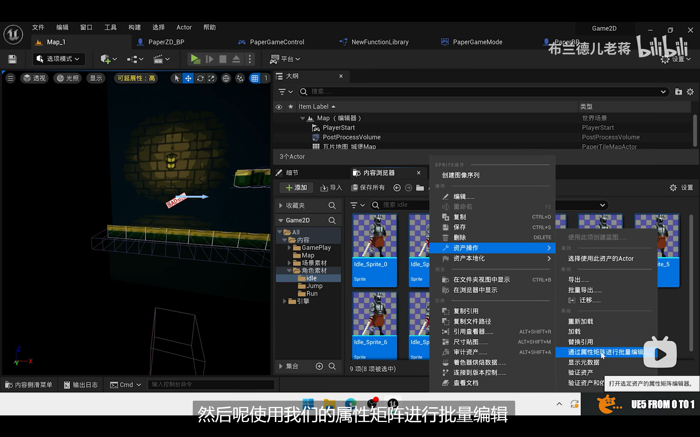
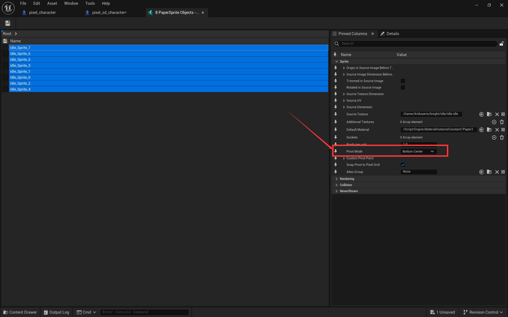

# 动画导入与合成

[TOC]

## 1. 从png的图片序列导入

​	美术在制作动画素材时，可能会选择导出为png的动画序列。

​	可以直接将png拖入UE中，将其使用Sprite纹理设置后，进行批量取出。

​	方法是：使用**提取Sprite**来将一个纹理中的序列进行提取。提取模式选择网格，在下方网格区域选择每个单元的宽度和高度，以及边缘信息等，一键提取。

## 2. 提取后的Sprite

​	提取后的n个序列以Sprite的格式保存，命名统一为`xxx_i`的格式，如果要修改名字，不要改变序号，否则会导致制作动画的错误。

## 3. 合成动画

​	选中提取出所有的Sprite，右击——创建图像序列。即可创建`纸片图像序列视图`。

### 调整频率（帧数）

​	在序列的界面的详细中可以通过每秒帧数来调整动画的频率。

## 4. 调整动画的轴位置

​	调整轴的位置，只需调整每个Sprite的轴的位置即可，双击可以某个Sprite可以看到轴的位置，右侧**枢轴位置**属性表示轴的位置。

​	推荐调整到**底部居中**。方法：选中所有Sprite，右击——资产操作——使用属性矩阵进行批量编辑。

​	设置枢轴位置：

