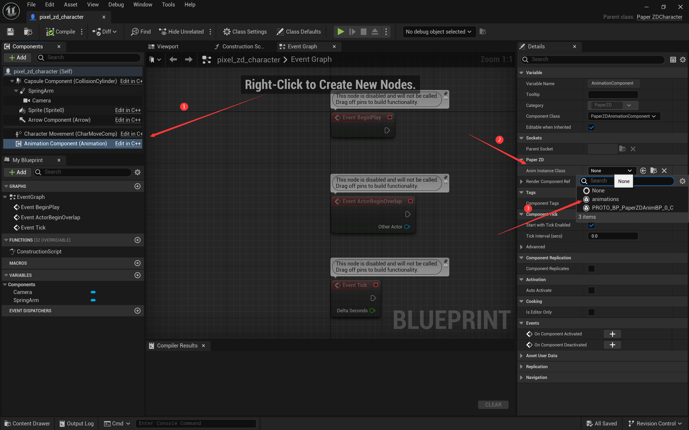

# paperzd动画（Source与状态机）.md

[TOC]

## 1. Animation Source

### 添加动画序列

* 添加新的动画序列
* 修改名字
* 选择对应的纸片序列

## 2. 动画状态机（PaperZD AnimBP）

​	需要选择从Source创建对应的AnimBP。

### 创建状态机

### 创建state

### 设置state的动画

### 创建新的state并设置状态转移条件

​	在init时获取角色蓝图，方便在后续动画时进行判断：

​	获取速度，作为状态变化的条件：

### 将animation配置到character上

### 设置sprite旋转方向

​	如果需要根据玩家操作，使得角色动画转向不同的方向。可以通过在输入input中判断输入的值，获取角色的sprite对象，设置其z轴的相对旋转方向。

